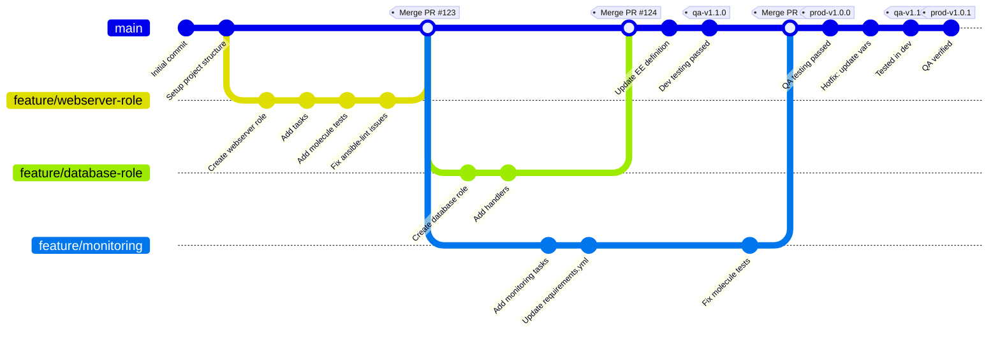
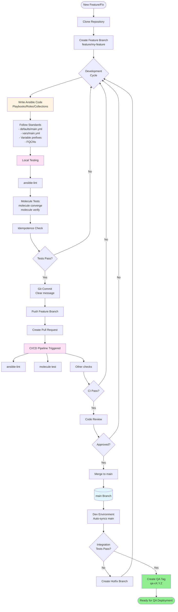

# A Guide to Ansible and Ansible Automation Platform Code Lifecycle

This guide outlines a robust workflow specifically for **Ansible Automation Platform (AAP)** users, detailing how to manage Ansible automation from concept to production. It emphasizes best practices sourced primarily from official Red Hat and Ansible documentation, tailored for the AAP environment.  
**Guiding Principles (within AAP):**

* **Treat Automation as Code:** Apply rigorous software development practices (version control, testing, reviews) to all Ansible artifacts managed within AAP Projects.[^1]  
* **Simplicity and Clarity:** Keep structures and logic as simple as possible within your playbooks and roles. Readability counts for easier maintenance and collaboration within AAP.[^1]  
* **Consistency:** Adhere to defined standards across the team for content stored in Git and executed via AAP.[^1]  
* **Idempotency:** Ensure all automation executed via AAP Job Templates can be run multiple times without unintended side effects.[^12]

### ---

**Phase 1: Plan & Structure \- Laying the Foundation for AAP**

#### **1\. Define the Goal (Keep it Simple)**

* Start with a clear, specific automation objective. Focus on the desired "Target State" for systems managed by AAP.[^14]  
* Begin with a simple concept and iterate, adding complexity gradually within your playbooks and roles.[^1]

#### **2\. Manage Inventory Effectively (within AAP)**

* **Identify The Sources of Truth:** A single source of truth should exist for any specific piece of information. For example, the current systems deployed to a specific environment. There may be other sources of truth for other environments, or for other types of data, but for those systems in that environment, there is a single source. Having multiple sources of truth for a single type of data can result in unexpected behavior and data synchronization issues. If the same type of data is scattered across multiple systems, it should be consolidated into a single system. Note \- Different teams may have different sources of truth, but within that team they should standardize and enforce accuracy within their selected sources of truth.  
* **Prioritize Dynamic Inventory Sources in AAP:** Configure AAP Inventory Sources to pull dynamically from cloud providers, VMware, or CMDBs.[^1] This is generally preferred over static files for scalability and accuracy within AAP.[^1]  
* **Use Separate AAP Inventories:** Create distinct AAP Inventory objects for Dev, QA, and Prod environments. Assign hosts (statically or via dynamic sources) to the appropriate inventory. This ensures clear separation when targeting Job Templates.[^5]  
* **Manage Variables in AAP Inventory:** Define environment-specific variables directly within the AAP Inventory (at the Inventory, Group, or Host level) or leverage group\_vars/host\_vars sourced from the AAP Project (note potential path differences compared to CLI 31).[^32]

#### **3\. Setup the Development Environment**

* Take your time looking for the most suitable development environment for your organization and for your use case.  
* Make sure that it adheres to your organization standards and does not violate any company policy  
* Key considerations when choosing the development environment are : completeness, security, user-friendliness, integrations and of course it should do the job.  
* The development environment could be local, like an IDE installed on the developer’s machine, or remote like Openshift Dev Spaces.  
* Local DE offers greater flexibility for the developer but introduces risks, remote DE offer more control and is easier to adhere to existing policies.  
* Red Hat provides a wide range of tools like linter and tester. You can find them packaged in [Ansible Development Tools (ADT)](https://ansible.readthedocs.io/projects/dev-tools/)  
* Red Hat also provides official Ansible plugin for VSCode which greatly improve the developer’s experience  
* If you’re using a Windows workstation, consider using WSL if your company allows it; it provides you with a fully integrated linux VM inside your Windows machine. VSCode has an excellent WSL integration plugin. If you cannot use WSL, VSCode also offer Remote Connection plugin which allows you to develop directly on a remote Linux machine

#### **4\. Adopt Recommended Project Structure (for Git Repository)**

* Use the "Alternative Directory Layout" in your Git repository to strictly separate environment configurations.[^5] This structure is essential for preventing errors when AAP manages Dev, QA, and Prod workflows. While this structure helps organize variables in Git, remember that AAP primarily uses its own Inventory objects, potentially sourced dynamically or from Git, for targeting and variable management during execution.

#### **5\. Standardize Role Creation (within Git Repository)**

* Always use  ansible-creator init collection role \<role\_name\> to create roles, ensuring a consistent structure.[^1]  
* **Crucially:** Place variables intended for user customization in defaults/main.yml. These have the lowest precedence and are easily overridden by AAP Inventory variables or Job Template extra vars.[^1]  
* Use vars/main.yml *only* for internal role variables that users should *not* override.[^1] This is a common point of failure if done incorrectly.[^24]  
* Prefix role variables with the role name (e.g., nginx\_port not port) to prevent naming collisions when roles are combined in AAP.[^1]  
* Prefix internal variables such as loop and register variables with a double underscore to make it obvious in code reviews and troubleshooting that these variables are for internal use only, and should not be overridden by users.  
* Design roles around *functionality* (e.g., configure\_webserver) rather than specific software (e.g., install\_apache).[^1]  
* Include a comprehensive README.md for each role.[^14] To help get started writing good README.md’s take a look at docsible tool.

#### **6\. Utilize Collections (within AAP Ecosystem)**

* Package reusable roles, modules, and plugins into Ansible Collections for better namespacing, dependency management, and distribution via Automation Hub or Git.[^1]  
* Reference content using Fully Qualified Collection Names (FQCNs) like namespace.collection\_name.module\_name in your playbooks and roles.[^1]  
* Manage collection dependencies via a requirements.yml file in your Git project root. This file is used when building Execution Environments or can be processed during AAP Project syncs.[^32]  
* Prioritize Red Hat Certified for supported content and Ansible Validated Content for enterprise-grade automation both available through Automation Hub within AAP.[^48]

### ---

**Phase 2: Develop & Version \- Building Reliable Code for AAP**

#### **1\. Write High-Quality Code (for Playbooks/Roles in Git)**

* **Mandate Idempotency:** Ensure playbooks run via AAP Job Templates yield the same outcome on subsequent runs. Use module parameters like state, and for command/shell modules, use creates, removes, or changed\_when.[^14]  
* **Name Everything:** Always use the name: attribute for plays, blocks, and tasks. These names appear in AAP job output, aiding debugging.[^1]  
* **Be Explicit:** Use state: present or state: absent even if it's the default for clarity.[^1]  
* **Prefer Native Modules:** Use Ansible's built-in modules over command or shell for better reliability and integration with AAP's reporting.[^1]  
* **Use Linters:** Integrate ansible-lint into your local development and CI pipeline to enforce best practices before code reaches AAP.[^32]

#### **2\. Manage Secrets Securely (Primarily within AAP)**

* **For Secrets Stored in Git (Use Sparingly):** If absolutely necessary to store secrets with code, use ansible-vault.[^1] Use the indirection pattern (unencrypted vars.yml referencing encrypted vault.yml).[^1]  
* **For Runtime Secrets (Recommended):** Strongly prefer using **AAP Credentials**.[^1] Store SSH keys, API tokens, Vault passwords, etc., securely within AAP, managed by RBAC. Assign these credentials to Job Templates; AAP injects them securely at runtime.

#### **3\. Implement Version Control (Git for AAP Projects)**

* **Mandatory Git:** Store *all* Ansible code (playbooks, roles, requirements.yml, Molecule tests, CaC definitions) in Git. AAP Projects sync directly from Git.[^1] Commit frequently with clear messages.[^1]  
* **Recommended Branching Strategy: Trunk-Based Development with Tags:**  
  * Use a single main branch (e.g., main) in Git.[^78]  
  * Develop features/fixes in short-lived branches, merging them back to main frequently via Pull/Merge Requests.[^78]  
  * Promote code to environments (QA, Prod) using **Git tags**. Create immutable tags (e.g., qa-v1.[^1].[^0], prod-v1.[^0].0) on specific commits in main.[^68] Configure AAP Projects for QA and Prod environments to check out these specific tags.[^1] The Dev environment's AAP Project typically tracks the main branch head.  
  * *Why this strategy for AAP?* It simplifies Git management, avoids environment branch synchronization issues 32, and integrates cleanly with AAP Projects' ability to deploy specific tags.  
* **Mandate Code Reviews:** Use Pull Requests (PRs) or Merge Requests (MRs) in your Git platform for all changes merged into main. This ensures code quality before it's pulled into AAP.[^84]

### ---

**Phase 3: Test \- Ensuring Quality Before AAP Execution**

#### **1\. Mandate Molecule Testing (Locally/CI)**

* Use **Molecule** as the standard framework for testing Ansible roles and collections *before* deploying them via AAP.[^1]

#### **2\. Set Up Molecule Scenarios**

* Initialize scenarios within your role or collection directory using molecule init scenario.[^68]  
* Configure molecule.yml:  
  * **Driver:** Use podman or docker for local container-based testing.[^68]  
  * **Platforms:** Define multiple platforms (e.g., RHEL 8, RHEL 9, based images) to ensure compatibility.[^68] Use images supporting systemd if testing services.[^61]  
  * **Provisioner:** Use ansible. Configure provisioner.env if needed to set ANSIBLE\_ROLES\_PATH.[^47]  
  * **Verifier:** Use ansible for simplicity, writing tests in verify.yml using standard Ansible modules.[^68]  
  * **Linters:** Enable ansible-lint.[^32]

#### **3\. Execute Tests (Locally/CI)**

* **Local Development:** Use molecule converge and molecule verify iteratively.[^68] Use molecule login for debugging.  
* **CI/CD Integration:** Run molecule test in your CI/CD pipeline (triggered on PRs) to execute the full test sequence *before* merging code that AAP will consume.[^68]  
* **Idempotence Check:** Ensure the idempotence check within molecule test passes.[^53]

### ---

## Visual Workflow Diagrams

### Git Workflow - Trunk-Based Development with Tags

#### Git Workflow Explanation

**Trunk-Based Development Strategy:**
- **main branch**: Single source of truth, always deployable
- **Feature branches**: Short-lived, merge back to main frequently
- **Git tags**: Immutable markers for environment promotion
  - `qa-vX.Y.Z`: Tags for QA environment deployment
  - `prod-vX.Y.Z`: Tags for Production environment deployment

**Workflow Steps:**
1. Create feature branch from main
2. Develop playbooks/roles/collections
3. Run local tests (ansible-lint, molecule)
4. Create Pull Request
5. CI/CD runs automated tests
6. Code review and approval
7. Merge to main
8. Test in Dev environment (tracks main branch)
9. Create QA tag when Dev tests pass
10. Deploy to QA using tag
11. Create Prod tag when QA tests pass
12. Deploy to Prod using tag

**Key Benefits:**
- Simplified Git management (no long-lived environment branches)
- Immutable releases via tags
- Clear promotion path: Dev (main) → QA (tag) → Prod (tag)
- Easy rollback (deploy previous tag)

### Code Development and Testing Flow

#### Development Flow Key Points

**Local Development:**
- Feature branches for all changes
- Local testing before pushing
- ansible-lint for code quality
- Molecule for role/collection testing

**CI/CD Integration:**
- Automated testing on every PR
- Blocks merge if tests fail
- Enforces code quality standards

**Code Standards:**
- Idempotent playbooks
- Named tasks for debugging
- Proper variable precedence (defaults vs vars)
- FQCN for all modules
- Comprehensive README files

### ---

**Phase 4: Deploy & Orchestrate \- Using Ansible Automation Platform (AAP)**

#### **1\. Use Execution Environments (EEs)**

* **EEs** are mandatory for consistent, portable runtimes in AAP.[^1] They package Ansible, Python, collections, and dependencies into container images used by AAP jobs.[^1]  
* Use ansible-builder to create custom EEs based on an execution-environment.yml definition file (specifying collections via requirements.yml, etc.).[^1]  
* Push built EE images to a container registry Automation Hub.[^1]  
* Add the EE to AAP Controller (Administration \-\> Execution Environments).[^1]  
* Avoid exposing EE's to local paths. The \`Paths to expose to isolated jobs\` option may provide a quick fix, but limits the scalability of Automation Controller.  
* Assign the appropriate EE to your Job Templates in AAP.[^1]

#### **2\. Integrate Code via AAP Projects**

* Create **AAP Projects** that point to your Git repository.[^1]  
* Configure the **SCM Branch/Tag/Commit** field for each environment's project:  
  * Dev Project: Points to main branch.  
  * QA Project: Points to the relevant qa-vX.Y.Z tag.  
  * Prod Project: Points to the relevant prod-vX.Y.Z tag.  
* Use SCM Update Options like Update Revision on Launch to ensure AAP jobs run with the specified code version.[^2]  
* Configure necessary **SCM Credentials** in AAP if the repository is private.[^32]

#### **3\. Define Execution with Job Templates (JTs)**

* Create **Job Templates (JTs)** in AAP to define how to run specific playbooks.[^1]  
* Link each JT to the correct Project (Dev, QA, or Prod version), Playbook file, Inventory (Dev, QA, or Prod), Execution Environment, and necessary Credentials.[^32]  
* Use Prompt on Launch sparingly; prefer separate JTs or Workflows for distinct environment configurations.[^32]

#### **4\. Orchestrate Promotion with Workflow Job Templates (WFJTs)**

* Use **Workflow Job Templates (WFJTs)** in AAP to automate the Dev \-\> QA \-\> Prod promotion pipeline.[^1]  
* Build workflows graphically in the AAP UI:  
  * Sequence nodes: Start \-\> Sync Project (using appropriate tag for QA/Prod) \-\> Run JT (deploy/test) \-\> Approval Node (for QA/Prod gates) \-\> Sync Next Project \-\> Run Next JT.[^32]  
  * Define success/failure paths for conditional logic (e.g., run rollback JT on failure).[^32]  
* Trigger workflows based on SCM webhooks or schedules within AAP.[^32]

### ---

**Phase 5: Manage AAP \- Configuration as Code (CaC)**

#### **1\. Mandate AAP Configuration as Code**

* Manage Authenticators via CaC and leverage Authenticator Maps to populate Users, Teams, and Organization.  
* Manage the configuration of AAP *itself* (Projects, Inventories, Credentials, JTs, WFJTs, EEs, Settings) using code stored in **Git**.[^1] This ensures consistency, repeatability, and auditability across potentially multiple AAP instances (Dev AAP, Prod AAP).  
* Organization administrators should manage their own objects in their own repositories with CaC. This allows each organization to push changes when they are ready and not affect or have to wait on other teams/orgs.

#### **2\. Use the Recommended Tool**

* Employ the infra.aap\_configuration Ansible collection (maintained by Red Hat CoP) to declaratively define AAP objects in YAML files within a dedicated Git repository.[^68]

#### **3\. Adopt a GitOps Workflow**

* Store CaC YAML definitions in a dedicated Git repository.[^68]  
* Use Pull/Merge Requests for proposing changes to the AAP configuration.  
* Implement a CI/CD pipeline (potentially using AAP itself or another tool like Jenkins/GitLab CI) that automatically triggers on merges to specific branches (e.g., main for Prod AAP, develop for Dev AAP). This pipeline runs an Ansible playbook using the infra.aap\_configuration roles against the target AAP instance to apply the configuration.[^68]

#### **4\. Manage Environment-Specific Variables within CaC**

* Keep the core CaC definitions (e.g., structure of a JT) identical across environments.  
* Handle differences (e.g., SCM tags in Projects, Inventory names in JTs, Credential names) using a combination of:  
  * **Ansible Variables per AAP Environment:** Define an Ansible inventory for your AAP instances (e.g., \[aap\_dev\], \[aap\_prod\]). Use group\_vars/aap\_dev.yml, group\_vars/aap\_prod.yml, etc., within your CaC repository to set environment-specific overrides.[^68]  
  * **AAP Object Name Referencing (Especially for Credentials):** Define AAP Credentials securely within each AAP instance. In your CaC definitions (e.g., for a Job Template), reference the *name* of the credential. AAP resolves this name to the actual credential specific to that AAP instance at runtime.[^68] This avoids storing sensitive details in the CaC code.  
  * **Lookup Plugins (Optional):** Use Ansible lookup plugins like env or cloud parameter stores within CaC definitions for dynamic values.[^68]  
* Use **Ansible Vault** within the CaC repository *only* for secrets needed by the CaC playbook itself (e.g., an AAP service account password), not for the runtime credentials AAP uses.[^68]

### ---

**Phase 6: Putting It All Together \- Synchronizing the Lifecycle**

The phases described above work together to create a synchronized and controlled lifecycle for your Ansible automation within AAP. Here’s how the different components stay in sync and move through environments without introducing unintended changes:

1. **The Central Role of Git and Tagging:**  
   * The **Trunk-Based Development with Tags** Git strategy is the cornerstone of synchronization.[^68] All code changes (playbooks, roles, collection definitions, EE definitions, CaC definitions) are merged into the main branch after development and testing (including Molecule tests on feature branches).  
   * **Git tags** (e.g., qa-v1.[^1].[^0], prod-v1.[^0].0) are created on specific, validated commits on the main branch. These tags represent a complete, tested, and approved state of the automation intended for a specific environment.[^68] A tag bundles together the application code, the required EE definition, and potentially the corresponding AAP configuration state.  
2. **Synchronizing Application Code (Playbooks, Roles, Collections):**  
   * AAP Projects configured for QA and Production environments are set to sync **only the specific Git tag** corresponding to that environment's release.[^68]  
   * When a promotion is triggered (often via an AAP Workflow), the first step is typically a Project Sync node that checks out the designated tag.[^74] This ensures that only the code belonging to that specific, tagged release is present for execution in that environment. Untagged changes on main or code from other feature branches are not pulled.  
3. **Synchronizing Execution Environments (EEs):**  
   * The definition file for your EE (execution-environment.yml) lives in the same Git repository and is versioned along with the code it supports.[^115]  
   * When a code release (represented by a Git tag) requires changes to the EE (e.g., a new collection version specified in requirements.yml), a new EE image must be built using ansible-builder.[^101]  
   * **Crucially, this new EE image should be tagged with a version that corresponds to the Git tag** (e.g., my-registry/my-ee:qa-v1.[^1].0). This creates an immutable link between the code version and its runtime environment.[^120]  
   * The tagged EE image is pushed to your container registry (Automation Hub, Quay, etc.).[^115]  
   * The AAP Job Template or Workflow for the target environment (QA/Prod) must be configured (often via CaC) to use this **specific, version-tagged EE image**.[^111] AAP will pull this exact image version when the job runs.[^120] Setting the pull policy appropriately (e.g., 'Always pull container' or 'Only pull if not present') ensures the correct image is used.[^121]  
4. **Synchronizing AAP Configuration (CaC):**  
   * The Configuration as Code (CaC) definitions for AAP (managed in a separate Git repo or the main one) also follow the same Git tagging strategy for promotion.[^68]  
   * When promoting a release to QA or Prod, the CaC definitions associated with that release tag are applied to the corresponding AAP instance (QA AAP or Prod AAP).  
   * These CaC definitions ensure that the AAP objects (Projects, Job Templates, Workflows, EE references) are configured correctly for that specific release tag. For example, the QA Job Template definition in CaC will point to the qa-vX.Y.Z Git tag in its Project configuration and the my-registry/my-ee:qa-vX.Y.Z image in its EE configuration.[^68]  
5. **Orchestration with AAP Workflows:**  
   * AAP Workflows are the engine that drives the synchronized promotion.[^114] A typical promotion workflow for QA might look like this:  
     * **Trigger:** Manual launch or triggered by the creation of a qa-vX.Y.Z Git tag.  
     * **Node 1: Sync QA Project:** Syncs the AAP Project using the specific qa-vX.Y.Z tag.[^74]  
     * **Node 2: (Optional) Run QA Tests:** Executes a Job Template containing integration or acceptance tests against the QA environment, using the tagged code and the corresponding version-tagged EE.  
     * **Node 3: (Optional) Approval Gate:** Pauses the workflow for manual QA sign-off.  
     * **Node 4: Run QA Deployment:** Executes the main deployment Job Template for QA, which uses the tagged code, the version-tagged EE, and targets the QA inventory.  
   * This ensures that each step uses the consistent, tagged set of components for that specific release.

**How This Prevents Unintended Changes:**

* **Immutable Releases:** Git tags create immutable pointers to specific versions of your codebase, EE definitions, and CaC.[^68] Only tagged commits are promoted.  
* **Version-Locked EEs:** By tagging EE container images to match code release tags and explicitly referencing these tagged images in AAP Job Templates, you guarantee that the correct runtime environment is used for each release.[^111]  
* **Targeted Configuration:** CaC ensures that AAP configurations (Project SCM refs, JT EE settings, Inventory targets) are precisely set for each environment based on the promoted tag.  
* **Workflow Control:** AAP Workflows enforce the sequence of operations (sync correct tag, run tests, get approval, deploy), preventing steps from being skipped or run with incorrect components.

By tightly coupling the versioning of application code, Execution Environments, and AAP configuration through Git tags and orchestrating the promotion using AAP Workflows, you create a robust system where only fully tested and approved releases move between environments.  
---

By following these steps within the **Ansible Automation Platform** ecosystem, you can establish a streamlined, reliable, and maintainable lifecycle for your enterprise automation.

#### **![][image1]**

#### 

## Footnotes

[^1]: Ansible Best Practices \- Red Hat People, accessed May 1, 2025, [https://people.redhat.com/bdumont/Central-Region-Lunch-n-Learns/Ansible%20Best%20Practices.pdf](https://people.redhat.com/bdumont/Central-Region-Lunch-n-Learns/Ansible%20Best%20Practices.pdf)  
[^2]: Ansible 101 \- Standards, accessed May 1, 2025, [https://www.ansiblejunky.com/blog/ansible-101-standards/](https://www.ansiblejunky.com/blog/ansible-101-standards/)  
[^3]: General tips — Ansible Community Documentation, accessed May 1, 2025, [https://docs.ansible.com/ansible/latest/tips\_tricks/ansible\_tips\_tricks.html](https://docs.ansible.com/ansible/latest/tips_tricks/ansible_tips_tricks.html)  
[^4]: Git Branching Strategies: A Comprehensive Guide \- DEV Community, accessed May 1, 2025, [https://dev.to/karmpatel/git-branching-strategies-a-comprehensive-guide-24kh](https://dev.to/karmpatel/git-branching-strategies-a-comprehensive-guide-24kh)  
[^5]: Best Practices \- Ansible Documentation, accessed May 1, 2025, [https://docs.ansible.com/ansible/2.9/user\_guide/playbooks\_best\_practices.html](https://docs.ansible.com/ansible/2.9/user_guide/playbooks_best_practices.html)  
[^6]: Best Practices \- Ansible Documentation, accessed May 1, 2025, [https://docs.ansible.com/ansible/2.8/user\_guide/playbooks\_best\_practices.html](https://docs.ansible.com/ansible/2.8/user_guide/playbooks_best_practices.html)  
[^7]: Good Practices for Ansible \- GPA, accessed May 1, 2025, [https://redhat-cop.github.io/automation-good-practices/](https://redhat-cop.github.io/automation-good-practices/)  
[^8]: ABU | Ansible Certification Workflow Guide \- Red Hat Partner Connect, accessed May 1, 2025, [https://connect.redhat.com/sites/default/files/2023-08/ABU%20Ansible%20Certification%20Workflow%20Guide-1.pdf](https://connect.redhat.com/sites/default/files/2023-08/ABU%20Ansible%20Certification%20Workflow%20Guide-1.pdf)  
[^9]: Git branching strategy integated with testing/QA process \- Stack Overflow, accessed May 1, 2025, [https://stackoverflow.com/questions/18371741/git-branching-strategy-integated-with-testing-qa-process](https://stackoverflow.com/questions/18371741/git-branching-strategy-integated-with-testing-qa-process)  
[^10]: Introduction to Execution Environments — Ansible Community Documentation, accessed May 1, 2025, [https://docs.ansible.com/ansible/latest/getting\_started\_ee/introduction.html](https://docs.ansible.com/ansible/latest/getting_started_ee/introduction.html)  
[^11]: redhat-cop/automation-good-practices: Recommended practices for all elements of automation using Ansible, starting with collections and roles, continuing with playbooks, inventories and plug-ins... These good practices are planned to be used by all Red Hat teams interested but can of course be used by others. \- GitHub, accessed May 1, 2025, [https://github.com/redhat-cop/automation-good-practices](https://github.com/redhat-cop/automation-good-practices)  
[^12]: Configuration Management with Ansible \[Benefits & Use Cases\] \- Spacelift, accessed May 1, 2025, [https://spacelift.io/blog/ansible-configuration-management](https://spacelift.io/blog/ansible-configuration-management)  
[^13]: Sample Ansible setup — Ansible Community Documentation, accessed May 1, 2025, [https://docs.ansible.com/ansible/latest/tips\_tricks/sample\_setup.html](https://docs.ansible.com/ansible/latest/tips_tricks/sample_setup.html)  
[^14]: Top 12 Ansible Best Practices | Linode Docs, accessed May 1, 2025, [https://www.linode.com/docs/guides/front-line-best-practices-ansible/](https://www.linode.com/docs/guides/front-line-best-practices-ansible/)  
[^15]: How to design an Ansible directory structure, accessed May 1, 2025, [https://forum.ansible.com/t/how-to-design-an-ansible-directory-structure/16849](https://forum.ansible.com/t/how-to-design-an-ansible-directory-structure/16849)  
[^16]: Best Ansible layout with multiple environments \- Stack Overflow, accessed May 1, 2025, [https://stackoverflow.com/questions/59786247/best-ansible-layout-with-multiple-environments](https://stackoverflow.com/questions/59786247/best-ansible-layout-with-multiple-environments)  
[^17]: Some questions about best practice to organize playbooks : r/ansible \- Reddit, accessed May 1, 2025, [https://www.reddit.com/r/ansible/comments/lsjced/some\_questions\_about\_best\_practice\_to\_organize/](https://www.reddit.com/r/ansible/comments/lsjced/some_questions_about_best_practice_to_organize/)  
[^18]: 14\. Projects — Ansible Tower User Guide v3.[^8].[^6], accessed May 1, 2025, [https://docs.ansible.com/ansible-tower/latest/html/userguide/projects.html](https://docs.ansible.com/ansible-tower/latest/html/userguide/projects.html)  
[^19]: Roles — Ansible Community Documentation, accessed May 1, 2025, [https://docs.ansible.com/ansible/latest/playbook\_guide/playbooks\_reuse\_roles.html](https://docs.ansible.com/ansible/latest/playbook_guide/playbooks_reuse_roles.html)  
[^20]: Laying out roles, inventories and playbooks \- Random stuff, accessed May 1, 2025, [https://leucos.github.io/ansible-files-layout](https://leucos.github.io/ansible-files-layout)  
[^21]: Ansible and Ansible Tower: best practices from the field \- Julio's Blog & Personal Website, accessed May 1, 2025, [https://www.juliosblog.com/ansible-and-ansible-tower-best-practices-from-the-field/](https://www.juliosblog.com/ansible-and-ansible-tower-best-practices-from-the-field/)  
[^22]: Top 10 Ansible Best Practices \- Whizlabs Blog, accessed May 1, 2025, [https://www.whizlabs.com/blog/ansible-best-practices/](https://www.whizlabs.com/blog/ansible-best-practices/)  
[^23]: Ansible : organize my playbooks, inventories and roles \- Rocky Linux Forum, accessed May 1, 2025, [https://forums.rockylinux.org/t/ansible-organize-my-playbooks-inventories-and-roles/10082](https://forums.rockylinux.org/t/ansible-organize-my-playbooks-inventories-and-roles/10082)  
[^24]: Open Source Collection of Ansible Good and Bad Practices \- Reddit, accessed May 1, 2025, [https://www.reddit.com/r/ansible/comments/xw588g/open\_source\_collection\_of\_ansible\_good\_and\_bad/](https://www.reddit.com/r/ansible/comments/xw588g/open_source_collection_of_ansible_good_and_bad/)  
[^25]: How to properly structure Ansible directory \- Reddit, accessed May 1, 2025, [https://www.reddit.com/r/ansible/comments/qvu75g/how\_to\_properly\_structure\_ansible\_directory/](https://www.reddit.com/r/ansible/comments/qvu75g/how_to_properly_structure_ansible_directory/)  
[^26]: Ansible tips and tricks, accessed May 1, 2025, [https://docs.ansible.com/ansible/latest/tips\_tricks/index.html](https://docs.ansible.com/ansible/latest/tips_tricks/index.html)  
[^27]: How to manage Ansible inventory files for different environments \- LabEx, accessed May 1, 2025, [https://labex.io/tutorials/ansible-how-to-manage-ansible-inventory-files-for-different-environments-415010](https://labex.io/tutorials/ansible-how-to-manage-ansible-inventory-files-for-different-environments-415010)  
[^28]: 50 Ansible Best Practices to Follow \[Tips & Tricks\] \- Spacelift, accessed May 1, 2025, [https://spacelift.io/blog/ansible-best-practices](https://spacelift.io/blog/ansible-best-practices)  
[^29]: Recommended approach for managing environments in AWX. : r/ansible \- Reddit, accessed May 1, 2025, [https://www.reddit.com/r/ansible/comments/1asp5cc/recommended\_approach\_for\_managing\_environments\_in/](https://www.reddit.com/r/ansible/comments/1asp5cc/recommended_approach_for_managing_environments_in/)  
[^30]: How to Manage Multistage Environments with Ansible | DigitalOcean, accessed May 1, 2025, [https://www.digitalocean.com/community/tutorials/how-to-manage-multistage-environments-with-ansible](https://www.digitalocean.com/community/tutorials/how-to-manage-multistage-environments-with-ansible)  
[^31]: Best practices \- Ansible automation : r/redhat \- Reddit, accessed May 1, 2025, [https://www.reddit.com/r/redhat/comments/wviga0/best\_practices\_ansible\_automation/](https://www.reddit.com/r/redhat/comments/wviga0/best_practices_ansible_automation/)  
[^32]: What Git branching strategies have worked for you? : r/ansible \- Reddit, accessed May 1, 2025, [https://www.reddit.com/r/ansible/comments/svs1ry/what\_git\_branching\_strategies\_have\_worked\_for\_you/](https://www.reddit.com/r/ansible/comments/svs1ry/what_git_branching_strategies_have_worked_for_you/)  
[^33]: 19\. Job Templates — Automation Controller User Guide v4.[^1].[^1] \- Ansible Documentation, accessed May 1, 2025, [https://docs.ansible.com/automation-controller/4.[^1].1/html/userguide/job\_templates.html](https://docs.ansible.com/automation-controller/4.[^1].1/html/userguide/job_templates.html)  
[^34]: 16\. Job Templates — Ansible Tower User Guide v3.[^8].[^6], accessed May 1, 2025, [https://docs.ansible.com/ansible-tower/latest/html/userguide/job\_templates.html](https://docs.ansible.com/ansible-tower/latest/html/userguide/job_templates.html)  
[^35]: Chapter 23\. Workflow job templates | Red Hat Product Documentation, accessed May 1, 2025, [https://docs.redhat.com/en/documentation/red\_hat\_ansible\_automation\_platform/2.4/html/automation\_controller\_user\_guide/controller-workflow-job-templates](https://docs.redhat.com/en/documentation/red_hat_ansible_automation_platform/2.4/html/automation_controller_user_guide/controller-workflow-job-templates)  
[^36]: Introducing Ansible Molecule with Ansible Automation Platform \- Red Hat Developer, accessed May 1, 2025, [https://developers.redhat.com/articles/2023/09/13/introducing-ansible-molecule-ansible-automation-platform](https://developers.redhat.com/articles/2023/09/13/introducing-ansible-molecule-ansible-automation-platform)  
[^37]: Developing collections — Ansible Community Documentation, accessed May 1, 2025, [https://docs.ansible.com/ansible/latest/dev\_guide/developing\_collections.html](https://docs.ansible.com/ansible/latest/dev_guide/developing_collections.html)  
[^38]: Using Ansible collections, accessed May 1, 2025, [https://docs.ansible.com/ansible/latest/collections\_guide/index.html](https://docs.ansible.com/ansible/latest/collections_guide/index.html)  
[^39]: Where Should You Keep Your Ansible Collection? \- techbeatly, accessed May 1, 2025, [https://www.techbeatly.com/where-should-you-keep-your-ansible-collection/](https://www.techbeatly.com/where-should-you-keep-your-ansible-collection/)  
[^40]: Ansible Content Collections \- Red Hat, accessed May 1, 2025, [https://www.redhat.com/en/technologies/management/ansible/content-collections](https://www.redhat.com/en/technologies/management/ansible/content-collections)  
[^41]: How to benefit from Ansible Collections | XLAB Steampunk blog, accessed May 1, 2025, [https://steampunk.si/blog/ansible-collection-benefits/](https://steampunk.si/blog/ansible-collection-benefits/)  
[^42]: Writing reliable Ansible Playbooks | XLAB Steampunk blog, accessed May 1, 2025, [https://steampunk.si/spotter/blog/writing-reliable-ansible-playbooks/](https://steampunk.si/spotter/blog/writing-reliable-ansible-playbooks/)  
[^43]: Developing modules — Ansible Community Documentation, accessed May 1, 2025, [https://docs.ansible.com/ansible/latest/dev\_guide/developing\_modules\_general.html](https://docs.ansible.com/ansible/latest/dev_guide/developing_modules_general.html)  
[^44]: Ansible Modules \- How To Use Them Efficiently (Examples) \- Spacelift, accessed May 1, 2025, [https://spacelift.io/blog/ansible-modules](https://spacelift.io/blog/ansible-modules)  
[^45]: Molecule: how to include local roles PATH to test playbook \- Get Help \- Ansible Forum, accessed May 1, 2025, [https://forum.ansible.com/t/molecule-how-to-include-local-roles-path-to-test-playbook/10547](https://forum.ansible.com/t/molecule-how-to-include-local-roles-path-to-test-playbook/10547)  
[^46]: Ansible best practices: using project-local collections and roles \- Reddit, accessed May 1, 2025, [https://www.reddit.com/r/ansible/comments/fcgdiv/ansible\_best\_practices\_using\_projectlocal/](https://www.reddit.com/r/ansible/comments/fcgdiv/ansible_best_practices_using_projectlocal/)  
[^47]: Getting Started With Molecule \- Ansible Documentation, accessed May 1, 2025, [https://ansible.readthedocs.io/projects/molecule/getting-started/](https://ansible.readthedocs.io/projects/molecule/getting-started/)  
[^48]: Creating and consuming execution environments | Red Hat Product Documentation, accessed May 1, 2025, [https://docs.redhat.com/en/documentation/red\_hat\_ansible\_automation\_platform/2.4/html-single/creating\_and\_consuming\_execution\_environments/index](https://docs.redhat.com/en/documentation/red_hat_ansible_automation_platform/2.4/html-single/creating_and_consuming_execution_environments/index)  
[^49]: Build an execution environment \- :: Ansible LearnFest, accessed May 1, 2025, [https://ansible-learnfest.github.io/50-build-ee/](https://ansible-learnfest.github.io/50-build-ee/)  
[^50]: redhat-cop/eda\_configuration: This ansible collection includes a number of roles and modules which can be used to configure and manage Ansible Automation Event Driven Ansible as code. \- GitHub, accessed May 1, 2025, [https://github.com/redhat-cop/eda\_configuration](https://github.com/redhat-cop/eda_configuration)  
[^51]: 14\. Execution Environments — Automation Controller User Guide v4.[^0].[^0], accessed May 1, 2025, [https://docs.ansible.com/automation-controller/4.[^0].0/html/userguide/execution\_environments.html](https://docs.ansible.com/automation-controller/4.[^0].0/html/userguide/execution_environments.html)  
[^52]: AAP Configuration as Code Docs \- Red Hat Communities of Practice, accessed May 1, 2025, [https://redhat-cop.github.io/aap\_config\_as\_code\_docs/](https://redhat-cop.github.io/aap_config_as_code_docs/)  
[^53]: Ansible Molecule \- Anurag's Blog, accessed May 1, 2025, [https://techblogsdomain.hashnode.dev/ansible-molecule](https://techblogsdomain.hashnode.dev/ansible-molecule)  
[^54]: Ansible Molecule, accessed May 1, 2025, [https://ansible.readthedocs.io/projects/molecule/](https://ansible.readthedocs.io/projects/molecule/)  
[^55]: Mastering Molecule Scenarios for Ansible Testing: A Comprehensive Guide, accessed May 1, 2025, [https://www.ansiblepilot.com/articles/ansible-role-and-collection-testing-with-molecule/](https://www.ansiblepilot.com/articles/ansible-role-and-collection-testing-with-molecule/)  
[^56]: Testing Ansible With Molecule \- kiennt26's home, accessed May 1, 2025, [https://ntk148v.github.io/posts/testing-ansible-with-molecule/](https://ntk148v.github.io/posts/testing-ansible-with-molecule/)  
[^57]: Molecule aids in the development and testing of Ansible content: collections, playbooks and roles \- GitHub, accessed May 1, 2025, [https://github.com/ansible/molecule](https://github.com/ansible/molecule)  
[^58]: Developing and Testing Ansible Roles with Molecule and Podman \- Part 1 \- Red Hat, accessed May 1, 2025, [https://www.redhat.com/en/blog/developing-and-testing-ansible-roles-with-molecule-and-podman-part-1](https://www.redhat.com/en/blog/developing-and-testing-ansible-roles-with-molecule-and-podman-part-1)  
[^59]: Using Molecule to Test Ansible Roles \- digitalis.io, accessed May 1, 2025, [https://digitalis.io/blog/ansible/using-molecule-to-test-ansible-roles/](https://digitalis.io/blog/ansible/using-molecule-to-test-ansible-roles/)  
[^60]: Test-Driven Ansible with Molecule, accessed May 1, 2025, [https://hashbangwallop.com/tdd-ansible.html](https://hashbangwallop.com/tdd-ansible.html)  
[^61]: How To Test Ansible Roles with Molecule on Ubuntu 18.[^04] \- DigitalOcean, accessed May 1, 2025, [https://www.digitalocean.com/community/tutorials/how-to-test-ansible-roles-with-molecule-on-ubuntu-18-04](https://www.digitalocean.com/community/tutorials/how-to-test-ansible-roles-with-molecule-on-ubuntu-18-04)  
[^62]: Testing Ansible roles with Molecule \- Bengerman, accessed May 1, 2025, [https://blog.bengerman.com/2017/12/testing-ansible-roles-with-molecule.html](https://blog.bengerman.com/2017/12/testing-ansible-roles-with-molecule.html)  
[^63]: molecule usage for ansible development \- Red Hat Learning Community, accessed May 1, 2025, [https://learn.redhat.com/t5/Automation-Management-Ansible/molecule-usage-for-ansible-development/td-p/1724](https://learn.redhat.com/t5/Automation-Management-Ansible/molecule-usage-for-ansible-development/td-p/1724)  
[^64]: Molecule shows misleading messages when linting is disabled · Issue \#2344 \- GitHub, accessed May 1, 2025, [https://github.com/ansible-community/molecule/issues/2344](https://github.com/ansible-community/molecule/issues/2344)  
[^65]: Git branching strategy, how to push to various environments without issues \- Stack Overflow, accessed May 1, 2025, [https://stackoverflow.com/questions/11140722/git-branching-strategy-how-to-push-to-various-environments-without-issues](https://stackoverflow.com/questions/11140722/git-branching-strategy-how-to-push-to-various-environments-without-issues)  
[^66]: Ansible Role and Collection Testing With Molecule \- YouTube, accessed May 1, 2025, [https://www.youtube.com/watch?v=RKk2HilVOn8](https://www.youtube.com/watch?v=RKk2HilVOn8)  
[^67]: How to Use Environment Variables in App Platform | DigitalOcean Documentation, accessed May 1, 2025, [https://docs.digitalocean.com/products/app-platform/how-to/use-environment-variables/](https://docs.digitalocean.com/products/app-platform/how-to/use-environment-variables/)  
[^68]: Manage automation controller Configuration as Code (CaC) with Ansible \- Red Hat, accessed May 1, 2025, [https://www.redhat.com/en/blog/ansible-automation-controller-cac-gitops](https://www.redhat.com/en/blog/ansible-automation-controller-cac-gitops)  
[^69]: 16\. Projects — Automation Controller User Guide v4.[^1].[^0] \- Ansible Documentation, accessed May 1, 2025, [https://docs.ansible.com/automation-controller/4.[^1].0/html/userguide/projects.html](https://docs.ansible.com/automation-controller/4.[^1].0/html/userguide/projects.html)  
[^70]: How to use workflow job templates in Ansible \- Red Hat, accessed May 1, 2025, [https://www.redhat.com/en/blog/ansible-workflow-job-templates](https://www.redhat.com/en/blog/ansible-workflow-job-templates)  
[^71]: Overview of the methods that will be used in this book \- Packt, accessed May 1, 2025, [https://www.packtpub.com/en-us/product/demystifying-ansible-automation-platform-9781803244884/chapter/chapter-1-introduction-to-ansible-automation-platform-2/section/overview-of-the-methods-that-will-be-used-in-this-book-ch02lvl1sec06](https://www.packtpub.com/en-us/product/demystifying-ansible-automation-platform-9781803244884/chapter/chapter-1-introduction-to-ansible-automation-platform-2/section/overview-of-the-methods-that-will-be-used-in-this-book-ch02lvl1sec06)  
[^72]: redhat\_cop.controller\_configuration \- Ansible Galaxy, accessed May 1, 2025, [https://galaxy.ansible.com/redhat\_cop/controller\_configuration](https://galaxy.ansible.com/redhat_cop/controller_configuration)  
[^73]: 13\. Security Best Practices — Automation Controller Administration Guide v4.[^1].[^2], accessed May 1, 2025, [https://docs.ansible.com/automation-controller/4.[^1].2/html/administration/security\_best\_practices.html](https://docs.ansible.com/automation-controller/4.[^1].2/html/administration/security_best_practices.html)  
[^74]: Chapter 10\. Configuration consistency across multi Ansible Automation Platform deployments \- Red Hat Documentation, accessed May 1, 2025, [https://docs.redhat.com/en/documentation/red\_hat\_ansible\_automation\_platform/2.1/html/deploying\_ansible\_automation\_platform\_2.1/config\_as\_code\_using\_webhooks](https://docs.redhat.com/en/documentation/red_hat_ansible_automation_platform/2.1/html/deploying_ansible_automation_platform_2.1/config_as_code_using_webhooks)  
[^75]: Creating an Ansible controller config as code pipeline \- Red Hat, accessed May 1, 2025, [https://www.redhat.com/en/blog/creating-ansible-controller-config-code-pipeline](https://www.redhat.com/en/blog/creating-ansible-controller-config-code-pipeline)  
[^76]: Specify Inventory for workflow\_nodes in workflow\_job\_template \- Get Help \- Ansible Forum, accessed May 1, 2025, [https://forum.ansible.com/t/specify-inventory-for-workflow-nodes-in-workflow-job-template/3464](https://forum.ansible.com/t/specify-inventory-for-workflow-nodes-in-workflow-job-template/3464)  
[^77]: Ansible best practices : r/linuxadmin \- Reddit, accessed May 1, 2025, [https://www.reddit.com/r/linuxadmin/comments/l2pd19/ansible\_best\_practices/](https://www.reddit.com/r/linuxadmin/comments/l2pd19/ansible_best_practices/)  
[^78]: Gitflow Branching Strategy for Multi Account Environments, accessed May 1, 2025, [https://www.techopsexamples.com/p/gitflow-branching-strategy-for-multi-account-environments](https://www.techopsexamples.com/p/gitflow-branching-strategy-for-multi-account-environments)  
[^79]: Deep Dive into Ansible Execution Environment for Network Automation \- CloudMyLab Blog, accessed May 1, 2025, [https://blog.cloudmylab.com/ansible-execution-environment](https://blog.cloudmylab.com/ansible-execution-environment)  
[^80]: 15\. Execution Environments — Automation Controller User Guide v4.[^5], accessed May 1, 2025, [https://docs.ansible.com/automation-controller/latest/html\_ja/userguide/execution\_environments.html](https://docs.ansible.com/automation-controller/latest/html_ja/userguide/execution_environments.html)  
[^81]: Best git branching strategy with dev / qa/ production \- Reddit, accessed May 1, 2025, [https://www.reddit.com/r/git/comments/u9n3yw/best\_git\_branching\_strategy\_with\_dev\_qa\_production/](https://www.reddit.com/r/git/comments/u9n3yw/best_git_branching_strategy_with_dev_qa_production/)  
[^82]: Ansible Automation Technical Workshops | workshops, accessed May 1, 2025, [https://labs.demoredhat.com/](https://labs.demoredhat.com/)  
[^83]: Setting the remote environment — Ansible Community Documentation, accessed May 1, 2025, [https://docs.ansible.com/ansible/latest/playbook\_guide/playbooks\_environment.html](https://docs.ansible.com/ansible/latest/playbook_guide/playbooks_environment.html)  
[^84]: Best Practices for Dev, QA, and Production Environments: A Comprehensive Guide, accessed May 1, 2025, [https://www.bunnyshell.com/blog/best-practices-for-dev-qa-and-production-environments/](https://www.bunnyshell.com/blog/best-practices-for-dev-qa-and-production-environments/)  
[^85]: Git \- branching strategies for automation \- The Club: Software Testing Community Forum, accessed May 1, 2025, [https://club.ministryoftesting.com/t/git-branching-strategies-for-automation/76086](https://club.ministryoftesting.com/t/git-branching-strategies-for-automation/76086)  
[^86]: How to Test Infrastructure with Molecule Testinfra \- Oteemo, accessed May 1, 2025, [https://oteemo.com/test-infrastructure-molecule/](https://oteemo.com/test-infrastructure-molecule/)  
[^87]: Introduction to Ansible Builder, accessed May 1, 2025, [https://ansible.readthedocs.io/projects/builder/](https://ansible.readthedocs.io/projects/builder/)  
[^88]: Building an Execution Environment Using ansible-builder \- YouTube, accessed May 1, 2025, [https://www.youtube.com/watch?v=U4bB9hMDgGg](https://www.youtube.com/watch?v=U4bB9hMDgGg)  
[^89]: Conventions, tips, and pitfalls — Ansible Community Documentation, accessed May 1, 2025, [https://docs.ansible.com/ansible/latest/dev\_guide/developing\_modules\_best\_practices.html](https://docs.ansible.com/ansible/latest/dev_guide/developing_modules_best_practices.html)  
[^90]: Automating Infrastructure Testing with Ansible Molecule \- NashTech Blog, accessed May 1, 2025, [https://blog.nashtechglobal.com/automating-infrastructure-testing-with-ansible-molecule/](https://blog.nashtechglobal.com/automating-infrastructure-testing-with-ansible-molecule/)  
[^91]: Testing Ansible playbooks with Molecule \- Sysbee, accessed May 1, 2025, [https://www.sysbee.net/blog/testing-ansible-playbooks-with-molecule/](https://www.sysbee.net/blog/testing-ansible-playbooks-with-molecule/)  
[^92]: Unit testing Ansible roles with Molecule \- Hetzner Community, accessed May 1, 2025, [https://community.hetzner.com/tutorials/testing-ansible-with-molecule/](https://community.hetzner.com/tutorials/testing-ansible-with-molecule/)  
[^93]: Testing Ansible automation with molecule | Red Hat Nordics SA Demo lab, accessed May 1, 2025, [https://redhatnordicssa.github.io/how-we-test-our-roles](https://redhatnordicssa.github.io/how-we-test-our-roles)  
[^94]: Chapter 3\. Getting started as an automation developer | Red Hat Product Documentation, accessed May 1, 2025, [https://docs.redhat.com/en/documentation/red\_hat\_ansible\_automation\_platform/2.5/html/getting\_started\_with\_ansible\_automation\_platform/assembly-gs-auto-dev](https://docs.redhat.com/en/documentation/red_hat_ansible_automation_platform/2.5/html/getting_started_with_ansible_automation_platform/assembly-gs-auto-dev)  
[^95]: Demystifying Ansible Automation Platform | Cloud & Networking | Paperback \- Packt, accessed May 1, 2025, [https://www.packtpub.com/en-us/product/demystifying-ansible-automation-platform-9781803244884?type=print](https://www.packtpub.com/en-us/product/demystifying-ansible-automation-platform-9781803244884?type=print)  
[^96]: syndr.molecule \- Ansible Galaxy, accessed May 1, 2025, [https://galaxy.ansible.com/ui/repo/published/syndr/molecule/docs/](https://galaxy.ansible.com/ui/repo/published/syndr/molecule/docs/)  
[^97]: Configuration \- Ansible Molecule, accessed May 1, 2025, [https://ansible.readthedocs.io/projects/molecule/configuration/](https://ansible.readthedocs.io/projects/molecule/configuration/)  
[^98]: Mastering Ansible Playbooks: Examples and Step by Step Guide \- Env0, accessed May 1, 2025, [https://www.env0.com/blog/ansible-playbooks-step-by-step-guide](https://www.env0.com/blog/ansible-playbooks-step-by-step-guide)  
[^99]: Getting started with Execution Environments — Ansible Community Documentation, accessed May 1, 2025, [https://docs.ansible.com/ansible/latest/getting\_started\_ee/index.html](https://docs.ansible.com/ansible/latest/getting_started_ee/index.html)  
[^100]: Red Hat Ansible Automation Platform 2.[^5] Creating and using execution environments, accessed May 1, 2025, [https://docs.redhat.com/en-us/documentation/red\_hat\_ansible\_automation\_platform/2.5/pdf/creating\_and\_using\_execution\_environments/Red\_Hat\_Ansible\_Automation\_Platform-2.5-Creating\_and\_using\_execution\_environments-en-US.pdf](https://docs.redhat.com/en-us/documentation/red_hat_ansible_automation_platform/2.5/pdf/creating_and_using_execution_environments/Red_Hat_Ansible_Automation_Platform-2.5-Creating_and_using_execution_environments-en-US.pdf)  
[^101]: How to create execution environments using ansible-builder \- Red Hat Developer, accessed May 1, 2025, [https://developers.redhat.com/articles/2023/05/08/how-create-execution-environments-using-ansible-builder](https://developers.redhat.com/articles/2023/05/08/how-create-execution-environments-using-ansible-builder)  
[^102]: Configuration-as-Code: Principles and Best Practices \- Configu, accessed May 1, 2025, [https://configu.com/blog/what-is-configuration-as-code-cac-and-5-tips-for-success/](https://configu.com/blog/what-is-configuration-as-code-cac-and-5-tips-for-success/)  
[^103]: Configuration and Config Vars \- Heroku Dev Center, accessed May 1, 2025, [https://devcenter.heroku.com/articles/config-vars](https://devcenter.heroku.com/articles/config-vars)  
[^104]: AAP: How to set environment variables (shell) in an execution environment before the playbook runs : r/ansible \- Reddit, accessed May 1, 2025, [https://www.reddit.com/r/ansible/comments/1ad3iqh/aap\_how\_to\_set\_environment\_variables\_shell\_in\_an/](https://www.reddit.com/r/ansible/comments/1ad3iqh/aap_how_to_set_environment_variables_shell_in_an/)  
[^105]: Build Custom Execution Environments with Oracle Linux Automation Manager Builder Utility, accessed May 1, 2025, [https://docs.oracle.com/en/learn/olam-builder-custom/](https://docs.oracle.com/en/learn/olam-builder-custom/)  
[^106]: Ansible Automation Platform 2.[^3] Configuration as Code Improvements \- Red Hat, accessed May 1, 2025, [https://www.redhat.com/en/blog/ansible-automation-platform-2.3-configuration-as-code-improvements](https://www.redhat.com/en/blog/ansible-automation-platform-2.3-configuration-as-code-improvements)  
[^107]: Best Practices for Environment-Specific Configurations \- OneNine, accessed May 1, 2025, [https://onenine.com/best-practices-for-environment-specific-configurations/](https://onenine.com/best-practices-for-environment-specific-configurations/)  
[^108]: Developing Ansible automation content | Red Hat Product Documentation, accessed May 1, 2025, [https://docs.redhat.com/en/documentation/red\_hat\_ansible\_automation\_platform/2.4/html-single/developing\_ansible\_automation\_content/index](https://docs.redhat.com/en/documentation/red_hat_ansible_automation_platform/2.4/html-single/developing_ansible_automation_content/index)  
[^109]: Best Practices for Managing Red Hat Ansible Playbooks, accessed May 1, 2025, [https://learn.redhat.com/t5/General/Best-Practices-for-Managing-Red-Hat-Ansible-Playbooks/td-p/45759](https://learn.redhat.com/t5/General/Best-Practices-for-Managing-Red-Hat-Ansible-Playbooks/td-p/45759)  
[^110]: Managing your environment variables \- AWS App Runner, accessed May 1, 2025, [https://docs.aws.amazon.com/apprunner/latest/dg/env-variable-manage.html](https://docs.aws.amazon.com/apprunner/latest/dg/env-variable-manage.html)  
[^111]: GitOps Pipeline for an Execution Environment (EE) with Ansible Collections | C2 Platform, accessed May 1, 2025, [https://c2platform.org/docs/howto/rws/aap/gitops/](https://c2platform.org/docs/howto/rws/aap/gitops/)  
[^112]: Ansible Config As Code With Network Backups To Git And Point-In-Time Rollback, accessed May 1, 2025, [https://gregsowell.com/?p=7459](https://gregsowell.com/?p=7459)  
[^113]: Automation Controller User Guide \- Ansible Documentation, accessed May 1, 2025, [https://docs.ansible.com/automation-controller/4.[^1].1/pdf/AutomationControllerUserGuide.pdf](https://docs.ansible.com/automation-controller/4.[^1].1/pdf/AutomationControllerUserGuide.pdf)  
[^114]: Managing Ansible Automation Platform workflow job templates at scale \- Red Hat, accessed May 1, 2025, [https://www.redhat.com/en/blog/managing-ansible-automation-platform-workflow-job-templates-scale](https://www.redhat.com/en/blog/managing-ansible-automation-platform-workflow-job-templates-scale)  
[^115]: Automate execution environment builds with Ansible Automation Platform \- Red Hat, accessed May 1, 2025, [https://www.redhat.com/en/blog/ansible-execution-environment-automated-build](https://www.redhat.com/en/blog/ansible-execution-environment-automated-build)  
[^116]: Red Hat Ansible Automation Platform Life Cycle, accessed May 1, 2025, [https://access.redhat.com/support/policy/updates/ansible-automation-platform](https://access.redhat.com/support/policy/updates/ansible-automation-platform)  
[^117]: 16\. Projects — Automation Controller User Guide v4.[^0].[^0] \- Ansible Documentation, accessed May 1, 2025, [https://docs.ansible.com/automation-controller/4.[^0].0/html/userguide/projects.html](https://docs.ansible.com/automation-controller/4.[^0].0/html/userguide/projects.html)  
[^118]: 19\. Workflow Job Templates — Ansible Tower User Guide v3.[^8].[^6], accessed May 1, 2025, [https://docs.ansible.com/ansible-tower/latest/html/userguide/workflow\_templates.html](https://docs.ansible.com/ansible-tower/latest/html/userguide/workflow_templates.html)  
[^119]: Building Infrastructure Harmony: The Role of GitOps in DevOps | Attract Group, accessed May 1, 2025, [https://attractgroup.com/blog/building-infrastructure-harmony-the-role-of-gitops-in-devops/](https://attractgroup.com/blog/building-infrastructure-harmony-the-role-of-gitops-in-devops/)  
[^120]: Question about Ansible execution environment \- Stack Overflow, accessed May 1, 2025, [https://stackoverflow.com/questions/77299638/question-about-ansible-execution-environment](https://stackoverflow.com/questions/77299638/question-about-ansible-execution-environment)  
[^121]: Latest Module Not Working With Ansible Execution Environment \#330 \- GitHub, accessed May 1, 2025, [https://github.com/ansible-collections/community.hashi\_vault/discussions/330](https://github.com/ansible-collections/community.hashi_vault/discussions/330)  
[^122]: Red Hat Ansible Automation Platform, accessed May 1, 2025, [https://docs.ansible.com/platform.html](https://docs.ansible.com/platform.html)  
[^123]: 23\. Workflows — Automation Controller User Guide v4.[^5] \- Ansible Documentation, accessed May 1, 2025, [https://docs.ansible.com/automation-controller/latest/html\_ja/userguide/workflows.html](https://docs.ansible.com/automation-controller/latest/html_ja/userguide/workflows.html)
