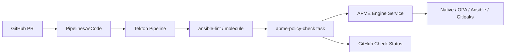

# APME Guide

**Ansible Policy & Modernization Engine — organization policy gate for PR validation**

## Overview

APME is the platform's **final PR quality gate** (Step 9, gate 6). It runs after ansible-lint, molecule, and build verification via Tekton/Pipelines as Code, scanning Ansible content against organization policies using the in-cluster APME service.

## Architecture



## Deployment

APME is deployed via ArgoCD application `applications/apme/`:

- Helm chart: `apme/apme` from `https://ansible.github.io/apme`
- Namespace: `apme`
- Route: `apme.apps.<cluster-domain>` (UI + Gateway API at `/api`)
- Image tag: `2026.8.6` (pinned to chart `appVersion`)

```bash
# Verify after sync
oc -n apme get pods
oc -n apme get route apme
curl -k https://apme.apps.<cluster-domain>/api/v1/health
```

## Organization policies

Central policies live in [rh1-cluster-config/applications/apme/policies/](../../rh1-cluster-config/applications/apme/policies/):

| File | Purpose |
|------|---------|
| `rules.yml` | Rule severity overrides and enable/disable flags |
| `opa/` | Custom OPA Rego bundles (optional) |

Synced to CI namespaces as ConfigMap `apme-org-policies`.

### Repository overrides

Content repos may add `.apme/rules.yml` for repo-specific settings and `.apme/suppressions.yml` for approved exceptions.

## PR pipeline integration

### Collection (`rh1-custom-collection`)

PAC pipeline [`.tekton/build-and-test.yml`](../../rh1-custom-collection/.tekton/build-and-test.yml):

```
fetch-source → build → molecule → apme-policy-check
```

### Playbooks (`rh1-automation-playbooks`)

PAC pipeline [`.tekton/pr-policy.yml`](../../rh1-automation-playbooks/.tekton/pr-policy.yml):

```
fetch-source → apme-policy-check
```

### Shared Tekton task

[`rh1-cluster-config/tekton-tasks/apme-policy-check-task.yml`](../../rh1-cluster-config/tekton-tasks/apme-policy-check-task.yml)

| Param | Default | Description |
|-------|---------|-------------|
| `apme-primary-address` | `apme-engine.apme.svc.cluster.local:50060` | APME Primary gRPC endpoint |
| `fail-on-severity` | `error` | Minimum severity that fails the task |
| `ansible-version` | `2.17` | Target ansible-core for migration rules |

## GitHub branch protection

Configure required status checks on `main`:

- `apme-policy-check` (PAC/Tekton)
- `ansible-lint` (GitHub Actions)
- `molecule` / `all_green` (as applicable)

APME runs **only on Tekton** to avoid duplicate scans. GitHub Actions handles fast feedback; APME enforces org policy before merge.

## Local development

Port-forward APME and run checks before opening a PR:

```bash
oc -n apme port-forward svc/apme-engine 50060:50060 &
export APME_PRIMARY_ADDRESS=127.0.0.1:50060
pip install "apme-engine @ git+https://github.com/ansible/apme.git@v2026.8.6"
apme check .
```

For remediation (not run in CI):

```bash
apme remediate --interactive .
```

## Troubleshooting

| Issue | Check |
|-------|-------|
| Task cannot reach APME | `oc -n apme get svc`; verify `apme-primary-address` param |
| Policy not applied | ConfigMap `apme-org-policies` in CI namespace |
| False positive | Add `.apme/suppressions.yml` or adjust org `rules.yml` |
| Slow PR pipeline | APME runs last by design; check engine pod resources |

## Related documentation

- [PLATFORM-GUIDE.md](./PLATFORM-GUIDE.md) — Step 9 PR workflow
- [VALIDATION-QUALITY-GUIDE.md](./VALIDATION-QUALITY-GUIDE.md) — Validation layers
- [CICD-GUIDE.md](./CICD-GUIDE.md) — Tekton task reference
- [SECURITY-GUIDE.md](./SECURITY-GUIDE.md) — Policy enforcement
