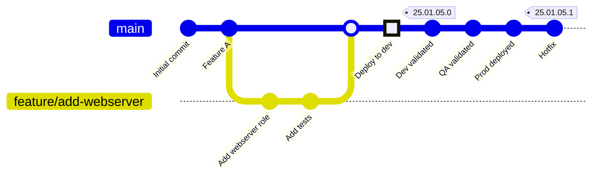
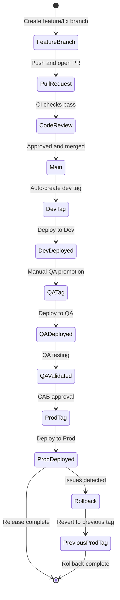

# Branching Strategy

**Trunk-Based Development with Git Tags for Environment Promotion**

---

## 🎯 Overview

This platform uses **Trunk-Based Development with Git Tags** as the branching strategy. This approach provides:

- ✅ **Simplified Git management** - Single main branch, no long-lived environment branches
- ✅ **Immutable releases** - Git tags create fixed points for each environment
- ✅ **Fast integration** - Frequent merges to main reduce conflicts
- ✅ **Clear promotion path** - Tags explicitly mark what's deployed where
- ✅ **Easy rollback** - Revert to previous tag
- ✅ **AAP Integration** - AAP Projects can checkout specific tags

---

## 📖 Strategy Overview



> **Note**: This platform uses **CalVer (YY.MM.DD.PATCH)** versioning. The same tag promotes through all environments (dev → qa → prod). See [VERSIONING-STRATEGY.md](./VERSIONING-STRATEGY.md) for details.

---

## 🌿 Branch Structure

### Main Branch

**Branch**: `main` (or `master`)

**Purpose**: Single source of truth for all development

**Characteristics**:
- Always in a releasable state
- Protected branch (requires PR + approvals)
- All changes merged here first
- Dev environment tracks HEAD of main

**Rules**:
- ❌ No direct commits (except initial setup)
- ✅ All changes via Pull Request
- ✅ Must pass CI/CD checks
- ✅ Requires code review approval

---

### Feature Branches

**Naming**: `feature/<description>` or `feat/<description>`

**Lifespan**: Short-lived (hours to days, not weeks)

**Purpose**: Develop new features or fixes

**Workflow**:
```bash
# Create feature branch
git checkout -b feature/add-monitoring main

# Make changes
git add .
git commit -m "feat: add monitoring role"

# Push and create PR
git push origin feature/add-monitoring

# After PR approval and merge, delete branch
git branch -d feature/add-monitoring
```

**Examples**:
- `feature/add-webserver-role`
- `feature/update-ee-dependencies`
- `feature/configure-backup-job`

---

### Fix Branches

**Naming**: `fix/<description>` or `bugfix/<description>`

**Purpose**: Bug fixes and corrections

**Examples**:
- `fix/webserver-port-binding`
- `fix/inventory-syntax-error`
- `bugfix/ee-build-failure`

---

### Hotfix Branches

**Naming**: `hotfix/<description>`

**Purpose**: Emergency fixes for production

**Special Workflow**:
```bash
# Branch from previous release tag
git checkout -b hotfix/critical-security-fix 25.01.05.0

# Fix the issue
git commit -m "fix: patch critical security vulnerability"

# Merge to main
git checkout main
git merge hotfix/critical-security-fix

# Create hotfix tag (increment PATCH)
git tag -a 25.01.05.1 -m "Hotfix: security patch"

# Push tag (same tag promotes through all environments)
git push origin 25.01.05.1
```

---

## 🏷️ Git Tags for Environment Promotion

### Tag Naming Convention

**Version Format**: `YY.MM.DD.PATCH` (Calendar Versioning)

**Single tag promoted across all environments:**

| Environment | Tag Used | Example | Notes |
|-------------|----------|---------|-------|
| **Development** | `YY.MM.DD.PATCH` | `25.01.05.0` | Same tag as QA/Prod |
| **QA** | `YY.MM.DD.PATCH` | `25.01.05.0` | Same tag promoted from Dev |
| **Production** | `YY.MM.DD.PATCH` | `25.01.05.0` | Same tag promoted from QA |

**Key Benefits:**
- ✅ **Atomic promotion** - one tag, multiple environments
- ✅ **Simplified management** - no environment-specific tags
- ✅ **Clear audit trail** - release manifest tracks which tag is where
- ✅ **Reduces tag sprawl** - one tag instead of three per release

**See**: [VERSIONING-STRATEGY.md](./VERSIONING-STRATEGY.md) for complete details.

### Tag Characteristics

**All Tags:**
- Created manually when ready for release
- Format: `YY.MM.DD.PATCH`
- Use PATCH=0 for new day, increment for hotfixes
- Immutable (never deleted)
- Same tag promoted through all environments
- Release manifest tracks deployment status per environment

---

## 🔄 Promotion Workflow

### 1. Development Environment

**Trigger**: Merge to `main`

**Process**:
```bash
# Developer merges PR to main
git checkout main
git pull

# Automatic: CI creates dev tag
git tag dev-$(git rev-parse --short HEAD)
git push origin dev-$(git rev-parse --short HEAD)

# AAP Dev Project syncs from main HEAD or dev tag
```

**AAP Project Configuration**:
- **Project Name**: "Dev - Automation Collection"
- **SCM Branch/Tag/Commit**: `main` or `dev-*`
- **Update on Launch**: ✅ Enabled

**Characteristics**:
- Fully automated
- Continuous deployment
- Fast feedback (<1 minute)

---

### 2. QA Environment

**Trigger**: Manual promotion request

**Process**:
```bash
# 1. Ensure main is tested in dev
git checkout main
git pull

# 2. Create QA release tag (calendar version)
git tag -a qa-25.01.05.0 -m "Release January 5, 2025 for QA testing"

# 3. Push tag
git push origin qa-25.01.05.0

# 4. Tekton promotion pipeline triggered by tag
#    - Syncs AAP Project to 25.01.05.0
#    - Builds EE with tag: ee:25.01.05.0
#    - Deploys to QA environment
#    - Runs smoke tests
```

**AAP Project Configuration**:
- **Project Name**: "QA - Automation Collection"
- **SCM Branch/Tag/Commit**: `25.01.05.0` (specific tag)
- **Update on Launch**: ❌ Disabled (use exact tag)

**Promotion Gates**:
- ✅ All dev tests passed
- ✅ Code review completed
- ✅ QA Lead approval

**Characteristics**:
- Manual trigger
- Specific version deployed
- Full test suite execution

---

### 3. Production Environment

**Trigger**: Manual promotion with CAB approval

**Process**:
```bash
# 1. Verify QA tag is validated
git checkout qa-25.01.05.0

# 2. Create production tag
git tag -a prod-25.01.05.0 -m "Production Release January 5, 2025
Approved by: CAB
Approval Date: 2025-01-05
Approval Ticket: CHG0001234"

# 3. Push tag
git push origin prod-25.01.05.0

# 4. Tekton promotion pipeline with approval gate
#    - Waits for manual approval
#    - Creates backup/rollback point
#    - Syncs AAP Prod Project to same tag (25.01.05.0)
#    - Uses same EE image: ee:25.01.05.0
#    - Deploys to Prod (blue-green)
#    - Runs verification
```

**AAP Project Configuration**:
- **Project Name**: "Prod - Automation Collection"
- **SCM Branch/Tag/Commit**: `25.01.05.0` (specific tag)
- **Update on Launch**: ❌ Disabled (use exact tag)

**Promotion Gates**:
- ✅ QA testing completed
- ✅ QA sign-off obtained
- ✅ Security scan passed
- ✅ CAB approval received
- ✅ Change window scheduled
- ✅ Rollback plan documented

**Characteristics**:
- Manual approval required
- Backup created first
- Blue-green deployment
- Extended monitoring period

---

## 📋 Complete Workflow Example

### Scenario: Add New Webserver Role

```bash
# === Developer Workflow ===

# 1. Create feature branch
git checkout main
git pull
git checkout -b feature/add-webserver-role

# 2. Develop the role
cd automation-collection-example/roles
ansible-creator add resource role webserver .
# ... develop role, add tests ...

# 3. Test locally
molecule test

# 4. Commit changes
git add .
git commit -m "feat: add webserver role with molecule tests"

# 5. Push and create PR
git push origin feature/add-webserver-role
gh pr create --title "Add webserver role" --body "Implements Apache webserver deployment"

# === After PR Approval ===

# 6. Merge to main (via GitHub UI or CLI)
gh pr merge --squash

# 7. Automatic dev deployment
# CI creates tag: dev-abc1234
# AAP Dev syncs and deploys

# === Promote to QA ===

# 8. After dev validation, create release tag
git checkout main
git pull
git tag -a 25.01.05.0 -m "Release January 5, 2025: Add webserver role"
git push origin 25.01.05.0

# 9. Tekton promotion pipeline runs
# Deploys to dev, then promotes to QA after validation

# 10. QA team validates
# Runs test playbooks, verifies functionality

# === Promote to Production ===

# 11. After QA approval, submit to CAB
# Create change request, document rollback plan

# 12. After CAB approval, update release manifest
# Mark tag 25.01.05.0 as approved for production

# 13. Tekton production pipeline runs
# Deploys same tag (25.01.05.0) to production with approval gate

# === Rollback if Needed ===

# 14. If issues found, rollback to previous tag
# Update release manifest to deploy 25.01.04.0 to prod
# Or create new tag pointing to previous commit
```

---

## 🔄 Synchronization with Other Components

### Execution Environment (EE) Versioning

EE images are tagged to match the code release tags:

```bash
# Build EE for QA release
cd automation-ee-example
ansible-builder build -t my-registry/my-ee:25.01.05.0

# Push to registry
podman push my-registry/my-ee:25.01.05.0
```

**AAP Job Template Configuration**:
```yaml
name: "Deploy Webserver - QA"
execution_environment: "my-registry/my-ee:25.01.05.0"  # Matches code tag
project: "QA - Automation Collection"
project_version: "qa-25.01.05.0"  # Matches code tag
```

**Benefits**:
- Code and runtime environment are synchronized
- No version mismatch between playbooks and dependencies
- Easy rollback (code + EE together)

### Release Manifests

Release manifests tie everything together:

```yaml
# automation-release-manifest/releases/release-25.01.05.0.yaml
version: "25.01.05.0"
created: "2025-01-05T10:30:00Z"
components:
  automation_collection:
    repository: "github.com/org/automation-collection"
    commit: "abc1234567890abcdef1234567890abcdef12345"  # Full SHA
    tag: "25.01.05.0"
  execution_environment:
    image: "my-registry/my-ee:25.01.05.0"
    digest: "sha256:1234567890abcdef..."  # Image digest
  aap_configuration:
    repository: "github.com/org/aap-config-as-code"
    commit: "def4567890abcdef1234567890abcdef45678901"
    tag: "25.01.05.0"

# Track which environments have this tag deployed
environments:
  dev:
    deployed_at: "2025-01-05T09:00:00Z"
    deployed_by: "tekton-pipeline"
  qa:
    deployed_at: "2025-01-05T11:00:00Z"
    deployed_by: "release-team"
    validated: true
  prod:
    deployed_at: "2025-01-05T15:00:00Z"
    deployed_by: "release-manager"
    approved_by: "CAB"
    approved_at: "2025-01-05T14:00:00Z"
```

---

## 🚫 Anti-Patterns to Avoid

### ❌ Long-Lived Environment Branches

**Bad**:
```
main
├── dev (branch)
├── qa (branch)
└── prod (branch)
```

**Why it's bad**:
- Environment branches diverge over time
- Merge conflicts between environments
- Unclear what's deployed where
- Difficult to synchronize changes

**Instead**: Use main + tags

---

### ❌ Using "latest" or Branch Names in Production

**Bad**:
```yaml
# AAP Prod Project
scm_branch: "main"  # ❌ Moves over time

# AAP Prod Job Template
execution_environment: "my-ee:latest"  # ❌ Unpredictable
```

**Instead**: Use specific tags
```yaml
# AAP Project (same tag for all environments)
scm_branch: "25.01.05.0"  # ✅ Immutable CalVer tag

# AAP Job Template
execution_environment: "my-ee:25.01.05.0"  # ✅ Matching version
```

---

### ❌ Skipping Environments

**Bad**:
```bash
# Merge to main, deploy directly to prod without testing
git tag 25.01.05.0  # ❌ Skip dev/QA testing
```

**Instead**: Follow the promotion path
```bash
# Create single CalVer tag
git tag 25.01.05.0   # Create release tag
# Promote through: dev → qa → prod
# Same tag used for all environments
```

---

### ❌ Reusing or Moving Tags

**Bad**:
```bash
git tag -d 25.01.05.0        # ❌ Delete tag
git tag 25.01.05.0 <new-commit>  # ❌ Recreate on different commit
git push origin 25.01.05.0 --force  # ❌ Force push tag
```

**Why it's bad**:
- Breaks immutability
- Loses audit trail
- AAP may cache old version

**Instead**: Create new version (increment PATCH)
```bash
git tag 25.01.05.1  # ✅ New version (hotfix)
```

---

## 🔧 Git Configuration

### Protected Branches

Configure `main` branch protection in GitHub:

```yaml
# .github/settings.yml (if using Probot Settings)
branches:
  - name: main
    protection:
      required_pull_request_reviews:
        required_approving_review_count: 1
        dismiss_stale_reviews: true
      required_status_checks:
        strict: true
        contexts:
          - "pre-commit"
          - "ansible-lint"
          - "molecule-test"
      enforce_admins: true
      required_linear_history: true
      allow_force_pushes: false
      allow_deletions: false
```

### Tag Protection

Protect release tags from deletion:

```bash
# GitHub Repository Settings
# Settings > Tags > Protected tags
# Pattern: [0-9][0-9].*  # Protects all CalVer tags
# - Prevent tag deletion
# - Require approval to create
```

---

## 📊 Branch and Tag Lifecycle



---

## 📖 Best Practices

### 1. Keep Feature Branches Short-Lived

- Aim for branches that live <2 days
- Merge frequently to avoid conflicts
- Use feature flags for incomplete features

### 2. Write Meaningful Tag Messages

```bash
# Good
git tag -a qa-25.01.05.0 -m "Release January 5, 2025: Add monitoring and logging
- Add monitoring role with Prometheus integration
- Add logging role with ELK stack
- Update EE with required collections
Tested: All molecule tests pass
QA Ticket: QA-1234"

# Bad
git tag qa-25.01.05.0  # No message
```

### 3. Document Promotion Decisions

```bash
# Production tag should document approvals in release manifest
# Tag message focused on changes
git tag -a 25.01.05.0 -m "Release January 5, 2025

Features:
- Webserver role with HA support
- Database backup automation

Testing:
- All molecule tests passed
- Security scan: PASS
- Performance validated

Rollback Plan: Revert to 25.01.04.0"

# Approvals tracked in release manifest:
# - QA Sign-off: Jane Doe (2025-01-05)
# - Security Review: PASS
# - CAB Approval: CHG0001234 (2025-01-05)
```

### 4. Use Semantic Versioning

**Note**: As of 2025-01-05, we use **Calendar Versioning** (YY.MM.DD.PATCH) instead of Semantic Versioning.

See [VERSIONING-STRATEGY.md](./VERSIONING-STRATEGY.md) for details on the current versioning approach.

**Version Format**: `YY.MM.DD.PATCH`
- **YY.MM.DD**: Release date
- **PATCH**: Hotfix/patch number (starts at 0)

### 5. Automate Where Possible

- CI automatically creates dev tags on merge
- Tekton pipelines triggered by tag creation
- AAP Projects auto-sync on tag push (for dev)

---

## 🔗 Integration with Platform Components

### ArgoCD (Platform Loop)

ArgoCD manages the platform configuration:

```yaml
# argocd/applications/aap-dev.yaml
apiVersion: argoproj.io/v1alpha1
kind: Application
metadata:
  name: aap-dev
spec:
  source:
    repoURL: https://github.com/org/cluster-config
    targetRevision: main  # Tracks main for dev
```

### Tekton (Application Loop)

Tekton promotes releases based on tags:

```yaml
# tekton/pipelines/promote-to-qa.yaml
apiVersion: tekton.dev/v1beta1
kind: Pipeline
metadata:
  name: promote-to-qa
spec:
  params:
    - name: release-tag
      description: Release tag in CalVer format (e.g., 25.01.05.0)
  tasks:
    - name: sync-project
      params:
        - name: tag
          value: $(params.qa-tag)
```

### AAP Projects

AAP Projects configured per environment to use same tags:

| Environment | Project Config |
|-------------|---------------|
| **Dev** | Tag: `25.01.05.0`, Update on Launch: ❌ |
| **QA** | Tag: `25.01.05.0`, Update on Launch: ❌ |
| **Prod** | Tag: `25.01.05.0`, Update on Launch: ❌ |

**Note**: All environments use the same git tag. Promotion is managed via release manifest and pipeline approvals.

---

## 📚 Related Documentation

- [Constitution - Article I: GitOps First](../.specify/memory/constitution.md#article-i-gitops-first)
- [Promotion Flow Diagrams](./diagrams/PROMOTION-FLOW.md)
- [CI/CD Guide](./CICD-GUIDE.md)
- [Release Manifest Structure](./diagrams/REPOSITORY-STRUCTURE.md)
- [Naming Conventions - Git Tags](./NAMING-CONVENTIONS.md#git-tags)

---

## 🎓 Training Resources

- **Red Hat CoP**: [Automation Good Practices - Git Workflow](https://redhat-cop.github.io/automation-good-practices/)
- **Trunk-Based Development**: https://trunkbaseddevelopment.com/
- **Semantic Versioning**: https://semver.org/
- **Git Tagging**: https://git-scm.com/book/en/v2/Git-Basics-Tagging

---

**Version**: 1.0
**Last Updated**: 2025-01-04
**Constitutional Compliance**: ✅ Article I (GitOps First), Article III (Atomic Promotion)

