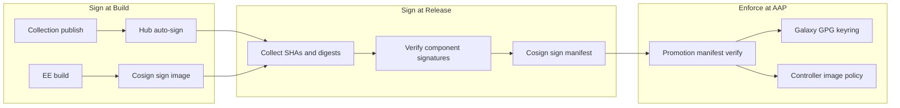

# Content Signing Guide

**Cryptographic content signature validation for the Cloud-Native Ansible Lifecycle Platform**

## Overview

The platform signs automation content at build and manifest-creation time, and enforces signature validation when AAP consumes collections and execution environments.

| Artifact | Signing | Verification |
|----------|---------|--------------|
| Ansible collections | Automation Hub GPG signing | `ansible-galaxy collection verify --keyring` |
| Execution environments | Cosign (key-based) | Cosign verify in Tekton; AAP controller `policy.json` |
| Release manifests | Cosign `sign-blob` | Cosign `verify-blob` before QA/Prod promotion |

## Architecture



## Key Management

All signing keys are stored in **HashiCorp Vault** (KV v2) and synced via External Secrets Operator. See [VAULT-GUIDE.md](./VAULT-GUIDE.md) and [rh1-cluster-config README](https://github.com/djdanielsson/rh1-cluster-config/blob/main/README.md#hashicorp-vault-bootstrap).

| Vault path | Kubernetes secret | Purpose |
|------------|-------------------|---------|
| `rh1/platform/signing/cosign` | `cosign-signing-key`, `cosign-public-key` | Sign/verify EE images and release manifests |
| `rh1/platform/signing/galaxy-gpg` | `galaxy-gpg-keyring` | Verify collection signatures |
| `rh1/platform/signing/hub-collection` | `hub-collection-signing-key` | Automation Hub collection signing |

### Generate Cosign keys

```bash
cosign generate-key-pair
vault kv put secret/rh1/platform/signing/cosign \
  cosign_key=@cosign.key cosign_pub=@cosign.pub password=""
```

### Key rotation

1. Generate new Cosign keypair
2. Update Vault path `rh1/platform/signing/cosign`
3. Wait for ExternalSecret refresh (or force reconcile)
4. Re-sign active EE images and release manifests with new key
5. Update `trusted.asc` / keyring used by AAP controller policy

## Tekton Tasks

Shared tasks in `rh1-cluster-config/tekton-tasks/`:

| Task | Description |
|------|-------------|
| `cosign-sign-image` | Sign container image digest |
| `cosign-verify-image` | Verify container image signature |
| `cosign-sign-blob` | Sign release manifest YAML |
| `cosign-verify-blob` | Verify release manifest signature |
| `ansible-galaxy-collection-verify` | Verify collection Hub signature |
| `skopeo-inspect-digest` | Resolve image digest for manifest |

## Pipeline Integration

### Collection release (`rh1-custom-collection`)

1. Build and publish collection to Hub
2. Verify signature with GPG keyring
3. Approve collection for published repo

### EE release (`rh1-ee`)

1. Build EE with `signature_required` container policy
2. Install collections with GPG keyring
3. Cosign sign image after buildah push

### Release manifest (`rh1-release-manifest`)

1. Tag all component repositories
2. Collect Git SHAs and EE digest into manifest
3. Verify EE Cosign signature and collection GPG signature
4. Cosign sign manifest blob; commit `.sig` and `.bundle` sidecars
5. Promotion pipelines verify manifest signature before applying CaC

## AAP Enforcement

### Collections

`ansible.cfg` in `rh1-aap-config-as-code`:

```ini
[galaxy]
gpg_keyring = /etc/ansible/galaxy-keyring/pubring.kbx
required_valid_signature_count = +1
```

Controller settings (QA/Prod via `inventory/group_vars/aap_*/settings.yml`):

- `GALAXY_SIGNATURE_VERIFICATION=True`
- `GALAXY_REQUIRED_VALID_SIGNATURE_COUNT=+1`

### Execution environments

- EE images use digest pins from signed release manifest when available
- Controller `policy.json` (from `rh1-cluster-config`) requires signed images from Quay

### Automation Hub

Hub signing is configured via `hub-collection-signing-config` ConfigMap and `hub-collection-signing-key` secret in each AAP namespace.

## Local Validation

```bash
# Verify release manifest signature
export COSIGN_PUBKEY_FILE=/path/to/cosign.pub
./scripts/verify-release-signatures.sh releases/release-26.1.27-0.yml

# Verify EE image
./scripts/verify-image-signature.sh quay.io/igou/rh1-ee:26.1.27-0 ./cosign.pub

# Full manifest validation
./scripts/validate-manifest.sh releases/
```

## Troubleshooting

| Symptom | Likely cause | Fix |
|---------|--------------|-----|
| `cosign verify` fails | Wrong key or unsigned image | Re-run EE release pipeline; confirm key in Vault `rh1/platform/signing/cosign` |
| `ansible-galaxy collection verify` fails | Hub signing not enabled | Enable Hub signing on AAP; approve collection |
| Promotion blocked on manifest | Missing `.sig` sidecar | Re-run `release-create` pipeline |
| AAP project sync fails | Keyring not mounted | Verify `galaxy-gpg-keyring` secret in AAP namespace |
| EE pull fails on controller | `policy.json` rejects unsigned image | Cosign sign image; confirm public key in policy |

## Related Documentation

- [SECURITY-GUIDE.md](./SECURITY-GUIDE.md)
- [VAULT-GUIDE.md](./VAULT-GUIDE.md)
- [VALIDATION-QUALITY-GUIDE.md](./VALIDATION-QUALITY-GUIDE.md)
- [diagrams/PLATFORM-ARCHITECTURE.md](./diagrams/PLATFORM-ARCHITECTURE.md)
- [diagrams/PROMOTION-FLOW.md](./diagrams/PROMOTION-FLOW.md)
