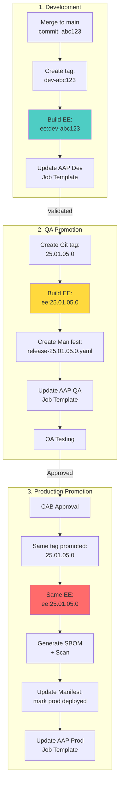

# Execution Environment Versioning Strategy

**Immutable, Version-Locked EE Images Synchronized with Code Releases**

**Version Format**: YY.MM.DD.PATCH (Calendar Versioning)

---

## 🎯 Overview

Execution Environments (EE) must be **version-locked** using **YY.MM.DD.PATCH** format to match code release tags, ensuring that Ansible playbooks and their runtime dependencies are always synchronized.

### Core Principle

> **Every code release tag has a corresponding EE image tag using YY.MM.DD.PATCH format**

```
Code Tag: 25.01.05.0  →  EE Image: my-registry/my-ee:25.01.05.0
```

**Benefits**:
- ✅ **Reproducibility**: Same code always runs with same dependencies
- ✅ **Rollback Safety**: Roll back code + EE together as a unit
- ✅ **Version Clarity**: Easy to identify what's running where
- ✅ **Immutability**: Tagged images never change
- ✅ **Traceability**: Clear audit trail from code to runtime

---

## 📋 Table of Contents

- [Version Tagging Convention](#version-tagging-convention)
- [Build Process](#build-process)
- [Promotion Workflow](#promotion-workflow)
- [AAP Job Template Configuration](#aap-job-template-configuration)
- [Release Manifest Integration](#release-manifest-integration)
- [CI/CD Integration](#cicd-integration)
- [Rollback Strategy](#rollback-strategy)
- [Best Practices](#best-practices)
- [Anti-Patterns](#anti-patterns)

---

## 🏷️ Version Tagging Convention

### Tag Format

| Component | Format | Example |
|-----------|--------|---------|
| **Code Tag** | `YY.MM.DD.PATCH` | `25.01.05.0` |
| **EE Image** | `ee:YY.MM.DD.PATCH` | `quay.io/myorg/automation-ee:25.01.05.0` |

**Note**: Same tag used for both code and EE image. Same tag promotes through all environments (dev → qa → prod).

### Additional Tags

```bash
# Primary version tag (immutable)
quay.io/myorg/automation-ee:25.01.05.0

# Git commit SHA for traceability
quay.io/myorg/automation-ee:sha-abc123def456

# Convenience tags (mutable, for dev only)
quay.io/myorg/automation-ee:dev-latest      # ⚠️ Dev only, never use in QA/Prod
```

### Tag Immutability Rules

- ✅ **Version tags** (`YY.MM.DD.PATCH`): **IMMUTABLE** - never overwritten
- ✅ **SHA tags** (`sha-*`): **IMMUTABLE** - permanent record
- ⚠️ **Convenience tags** (`dev-latest`): **MUTABLE** - dev environment only
- ❌ **Never use** `latest` in QA or Production

---

## 🔨 Build Process

### 1. Development Build (Automatic)

**Trigger**: Merge to main branch

```bash
#!/bin/bash
# Triggered by Tekton pipeline on merge to main

# Get version
VERSION=$(date +"%y.%m.%d").0
SHA=$(git rev-parse --short HEAD)
DEV_TAG="dev-${VERSION}-${SHA}"

# Build EE with dev tag
cd automation-ee-example
ansible-builder build \
  --tag "quay.io/myorg/automation-ee:${VERSION}" \
  --tag "quay.io/myorg/automation-ee:sha-$(git rev-parse HEAD)" \
  --tag "quay.io/myorg/automation-ee:dev-latest" \
  --container-runtime podman

# Push to registry
podman push "quay.io/myorg/automation-ee:${VERSION}"
podman push "quay.io/myorg/automation-ee:sha-$(git rev-parse HEAD)"
podman push "quay.io/myorg/automation-ee:dev-latest"

echo "✅ Built and pushed EE: ${VERSION}"
```

### 2. QA Build (Manual Trigger)

**Trigger**: Git tag creation (`qa-YY.MM.DD.PATCH`)

```bash
#!/bin/bash
# Triggered by Tekton pipeline on git tag creation

# Extract tag from git (e.g., 25.01.05.0)
QA_TAG="${1}"  # Passed from Tekton trigger

# Extract version from tag (remove qa- prefix)
VERSION="${QA_TAG#qa-}"

# Validate tag format
if [[ ! "${VERSION}" =~ ^[0-9]{2}\.(0[1-9]|1[0-2])\.(0[1-9]|[12][0-9]|3[01])\.[0-9]+$ ]]; then
  echo "❌ Invalid QA tag format: ${QA_TAG}"
  exit 1
fi

# Checkout the tagged commit
git checkout "${QA_TAG}"
COMMIT_SHA=$(git rev-parse HEAD)

# Build EE with version tag
cd automation-ee-example
ansible-builder build \
  --tag "quay.io/myorg/automation-ee:${VERSION}" \
  --tag "quay.io/myorg/automation-ee:sha-${COMMIT_SHA}" \
  --container-runtime podman

# Get image digest for immutability tracking
IMAGE_DIGEST=$(podman inspect "quay.io/myorg/automation-ee:${VERSION}" \
  --format '{{.Digest}}')

# Push to registry
podman push "quay.io/myorg/automation-ee:${VERSION}"
podman push "quay.io/myorg/automation-ee:sha-${COMMIT_SHA}"

echo "✅ Built and pushed EE: ${VERSION}"
echo "📦 Image Digest: ${IMAGE_DIGEST}"
```

### 3. Production Build (Manual Trigger with Approval)

**Trigger**: Promotion pipeline + CAB approval

```bash
#!/bin/bash
# Triggered by Tekton pipeline with approval gate

PROD_TAG="${1}"
APPROVAL_TICKET="${2}"  # CAB approval ticket

# Validate tag format
if [[ ! "${VERSION}" =~ ^[0-9]{2}\.[0-9]{2}\.[0-9]{2}\.[0-9]+$ ]]; then
  echo "❌ Invalid Prod tag format: ${PROD_TAG}"
  exit 1
fi

# Verify approval exists (check external system)
if ! verify_cab_approval "${APPROVAL_TICKET}"; then
  echo "❌ No CAB approval found for ${APPROVAL_TICKET}"
  exit 1
fi

# Checkout the tagged commit
git checkout "${PROD_TAG}"
COMMIT_SHA=$(git rev-parse HEAD)

# Build EE with production tag
cd automation-ee-example
ansible-builder build \
  --tag "quay.io/myorg/automation-ee:${PROD_TAG}" \
  --tag "quay.io/myorg/automation-ee:sha-${COMMIT_SHA}" \
  --container-runtime podman

# Get image digest
IMAGE_DIGEST=$(podman inspect "quay.io/myorg/automation-ee:${PROD_TAG}" \
  --format '{{.Digest}}')

# Push to registry
podman push "quay.io/myorg/automation-ee:${PROD_TAG}"
podman push "quay.io/myorg/automation-ee:sha-${COMMIT_SHA}"

# Generate SBOM (Software Bill of Materials)
syft "quay.io/myorg/automation-ee:${PROD_TAG}" \
  -o json > "sbom-${PROD_TAG}.json"

# Scan for vulnerabilities
grype "quay.io/myorg/automation-ee:${PROD_TAG}" \
  -o json > "scan-${PROD_TAG}.json"

echo "✅ Built and pushed EE: ${PROD_TAG}"
echo "📦 Image Digest: ${IMAGE_DIGEST}"
echo "🔒 Approval: ${APPROVAL_TICKET}"
```

---

## 🔄 Promotion Workflow

### Complete Flow: Code → EE → Deployment



### Synchronization Example

```yaml
# Step 1: Developer creates Git tag
$ git tag -a 25.01.05.0 -m "Release January 5, 2025"
$ git push origin 25.01.05.0

# Step 2: Tekton pipeline triggered
#   - Builds EE with tag: ee:25.01.05.0
#   - Creates release manifest
#   - Updates AAP QA Job Templates

# Step 3: AAP Job Template (automatically updated via CaC)
---
controller_templates:
  - name: "Deploy Webserver - QA"
    project: "Automation Collection"
    project_version: "25.01.05.0"  # ← Git tag
    execution_environment: "Automation EE QA"
    # ↓ EE configured to use version-tagged image

controller_execution_environments:
  - name: "Automation EE QA"
    image: "quay.io/myorg/automation-ee:25.01.05.0"  # ← Matching EE tag
    pull: missing
```

---

## 🎮 AAP Job Template Configuration

### Version-Locked Job Template

```yaml
# File: aap-config-as-code/group_vars/aap_qa/job_templates.yml

controller_templates:
  - name: "Deploy Webserver - QA"
    description: "Deploy Apache webserver to QA environment"
    organization: "Platform"
    inventory: "QA Infrastructure"
    project: "Automation Collection"

    # ⚠️ CRITICAL: Lock to specific Git tag
    scm_branch: "25.01.05.0"  # NOT 'main', specific tag

    # ⚠️ CRITICAL: Lock to version-tagged EE
    execution_environment: "Automation EE - 25.01.05.0"

    playbook: "playbooks/deploy-webserver.yml"

    credentials:
      - "QA SSH Key"

    # Don't auto-update in QA/Prod
    ask_scm_branch_on_launch: false
    ask_execution_environment_on_launch: false
```

### Execution Environment Definition

```yaml
# File: aap-config-as-code/group_vars/aap_qa/execution_environments.yml

controller_execution_environments:
  - name: "Automation EE - 25.01.05.0"
    description: "Execution Environment (25.01.05.0)"
    organization: "Platform"

    # ⚠️ CRITICAL: Use full image path with version tag
    image: "quay.io/myorg/automation-ee:25.01.05.0"

    # Use digest for ultimate immutability (optional but recommended)
    # image: "quay.io/myorg/automation-ee@sha256:abc123..."

    credential: "Quay.io Registry"
    pull: "missing"  # Don't pull if already present
```

### Production Example with Digest

```yaml
# File: aap-config-as-code/group_vars/aap_prod/execution_environments.yml

controller_execution_environments:
  - name: "Automation EE - 25.01.04.0"
    description: "Production Execution Environment (25.01.04.0)"
    organization: "Platform"

    # Best Practice: Use image digest in production
    image: "quay.io/myorg/automation-ee@sha256:1234567890abcdef..."

    # Or version tag (also acceptable)
    # image: "quay.io/myorg/automation-ee:25.01.04.0"

    credential: "Quay.io Registry"
    pull: "missing"
```

---

## 📦 Release Manifest Integration

### Complete Release Manifest with EE Version

```yaml
# File: automation-release-manifest/releases/qa/release-25.01.05.0.yaml

version: "25.01.05.0"
created: "2025-01-04T10:30:00Z"
created_by: "tekton-pipeline"
environment: "qa"

components:
  automation_collection:
    repository: "github.com/myorg/automation-collection"
    ref_type: "tag"
    ref: "25.01.05.0"
    commit: "abc1234567890abcdef1234567890abcdef12345"

  execution_environment:
    name: "automation-ee"
    registry: "quay.io"
    image: "quay.io/myorg/automation-ee:25.01.05.0"
    digest: "sha256:1234567890abcdef1234567890abcdef1234567890abcdef1234567890abcdef"
    built_at: "2025-01-04T10:25:00Z"
    base_image: "quay.io/ansible/creator-ee:v0.20.1"
    python_version: "3.11"
    ansible_core_version: "2.16.0"

    # Track dependencies in EE
    collections:
      - name: "ansible.posix"
        version: "1.5.4"
      - name: "ansible.utils"
        version: "3.1.0"
      - name: "community.general"
        version: "8.1.0"
      - name: "kubevirt.core"
        version: "1.3.0"

    python_packages:
      - name: "jmespath"
        version: "1.0.1"
      - name: "netaddr"
        version: "0.9.0"

    system_packages:
      - "git-2.43.0"
      - "openssh-clients-8.7"

  aap_configuration:
    repository: "github.com/myorg/aap-config-as-code"
    ref_type: "tag"
    ref: "25.01.05.0"
    commit: "def4567890abcdef1234567890abcdef45678901"

testing:
  unit_tests: "passed"
  integration_tests: "passed"
  molecule_tests: "passed"
  security_scan: "passed"

approvals:
  - approver: "qa-lead@example.com"
    approved_at: "2025-01-04T14:30:00Z"
    ticket: "QA-1234"

artifacts:
  sbom: "https://artifactory.example.com/sbom/25.01.05.0.json"
  vulnerability_scan: "https://artifactory.example.com/scans/25.01.05.0.json"
  collection_tarball: "https://artifactory.example.com/myorg-custom_collection-1.1.0.tar.gz"
```

---

## 🔧 CI/CD Integration

### Tekton Pipeline: Build EE on Tag

```yaml
# File: cluster-config/tekton/pipelines/build-ee-on-tag.yaml

apiVersion: tekton.dev/v1beta1
kind: Pipeline
metadata:
  name: build-ee-on-tag
  namespace: aap-cicd
spec:
  params:
    - name: git-tag
      description: "Git tag (e.g., 25.01.05.0)"
    - name: git-url
      default: "https://github.com/myorg/automation-ee"
    - name: image-registry
      default: "quay.io/myorg"
    - name: image-name
      default: "automation-ee"

  workspaces:
    - name: source
    - name: dockerconfig

  tasks:
    # 1. Clone repo at specific tag
    - name: git-clone
      taskRef:
        name: git-clone
      params:
        - name: url
          value: $(params.git-url)
        - name: revision
          value: $(params.git-tag)
      workspaces:
        - name: output
          workspace: source

    # 2. Validate tag format
    - name: validate-tag
      runAfter: [git-clone]
      taskSpec:
        params:
          - name: tag
        steps:
          - name: validate
            image: alpine:latest
            script: |
              #!/bin/sh
              TAG=$(params.tag)
              if [[ ! "$TAG" =~ ^(dev|qa|prod)-v?[0-9]+\.[0-9]+\.[0-9]+$ ]] && \
                 [[ ! "$TAG" =~ ^dev-[a-f0-9]+$ ]]; then
                echo "❌ Invalid tag format: $TAG"
                exit 1
              fi
              echo "✅ Valid tag: $TAG"
      params:
        - name: tag
          value: $(params.git-tag)

    # 3. Build EE with ansible-builder
    - name: build-ee
      runAfter: [validate-tag]
      taskRef:
        name: ansible-builder-build
      params:
        - name: tag
          value: "$(params.image-registry)/$(params.image-name):$(params.git-tag)"
        - name: context
          value: "automation-ee-example"
      workspaces:
        - name: source
          workspace: source

    # 4. Tag with commit SHA
    - name: tag-with-sha
      runAfter: [build-ee]
      taskSpec:
        workspaces:
          - name: source
        params:
          - name: image
          - name: registry
          - name: name
        steps:
          - name: tag
            image: quay.io/podman/stable:latest
            script: |
              #!/bin/bash
              cd $(workspaces.source.path)
              COMMIT_SHA=$(git rev-parse HEAD)
              SHA_TAG="$(params.registry)/$(params.name):sha-${COMMIT_SHA}"

              podman tag \
                "$(params.image)" \
                "${SHA_TAG}"

              echo "✅ Tagged: ${SHA_TAG}"
      params:
        - name: image
          value: "$(params.image-registry)/$(params.image-name):$(params.git-tag)"
        - name: registry
          value: $(params.image-registry)
        - name: name
          value: $(params.image-name)
      workspaces:
        - name: source
          workspace: source

    # 5. Generate SBOM
    - name: generate-sbom
      runAfter: [tag-with-sha]
      taskRef:
        name: syft-generate-sbom
      params:
        - name: image
          value: "$(params.image-registry)/$(params.image-name):$(params.git-tag)"
        - name: output-file
          value: "sbom-$(params.git-tag).json"
      workspaces:
        - name: source
          workspace: source

    # 6. Scan for vulnerabilities
    - name: scan-vulnerabilities
      runAfter: [generate-sbom]
      taskRef:
        name: grype-scan
      params:
        - name: image
          value: "$(params.image-registry)/$(params.image-name):$(params.git-tag)"
        - name: fail-on
          value: "critical"
      workspaces:
        - name: source
          workspace: source

    # 7. Push to registry
    - name: push-image
      runAfter: [scan-vulnerabilities]
      taskRef:
        name: buildah-push
      params:
        - name: image
          value: "$(params.image-registry)/$(params.image-name):$(params.git-tag)"
      workspaces:
        - name: dockerconfig
          workspace: dockerconfig

    # 8. Create release manifest
    - name: create-manifest
      runAfter: [push-image]
      taskRef:
        name: create-release-manifest
      params:
        - name: version
          value: $(params.git-tag)
        - name: ee-image
          value: "$(params.image-registry)/$(params.image-name):$(params.git-tag)"
      workspaces:
        - name: source
          workspace: source

    # 9. Update AAP via CaC
    - name: update-aap-config
      runAfter: [create-manifest]
      taskRef:
        name: run-aap-cac
      params:
        - name: environment
          value: "$(params.environment)"
        - name: version
          value: $(params.git-tag)
```

### GitHub Actions: Validate EE Definition

```yaml
# File: automation-ee-example/.github/workflows/validate-ee.yml

name: Validate EE Definition

on:
  pull_request:
    paths:
      - 'automation-ee-example/**'
  push:
    branches: [main]

jobs:
  validate:
    runs-on: ubuntu-latest
    steps:
      - uses: actions/checkout@v4

      - name: Install ansible-builder
        run: pip install ansible-builder

      - name: Validate execution-environment.yml
        working-directory: automation-ee-example
        run: |
          ansible-builder create --verbosity 3

      - name: Check for version pinning
        working-directory: automation-ee-example
        run: |
          # Verify all collections are version-pinned
          if grep -E "^  - [a-z]+\.[a-z]+$" requirements.yml; then
            echo "❌ Found unpinned collections"
            exit 1
          fi

          # Verify all Python packages are version-pinned
          if grep -E "^[a-z]+-*[a-z]*$" requirements.txt 2>/dev/null; then
            echo "❌ Found unpinned Python packages"
            exit 1
          fi

          echo "✅ All dependencies are version-pinned"
```

---

## ↩️ Rollback Strategy

### Rolling Back EE Version

```yaml
# Scenario: Production issue detected, rollback to previous version

# 1. Identify previous working version
$ kubectl get -n aap-prod deployments -o yaml | grep image:
# Previous: quay.io/myorg/automation-ee:25.01.04.0

# 2. Update AAP Job Template (via CaC)
# File: aap-config-as-code/group_vars/aap_prod/job_templates.yml

controller_templates:
  - name: "Deploy Webserver - Prod"
    scm_branch: "25.01.04.0"  # ← Rollback to previous tag
    execution_environment: "Automation EE - 25.01.04.0"  # ← Rollback EE

controller_execution_environments:
  - name: "Automation EE - 25.01.04.0"
    image: "quay.io/myorg/automation-ee:25.01.04.0"  # ← Previous version

# 3. Apply CaC to revert
$ cd aap-config-as-code
$ ansible-playbook playbook.yml -i inventory.yml -l aap_prod

# 4. Verify rollback
$ curl https://aap-prod.example.com/api/v2/job_templates/123/ | \
  jq '.execution_environment'
# Expected: "Automation EE - 25.01.04.0"
```

### Rollback Checklist

- [ ] Identify previous working version (Git tag + EE tag)
- [ ] Verify previous EE image still exists in registry
- [ ] Update Job Template `scm_branch` to previous tag
- [ ] Update Job Template `execution_environment` to previous EE
- [ ] Apply CaC changes
- [ ] Run smoke tests
- [ ] Monitor for 1 hour
- [ ] Document incident and rollback in post-mortem

---

## ✅ Best Practices

### 1. Always Pin Dependencies in EE Definition

```yaml
# File: automation-ee-example/requirements.yml

# ✅ GOOD - Version pinned
collections:
  - name: ansible.posix
    version: "1.5.4"
  - name: community.general
    version: "8.1.0"
  - name: kubevirt.core
    version: "1.3.0"

# ❌ BAD - No version specified
collections:
  - name: ansible.posix  # Will pull latest (non-reproducible)
```

```txt
# File: automation-ee-example/requirements.txt

# ✅ GOOD - Version pinned
jmespath==1.0.1
netaddr==0.9.0
python-dateutil==2.8.2

# ❌ BAD - No version
jmespath
netaddr
```

### 2. Use Image Digests in Production

```yaml
# ✅ BEST - Use digest (immutable)
image: "quay.io/myorg/automation-ee@sha256:abc123..."

# ✅ GOOD - Use version tag
image: "quay.io/myorg/automation-ee:25.01.04.0"

# ❌ BAD - Mutable tag
image: "quay.io/myorg/automation-ee:latest"
```

### 3. Match EE Tag to Code Tag

```bash
# When creating QA release
git tag 25.01.05.0
# EE must be built with matching tag
ansible-builder build -t automation-ee:25.01.05.0
```

### 4. Store SBOM and Scan Results

```yaml
# Store in release manifest
artifacts:
  sbom: "https://artifactory.example.com/sbom/25.01.05.0.json"
  vulnerability_scan: "https://artifactory.example.com/scans/25.01.05.0.json"
```

### 5. Test EE Before Promotion

```bash
# Test EE locally before promoting
podman run -it quay.io/myorg/automation-ee:25.01.05.0 /bin/bash

# Verify collections
ansible-galaxy collection list

# Verify Python packages
pip list

# Run a test playbook
ansible-playbook test-playbook.yml
```

### 6. Document EE Changes in Git Tag Message

```bash
git tag -a 25.01.04.0 -m "Production Release 1.0.0

Code Changes:
- Add webserver role

EE Changes:
- Update ansible.posix to 1.5.4
- Add kubevirt.core 1.3.0 collection
- Update Python to 3.11

Tested: All molecule tests pass
Approved: CHG0001234"
```

### 7. Separate EE per Major Version

```yaml
# v1.x.x series
image: "quay.io/myorg/automation-ee-v1:25.01.04.0"

# v2.x.x series (breaking changes)
image: "quay.io/myorg/automation-ee-v2:25.02.01.0"
```

### 8. Automate EE Builds via Tekton

- ✅ Trigger builds on Git tag creation
- ✅ Run security scans automatically
- ✅ Generate SBOM automatically
- ✅ Update AAP configuration automatically

---

## 🚫 Anti-Patterns

### ❌ Using Mutable Tags in QA/Prod

```yaml
# BAD - 'latest' can change
execution_environment:
  image: "quay.io/myorg/automation-ee:latest"

# BAD - 'dev' tag is overwritten constantly
execution_environment:
  image: "quay.io/myorg/automation-ee:dev"
```

### ❌ Mismatched Code and EE Versions

```yaml
# BAD - Code and EE out of sync
job_template:
  scm_branch: "25.01.05.0"  # Code version 1.1.0
  execution_environment: "automation-ee:25.01.04.0"  # EE version 1.0.0 ❌
```

### ❌ Not Pinning Collection Versions

```yaml
# BAD - Will break when collection updates
collections:
  - name: community.general  # No version = non-reproducible
```

### ❌ Overwriting Version Tags

```bash
# BAD - Never do this!
git tag -d 25.01.04.0
git tag 25.01.04.0 <different-commit>
podman tag automation-ee:25.01.04.0 <new-image>
podman push --force automation-ee:25.01.04.0
```

### ❌ Not Tracking EE in Release Manifest

```yaml
# BAD - Incomplete manifest
components:
  automation_collection:
    tag: "25.01.05.0"
  # ❌ Missing EE version information
```

### ❌ Skipping Security Scans

```bash
# BAD - Deploying without scanning
ansible-builder build -t ee:25.01.04.0
podman push ee:25.01.04.0
# ❌ No SBOM, no vulnerability scan
```

---

## 📚 Related Documentation

- [Git Workflow](./GIT-WORKFLOW.md) - Branching and versioning
- [Promotion Flow Diagrams](./diagrams/PROMOTION-FLOW.md) - Visual workflows
- [CI/CD Guide](./CICD-GUIDE.md) - Build automation
- [Release Manifests](./diagrams/REPOSITORY-STRUCTURE.md) - Manifest structure
- [Validation & Quality Guide](./VALIDATION-QUALITY-GUIDE.md) - Security scanning

---

## 🎓 External Resources

- **Ansible Builder**: https://ansible.readthedocs.io/projects/builder/
- **Execution Environments**: https://docs.ansible.com/automation-controller/latest/html/userguide/execution_environments.html
- **Container Image Digests**: https://docs.docker.com/engine/reference/commandline/pull/#pull-an-image-by-digest
- **SBOM with Syft**: https://github.com/anchore/syft
- **Vulnerability Scanning with Grype**: https://github.com/anchore/grype
- **Red Hat CoP**: https://redhat-cop.github.io/automation-good-practices/
