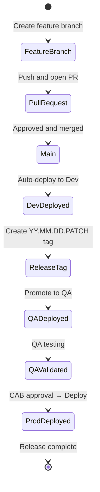

# Git Workflow & Versioning

**Trunk-Based Development with CalVer Tags**

**Status**: 🟢 Active  
**Effective Date**: 2025-01-05

---

## Overview

This platform uses **Trunk-Based Development** with **CalVer (YY.MM.DD.PATCH)** tags for release management. This approach provides:

- ✅ **Single source of truth** - One `main` branch, no environment branches
- ✅ **Instant date visibility** - Know exactly when something was released
- ✅ **Atomic promotion** - Same tag promotes through all environments
- ✅ **Fast integration** - Frequent merges reduce conflicts
- ✅ **Easy rollback** - Revert to any previous tag
- ✅ **AAP Integration** - AAP Projects checkout specific tags

---

## Version Format

```
YY.MM.DD.PATCH
```

| Component | Description | Values | Example |
|-----------|-------------|--------|---------|
| **YY** | Two-digit year | `00-99` | `25` (2025) |
| **MM** | Two-digit month | `01-12` | `01` (January) |
| **DD** | Two-digit day | `01-31` | `05` (5th) |
| **PATCH** | Hotfix number | `0-N` | `0` (first), `1` (hotfix) |

### Examples

```
26.01.06.0    # January 6, 2026 - Initial release
26.01.06.1    # January 6, 2026 - Hotfix 1
26.01.06.2    # January 6, 2026 - Hotfix 2
26.01.07.0    # January 7, 2026 - New release
26.02.15.0    # February 15, 2026 - New release
```

### Version Rules

| Scenario | Action | Example |
|----------|--------|---------|
| New release | Use today's date, PATCH=0 | `26.01.06.0` |
| Same-day hotfix | Increment PATCH | `26.01.06.1` |
| Next day release | New date, PATCH=0 | `26.01.07.0` |
| Skip days | Use actual release date | `26.01.10.0` after `26.01.06.0` |

---

## Branch Structure

### Main Branch

**Branch**: `main`

**Purpose**: Single source of truth for all development

**Rules**:
- ❌ No direct commits (except initial setup)
- ✅ All changes via Pull Request
- ✅ Must pass CI/CD checks
- ✅ Requires code review approval
- ✅ Always in a releasable state

### Feature Branches

**Naming**: `feature/<description>` or `feat/<description>`

**Lifespan**: Short-lived (hours to days, not weeks)

```bash
git checkout -b feature/add-monitoring main
# ... develop ...
git push origin feature/add-monitoring
# Create PR, get approval, merge, delete branch
```

**Examples**:
- `feature/add-webserver-role`
- `feature/update-ee-dependencies`
- `feature/configure-backup-job`

### Fix Branches

**Naming**: `fix/<description>` or `bugfix/<description>`

**Examples**:
- `fix/webserver-port-binding`
- `fix/inventory-syntax-error`

### Hotfix Branches

**Naming**: `hotfix/<description>`

**Purpose**: Emergency fixes for production

```bash
# Branch from previous release tag
git checkout -b hotfix/critical-security-fix 25.01.05.0

# Fix the issue
git commit -m "fix: patch critical vulnerability"

# Merge to main
git checkout main && git merge hotfix/critical-security-fix

# Create hotfix tag (increment PATCH)
git tag -a 25.01.05.1 -m "Hotfix: security patch"
git push origin 25.01.05.1
```

---

## Git Tags

### Single Tag Across All Environments

**One tag promotes through dev → qa → prod:**

| Environment | Tag | Notes |
|-------------|-----|-------|
| **Dev** | `25.01.05.0` | First deployment |
| **QA** | `25.01.05.0` | Same tag promoted |
| **Prod** | `25.01.05.0` | Same tag promoted |

**Benefits:**
- ✅ True atomic promotion - same artifact everywhere
- ✅ Simplified management - no environment-specific tags
- ✅ Clear audit trail via release manifest
- ✅ Reduces tag sprawl by 66%

### Tag Characteristics

- Created manually when ready for release
- Immutable (never deleted or moved)
- Same tag used across all environments
- Release manifest tracks deployment status per environment

---

## Promotion Workflow



### 1. Development

**Trigger**: Merge to `main` or tag creation

```bash
# Create release tag
git tag -a 25.01.05.0 -m "Release January 5, 2025"
git push origin 25.01.05.0

# Tekton deploys to dev automatically
```

**AAP Project**: Tracks specific tag, Update on Launch: ❌

### 2. QA Promotion

**Trigger**: Tekton promote pipeline

```bash
# Promote to QA
tkn pipeline start promote \
  -p VERSION=25.01.05.0 \
  -p FROM_ENVIRONMENT=dev \
  -p TO_ENVIRONMENT=qa
```

**Gates**:
- ✅ Dev tests passed
- ✅ Code review completed
- ✅ QA Lead approval

### 3. Production Promotion

**Trigger**: Tekton promote pipeline with CAB approval

```bash
# Promote to production
tkn pipeline start promote \
  -p VERSION=25.01.05.0 \
  -p FROM_ENVIRONMENT=qa \
  -p TO_ENVIRONMENT=prod
```

**Gates**:
- ✅ QA testing completed
- ✅ QA sign-off
- ✅ Security scan passed
- ✅ CAB approval received
- ✅ Change window scheduled
- ✅ Rollback plan documented

---

## Component Versioning

All components use the same YY.MM.DD.PATCH format:

### Ansible Collections

```yaml
# galaxy.yml
namespace: myorg
name: custom_collection
version: "25.01.05.0"
```

### Execution Environments

```bash
# Image tags
quay.io/myorg/automation-ee:25.01.05.0

# With SHA digest (recommended for prod)
quay.io/myorg/automation-ee@sha256:abc123...
```

### AAP Configuration

```yaml
controller_projects:
  - name: "Automation Collection - Prod"
    scm_url: "https://github.com/org/aap-config-as-code"
    scm_branch: "25.01.05.0"  # Specific tag
    scm_update_on_launch: false
```

### Release Manifests

```yaml
# releases/release-25.01.05.0.yaml
version: "25.01.05.0"
created: "2025-01-05T10:00:00Z"

components:
  aap_configuration:
    commit: "abc123..."
    tag: "25.01.05.0"
  collections:
    version: "25.01.05.0"
  execution_environment:
    tag: "25.01.05.0"
    digest: "sha256:fedcba..."

environments:
  dev:
    deployed_at: "2025-01-05T09:00:00Z"
  qa:
    deployed_at: "2025-01-05T11:00:00Z"
    validated: true
  prod:
    deployed_at: "2025-01-05T15:00:00Z"
    approved_by: "CAB"
```

**All components must match:**

```yaml
# ✅ CORRECT - Synchronized
Release: 25.01.05.0
  ├── AAP Config:   25.01.05.0
  ├── Collection:   25.01.05.0
  └── EE Image:     25.01.05.0

# ❌ WRONG - Mismatched
Release: 25.01.05.0
  ├── AAP Config:   25.01.05.0
  ├── Collection:   25.01.04.0  # ❌ Wrong
  └── EE Image:     25.01.05.1  # ❌ Wrong
```

---

## Rollback

### Using Tekton Pipeline (Recommended)

```bash
tkn pipeline start rollback \
  -p TARGET_VERSION=25.01.04.0 \
  -p ENVIRONMENT=prod
```

### Creating Audit Trail

```bash
# Current: 25.01.05.1 (has issues)
# Create new release pointing to previous commit
git tag -a 25.01.06.0 -m "Rollback to 25.01.05.0 state

Rolled back from: 25.01.05.1
Reason: Critical issue in webserver
Rollback approved: CHG0001236"
```

---

## Complete Workflow Example

```bash
# === Developer Workflow ===

# 1. Create feature branch
git checkout main && git pull
git checkout -b feature/add-webserver-role

# 2. Develop and test locally
molecule test

# 3. Push and create PR
git push origin feature/add-webserver-role
gh pr create --title "Add webserver role"

# === After PR Approval ===

# 4. Merge to main
gh pr merge --squash

# 5. Create release tag
git checkout main && git pull
git tag -a 25.01.05.0 -m "Release January 5, 2025: Add webserver role"
git push origin 25.01.05.0

# === Promotion ===

# 6. Auto-deployed to Dev
# 7. Promote to QA after dev validation
tkn pipeline start promote -p VERSION=25.01.05.0 -p FROM=dev -p TO=qa

# 8. QA validates, then promote to prod
tkn pipeline start promote -p VERSION=25.01.05.0 -p FROM=qa -p TO=prod

# === Hotfix (if needed) ===

# 9. Create hotfix branch
git checkout -b hotfix/critical-fix 25.01.05.0
git commit -m "fix: correct port binding"
git checkout main && git merge hotfix/critical-fix

# 10. Create hotfix tag
git tag -a 25.01.05.1 -m "Hotfix: port binding"
git push origin 25.01.05.1
```

---

## Anti-Patterns to Avoid

### ❌ Long-Lived Environment Branches

**Bad:**
```
main
├── dev (branch)
├── qa (branch)
└── prod (branch)
```

**Why:** Branches diverge, merge conflicts, unclear state

**Instead:** Use `main` + tags

### ❌ Using "latest" in Production

**Bad:**
```yaml
execution_environment: "my-ee:latest"
scm_branch: "main"
```

**Instead:**
```yaml
execution_environment: "my-ee:25.01.05.0"
scm_branch: "25.01.05.0"
```

### ❌ Reusing or Moving Tags

**Bad:**
```bash
git tag -d 25.01.05.0        # Delete
git tag 25.01.05.0 <new>     # Recreate
git push --force             # Force push
```

**Instead:** Create new PATCH version
```bash
git tag 25.01.05.1
```

---

## Git Configuration

### Protected Branches

```yaml
# GitHub branch protection for main
required_pull_request_reviews:
  required_approving_review_count: 1
required_status_checks:
  contexts: ["pre-commit", "ansible-lint", "molecule-test"]
allow_force_pushes: false
allow_deletions: false
```

### Protected Tags

```bash
# GitHub: Settings > Tags > Protected tags
# Pattern: [0-9][0-9].*
# Prevents deletion of CalVer tags
```

### Tag Validation Regex

```bash
^[0-9]{2}\.(0[1-9]|1[0-2])\.(0[1-9]|[12][0-9]|3[01])\.[0-9]+$
```

---

## Best Practices

### 1. Keep Feature Branches Short-Lived

- Aim for branches that live <2 days
- Merge frequently to avoid conflicts
- Use feature flags for incomplete features

### 2. Write Meaningful Tag Messages

```bash
# ✅ GOOD
git tag -a 25.01.05.0 -m "Release January 5, 2025

Features:
- Monitoring role with Prometheus
- Database backup automation

Testing: All molecule tests passed
Rollback: Revert to 25.01.04.0 if issues"

# ❌ BAD
git tag 25.01.05.0  # No message
```

### 3. Always Use Full Format

```bash
# ✅ GOOD
25.01.05.0

# ❌ BAD
25.1.5.0     # Missing leading zeros
25.01.05     # Missing PATCH
```

### 4. Use Tekton Pipelines

```bash
# Create release
tkn pipeline start create-release -p VERSION=25.01.05.0

# Pipeline validates format, gathers commits, creates manifest
```

---

## FAQs

### Q: What about breaking changes?

Document breaking changes prominently in:
- Git tag message (use ⚠️ WARNING)
- CHANGELOG
- Release manifest metadata

```bash
git tag -a 25.02.01.0 -m "⚠️ BREAKING CHANGES
- Removed deprecated inventory format
- Changed role variable names
See CHANGELOG.md for migration guide"
```

### Q: Can I skip days?

Yes, version = release date, not sequential days.

```bash
25.01.05.0  # Jan 5
25.01.10.0  # Jan 10 (skipped 6-9)
```

### Q: Multiple releases per day?

Use PATCH:
```bash
25.01.05.0  # Morning
25.01.05.1  # Afternoon hotfix
25.01.05.2  # Evening fix
```

### Q: How do I compare versions?

Lexicographic sorting works correctly:
```bash
25.01.05.0 < 25.01.05.1 < 25.01.06.0 < 25.02.01.0
```

---

## References

- **CalVer Spec**: https://calver.org/
- **Trunk-Based Development**: https://trunkbaseddevelopment.com/
- **Git Tagging**: https://git-scm.com/book/en/v2/Git-Basics-Tagging
- **EE Versioning**: [EE-VERSIONING-STRATEGY.md](./EE-VERSIONING-STRATEGY.md)
