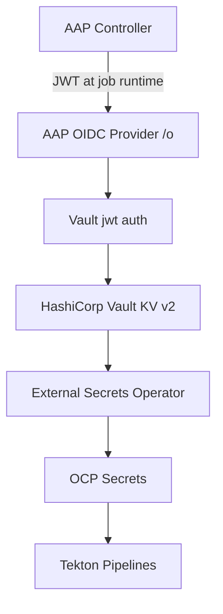

# HashiCorp Vault Guide

**Primary secrets backend and AAP OIDC just-in-time access for the RH1 platform**

## Overview

HashiCorp Vault replaces 1Password as the platform secrets backend. External Secrets Operator (ESO) syncs secrets into Kubernetes for Tekton pipelines. Ansible Automation Platform uses **OIDC workload identity** (AAP 2.7+) to obtain short-lived Vault tokens at job runtime—no long-lived `VAULT_TOKEN` credentials.

Reference: [Just-in-time access to HashiCorp Vault with Ansible OIDC provider](https://developers.redhat.com/articles/2026/08/11/just-in-time-access-to-hashicorp-vault-with-ansible-oidc-provider)

## Architecture



## Deployment

Vault is deployed via ArgoCD application `applications/hashicorp-vault/`:

- Helm chart: `hashicorp/vault` with Raft storage
- Route: `vault` in `hashicorp-vault` namespace
- Bootstrap script: [scripts/vault-bootstrap.sh](../../rh1-cluster-config/scripts/vault-bootstrap.sh)

```bash
# Initialize and unseal (first time only)
kubectl -n hashicorp-vault exec vault-0 -- vault operator init
kubectl -n hashicorp-vault exec vault-0 -- vault operator unseal

export VAULT_ADDR=http://vault.apps.cluster.example.com
export VAULT_TOKEN=<root-token>
./scripts/vault-bootstrap.sh
```

## Secret path layout

```
secret/data/rh1/
├── platform/
│   ├── signing/{cosign,galaxy-gpg,hub-collection}
│   ├── ci/{github,quay-ee,automationhub}
│   └── aap/{dev,qa,prod}/admin-password
└── automation/
    ├── scm/github
    ├── registry/quay
    └── machine/linux/{env}
```

## ESO integration

ClusterSecretStore `vault-rh1` authenticates via Kubernetes auth role `external-secrets`.

All ExternalSecrets in `ci-rh1-*` and `aap-*` namespaces reference `vault-rh1` and Vault KV paths.

## AAP OIDC JIT setup

### 1. Enable OIDC on AAP

Configured in AnsibleAutomationPlatform CR:

```yaml
spec:
  feature_flags:
    FEATURE_OIDC_WORKLOAD_IDENTITY_ENABLED: true
```

### 2. Verify OIDC provider

```bash
curl -k https://${AAP_URL}/o/.well-known/openid-configuration/
```

### 3. Configure Vault JWT auth

```bash
vault auth enable jwt
vault write auth/jwt/config oidc_discovery_url="https://${AAP_URL}/o"
vault write auth/jwt/role/rh1-aap-prod-jt - <<EOF
{
  "role_type": "jwt",
  "user_claim": "sub",
  "policies": ["rh1-aap-prod-read"],
  "bound_claims": {
    "aap_controller_organization_name": ["platform"],
    "aap_controller_job_template_name": ["plat_configure_webserver_prod"]
  }
}
EOF
```

See ConfigMap `vault-jwt-auth-aap` in `hashicorp-vault` namespace for full role definitions.

### 4. Create AAP credentials

In AAP UI (or CaC):

- **Credential type**: `HashiCorp Vault Secret Lookup (OIDC)`
- **Inputs**: Server URL, JWT path (`jwt`), Vault role, API version (`v2`)
- **Custom credential**: `HashiCorp Vault Value` for JT injection (see [credential_types.yml](../../rh1-aap-config-as-code/inventory/group_vars/all/credential_types.yml))

### 5. Test

Use the credential Test button in AAP UI with path `secret/rh1/automation/scm/github`, key `password`.

## Tekton Kubernetes auth

Tekton pipeline ServiceAccounts authenticate to Vault via Kubernetes auth roles:

| Role | Namespace | ServiceAccount |
|------|-----------|----------------|
| `external-secrets` | `external-secrets-operator` | `external-secrets` |
| `ci-rh1-ee` | `ci-rh1-ee` | `pipeline` |
| `ci-rh1-custom-collection` | `ci-rh1-custom-collection` | `pipeline` |
| `ci-rh1-release-manifest` | `ci-rh1-release-manifest` | `pipeline` |

Configure via ConfigMap `vault-kubernetes-auth-tekton`.

## Key rotation

1. Update secret in Vault: `vault kv put secret/rh1/platform/...`
2. ESO refreshes within `refreshInterval` (1h) or force reconcile
3. For signing keys: re-sign active EE images and release manifests after rotation
4. For OIDC: no credential rotation needed—JWTs are ephemeral per job

## Troubleshooting

| Issue | Check |
|-------|-------|
| ESO sync failed | `kubectl describe externalsecret -n <ns>`; verify `external-secrets` Vault role |
| AAP OIDC test fails | Verify `FEATURE_OIDC_WORKLOAD_IDENTITY_ENABLED`; check Vault jwt config CA |
| Job cannot read secret | Vault audit log; verify `bound_claims` match org/JT name |
| Vault sealed | Unseal keys (break-glass storage) |

## Related documentation

- [CONTENT-SIGNING.md](./CONTENT-SIGNING.md) — signing keys in Vault
- [SECURITY-GUIDE.md](./SECURITY-GUIDE.md) — security layers
- [MULTI-CLUSTER-GUIDE.md](./MULTI-CLUSTER-GUIDE.md) — Vault across clusters
