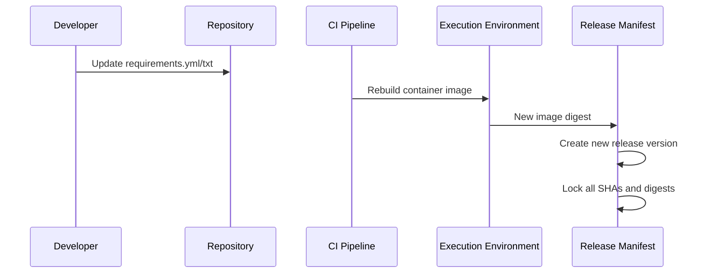

# Version Dependency Tree

**Complete dependency hierarchy for all versioned and tracked components in the Cloud-Native Ansible Lifecycle Platform.**

---

## Overview

This diagram shows the complete dependency tree that gets version-locked in each release. Understanding these relationships is crucial for maintaining atomic promotions and proper dependency management.

---

## Dependency Tree Diagram

```mermaid
graph TD
    %% Top Level: Release Manifest
    RM[Release Manifest<br/>26.1.6-0]:::manifest

    %% Main Components - arrange horizontally
    subgraph MAIN[" "]
        AAP[AAP Configuration<br/>Git SHA]:::component
        PLAY[Playbooks<br/>Git SHA]:::component
        COLL[Collections<br/>Git SHA]:::component
        EE[Execution Environment<br/>Image Digest]:::component
    end

    %% Connect main components to release manifest
    RM --> AAP
    RM --> PLAY
    RM --> COLL
    RM --> EE

    %% AAP Configuration subtree
    subgraph AAP_SUB["AAP Configuration Details"]
        AAP_REPO[AAP Config Repository<br/>rh1-aap-config-as-code]:::repo
        JT[Job Templates<br/>*.yml files]:::config
        PROJS[Projects<br/>projects.yml]:::config
        EE_CONFIG[Execution Environments<br/>execution_environments.yml]:::config
        INV[Inventories<br/>inventory_*.yml]:::config
        CREDS[Credentials<br/>credentials.yml]:::config
        ORGS[Organizations<br/>organizations.yml]:::config
        SCHEDS[Schedules<br/>schedules.yml]:::config
    end

    AAP --> AAP_REPO
    AAP_REPO --> JT
    AAP_REPO --> PROJS
    AAP_REPO --> EE_CONFIG
    AAP_REPO --> INV
    AAP_REPO --> CREDS
    AAP_REPO --> ORGS
    AAP_REPO --> SCHEDS

    %% Job Templates reference Projects and EEs
    JT -.-> PROJS
    JT -.-> EE_CONFIG

    %% Projects reference playbooks - clear connection
    PROJS -.-> PLAY_REPO

    %% EE Config references the built EE image
    EE_CONFIG -.-> EE

    %% Playbooks subtree
    subgraph PLAY_SUB["Playbooks Details"]
        PLAY_REPO[Playbooks Repository<br/>rh1-automation-playbooks]:::repo
        PLAYBOOK_FILES[Playbook Files<br/>*.yml files]:::config
    end

    PLAY --> PLAY_REPO
    PLAY_REPO --> PLAYBOOK_FILES

    %% Playbooks call roles from collections - clear connection
    PLAYBOOK_FILES -.-> COLL_REPO

    %% Collections subtree
    subgraph COLL_SUB["Collections Details"]
        COLL_REPO[Collection Repository<br/>rh1-custom-collection]:::repo
        GALAXY[galaxy.yml<br/>Collection Metadata]:::config
        ROLES[Roles Directory<br/>roles/]:::code
        PLUGINS[Plugins Directory<br/>plugins/]:::code
        TESTS[Tests Directory<br/>tests/]:::code
        DEPS[Dependencies<br/>requirements.yml]:::deps
    end

    COLL --> COLL_REPO
    COLL_REPO --> GALAXY
    COLL_REPO --> ROLES
    COLL_REPO --> PLUGINS
    COLL_REPO --> TESTS
    COLL_REPO --> DEPS

    %% Roles breakdown
    subgraph ROLE_SUB["Role Details"]
        ROLE1[Individual Role<br/>e.g., webserver]:::role
        TASKS[tasks/main.yml]:::file
        DEFAULTS[defaults/main.yml]:::file
        MOLECULE[Molecule Tests<br/>molecule/]:::test
    end

    ROLES --> ROLE1
    ROLE1 --> TASKS
    ROLE1 --> DEFAULTS
    ROLE1 --> MOLECULE

    %% EE subtree
    subgraph EE_SUB["Execution Environment Details"]
        EE_REPO[EE Repository<br/>rh1-ee]:::repo
        EXEC_ENV[execution-environment.yml]:::config
        PY_REQS[Python Requirements<br/>requirements.txt]:::deps
        COLL_REQS[Collection Requirements<br/>requirements.yml]:::deps
        BINDEP[System Packages<br/>bindep.txt]:::deps
        BASE_IMG[Base Image<br/>registry.redhat.io/...@sha256]:::image
    end

    EE --> EE_REPO
    EE_REPO --> EXEC_ENV
    EE_REPO --> PY_REQS
    EE_REPO --> COLL_REQS
    EE_REPO --> BINDEP
    EE --> BASE_IMG

    %% External Dependencies - group them
    subgraph EXT_SUB["External Dependencies"]
        EXT_COLL1[ansible.posix<br/>>=1.5.0]:::ext
        EXT_COLL2[community.postgresql<br/>>=3.0.0]:::ext
        EXT_COLL3[containers.podman<br/>>=1.10.0]:::ext
        PY1[jmespath<br/>>=1.0.0]:::ext
        PY2[netaddr<br/>>=0.8.0]:::ext
        PY3[PyYAML<br/>>=6.0]:::ext
        SYS1[gcc]:::ext
        SYS2[python3.11-devel]:::ext
        SYS3[pkg-config]:::ext
    end

    DEPS --> EXT_COLL1
    DEPS --> EXT_COLL2
    DEPS --> EXT_COLL3
    COLL_REQS --> EXT_COLL1
    COLL_REQS --> EXT_COLL2
    COLL_REQS --> EXT_COLL3
    PY_REQS --> PY1
    PY_REQS --> PY2
    PY_REQS --> PY3
    BINDEP --> SYS1
    BINDEP --> SYS2
    BINDEP --> SYS3

    %% Test scenarios
    subgraph TEST_SUB["Test Scenarios"]
        MOLECULE_DEFAULT[Molecule: default<br/>RockyLinux 9]:::test
        MOLECULE_CENTOS[Molecule: centos<br/>CentOS 8]:::test
        MOLECULE_UBUNTU[Molecule: ubuntu<br/>Ubuntu 22.04]:::test
    end

    MOLECULE --> MOLECULE_DEFAULT
    MOLECULE --> MOLECULE_CENTOS
    MOLECULE --> MOLECULE_UBUNTU

    %% Improve line visibility
    linkStyle default stroke:#333,stroke-width:2px

    %% Styling
    classDef manifest fill:#e1f5fe,stroke:#01579b,stroke-width:3px,color:#000000
    classDef component fill:#f3e5f5,stroke:#4a148c,stroke-width:2px,color:#000000
    classDef repo fill:#e8f5e8,stroke:#2e7d32,stroke-width:2px,color:#000000
    classDef config fill:#fff3e0,stroke:#ef6c00,stroke-width:2px,color:#000000
    classDef code fill:#fce4ec,stroke:#c2185b,stroke-width:2px,color:#000000
    classDef role fill:#f3e5f5,stroke:#7b1fa2,stroke-width:1px,color:#000000
    classDef file fill:#f5f5f5,stroke:#424242,stroke-width:1px,color:#000000
    classDef deps fill:#e0f2f1,stroke:#00695c,stroke-width:2px,color:#000000
    classDef image fill:#fff8e1,stroke:#f57f17,stroke-width:2px,color:#000000
    classDef test fill:#e8eaf6,stroke:#3f51b5,stroke-width:1px,color:#000000
    classDef ext fill:#fafafa,stroke:#616161,stroke-width:1px,stroke-dasharray: 5 5,color:#000000
```

---

## Diagram Explanation

### Hierarchy Levels

1. **Release Manifest** (Top Level)
   - Version-locks all components together
   - Enables atomic promotion and rollback

2. **Main Components** (Versioned by SHA/Digest)
   - **AAP Configuration**: Job templates, inventories, credentials, projects
   - **Playbooks**: Ansible playbooks that orchestrate role execution
   - **Collections**: Ansible roles, modules, plugins called by playbooks
   - **Execution Environment**: Container image with all runtime dependencies

3. **Git Repositories** (Source of Truth)
   - Six repositories that contain all configuration
   - Each tracked by Git SHA for exact versioning

4. **Configuration Files** (Declarative Config)
   - YAML files defining behavior
   - Templates, variables, metadata

5. **Code Artifacts** (Implementation)
   - Ansible roles and tasks
   - Python modules and plugins
   - Build scripts and utilities

6. **Dependencies** (External Requirements)
   - Ansible collections from Galaxy
   - Python packages from PyPI
   - System packages from OS repos

### Version Tracking Scope

| Component | Versioned How | Updated When |
|-----------|---------------|--------------|
| **Release Manifest** | CalVer (YY.M.D-PATCH) | Each promotion |
| **Git Repositories** | SHA commit hash | Code changes |
| **Container Images** | SHA256 digest | EE rebuilds |
| **Ansible Collections** | Semantic version ranges | Dependency updates |
| **Python Packages** | Version constraints | Security/fixes |
| **System Packages** | Package names | OS updates |

### Dependency Relationships

- **Direct Dependencies**: Components directly referenced in release manifest
- **Transitive Dependencies**: Dependencies pulled in by main components
- **External Dependencies**: Third-party packages not under our control
- **Build Dependencies**: Only needed during image/container builds

### Atomic Promotion Impact

When promoting a release:
1. **All SHAs freeze**: No changes to Git repos during promotion
2. **Image digest locks**: Same container image across all environments
3. **Dependencies consistent**: Same versions in dev/qa/prod
4. **Rollback possible**: Previous manifest restores exact state

---

## Key Insights

### 1. Version Granularity
- **Coarse-grained**: Release manifest versions everything together
- **Fine-grained**: Individual Git SHAs allow precise change tracking
- **Immutable**: SHA256 digests ensure container reproducibility

### 2. Change Propagation
- **Bottom-up**: Changes in roles/files bubble up through playbooks to release
- **Dependency-driven**: EE rebuilds when collections change, playbooks reference role versions
- **Promotion-driven**: Changes to any component (roles/playbooks/config) trigger new releases
- **Project isolation**: Projects reference specific playbook versions for stability

### 3. Testing Requirements
- **Unit tests**: Molecule tests each role individually
- **Integration tests**: Test EE + collection combinations
- **Promotion tests**: Validate release manifest before promotion

### 4. Rollback Complexity
- **Simple rollback**: Previous release manifest
- **Partial rollback**: Not supported—atomicity requirement
- **Dependency rollback**: May require rebuilding older images

---

## Related Diagrams

- **[Promotion Flow](./PROMOTION-FLOW.md)** - How releases move through environments
- **[Repository Structure](./REPOSITORY-STRUCTURE.md)** - Where components live
- **[Platform Architecture](./PLATFORM-ARCHITECTURE.md)** - Overall system design
- **[GitOps Loops](./GITOPS-LOOPS.md)** - How changes get deployed

---

## Maintenance Notes

### When Dependencies Change

1. **Add new dependency** → Update requirements files → EE rebuild → New release
2. **Update version constraint** → Modify version ranges → EE rebuild → New release
3. **Remove dependency** → Update requirements → EE rebuild → New release

### Version Pinning Strategy

- **Git SHAs**: Always pinned to exact commit
- **Container digests**: Always use SHA256 (not tags)
- **Collection versions**: Use `>=` for flexibility in patches
- **Python packages**: Pin to minor versions for stability

### Monitoring Dependencies

- **Security scans**: Check for CVEs in dependencies
- **License compliance**: Track dependency licenses
- **Update frequency**: Regular dependency updates
- **Breaking changes**: Test before promotion

---

## Quick Reference

### What Gets Version-Locked Per Release

| Category | Components | Version Method |
|----------|------------|----------------|
| **Source Code** | Collections, Playbooks, AAP config, EE definition | Git SHA |
| **Built Artifacts** | Container images | SHA256 digest |
| **Dependencies** | Collections, Python packages | Version constraints |
| **Metadata** | Release manifest itself | CalVer YY.M.D-PATCH |

### Dependency Update Process

---

**Legend**: Solid arrows show direct dependencies, dashed borders indicate external/third-party components.
