# GitOps Loops Architecture

**Dual GitOps Loops: Platform + Application**

## Dual Loop Overview

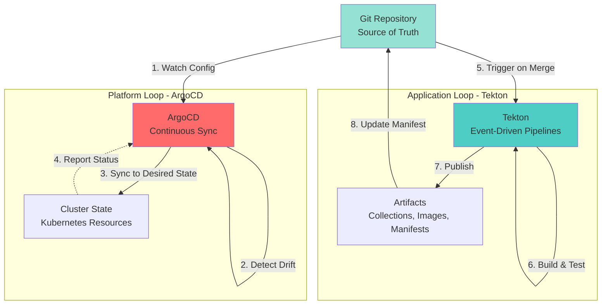

---

## Platform Loop (ArgoCD)

**Purpose**: Declarative cluster configuration management

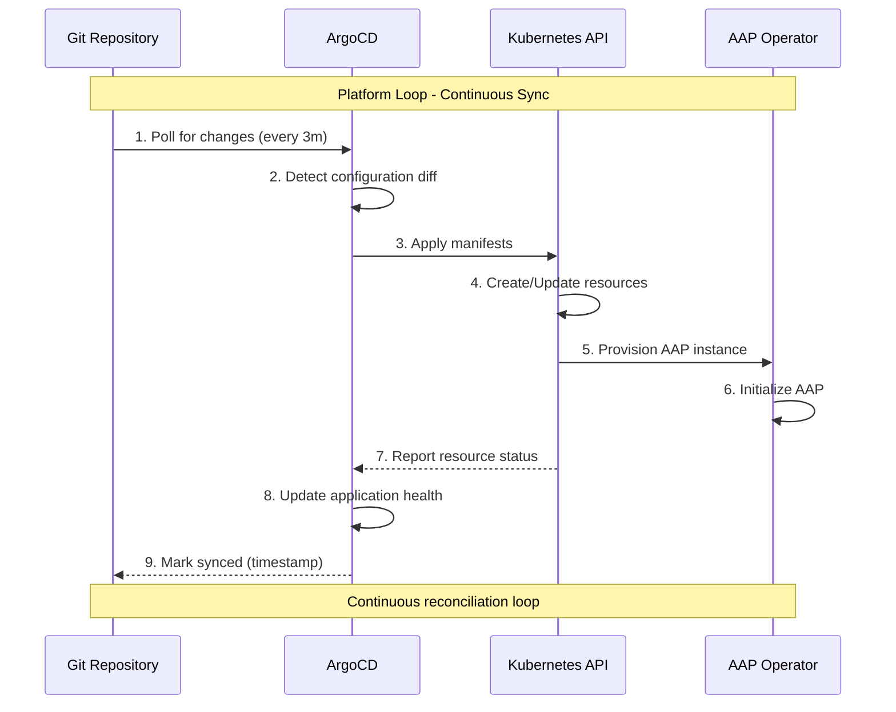

### Platform Loop Characteristics

| Characteristic | Value |
|---------------|-------|
| **Pattern** | Pull-based, declarative |
| **Frequency** | Every 3 minutes (configurable) |
| **Scope** | Kubernetes resources only |
| **Automation** | Fully automated (auto-sync) |
| **Rollback** | Git revert + auto-sync |
| **Approval** | Via Git PR process |

### What the Platform Loop Manages

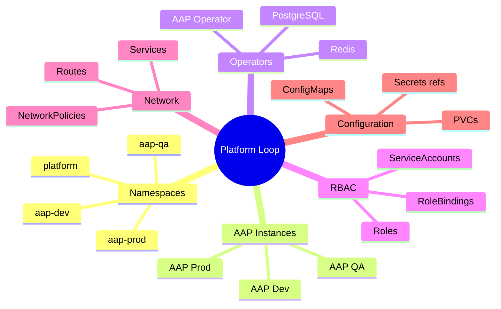

---

## Application Loop (Tekton)

**Purpose**: Event-driven CI/CD for Ansible content

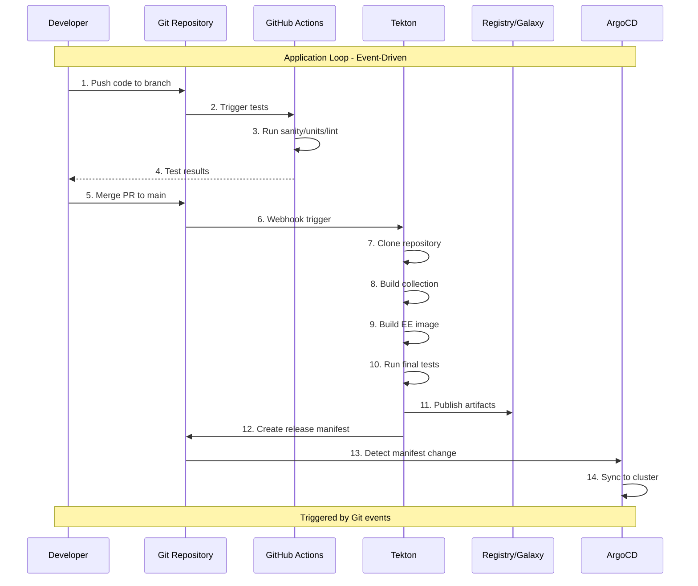

### Application Loop Characteristics

| Characteristic | Value |
|---------------|-------|
| **Pattern** | Event-driven, pipeline-based |
| **Frequency** | On Git events (push, tag, PR) |
| **Scope** | Build, test, publish artifacts |
| **Automation** | Automatic on merge to main |
| **Rollback** | Revert manifest + rollback job |
| **Approval** | Manual gates for prod promotion |

### What the Application Loop Manages

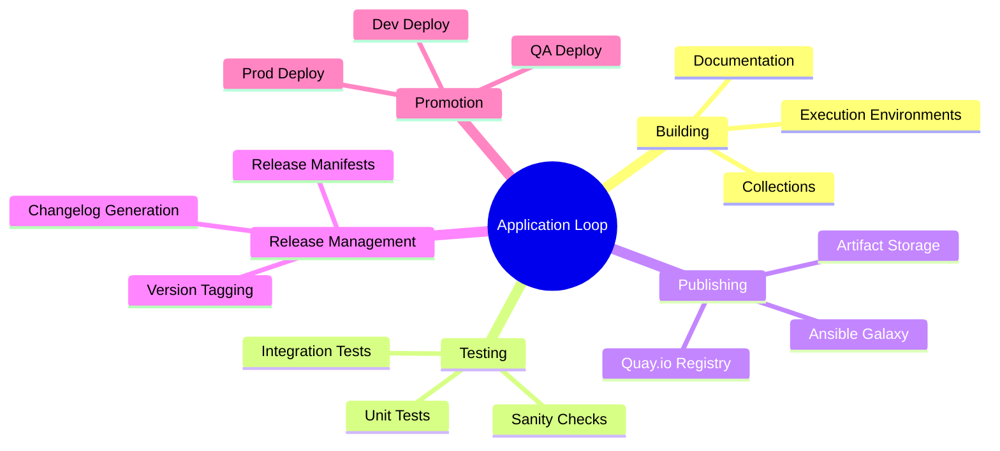

---

## Loop Interactions

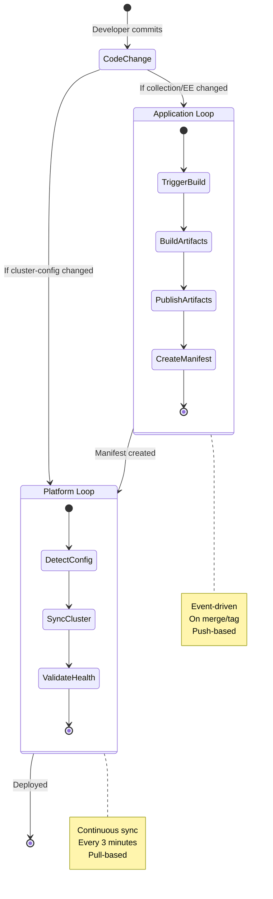

---

## Promotion Flow Through Loops

### Development Environment

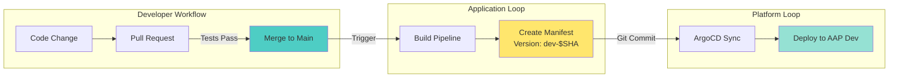

### QA Environment

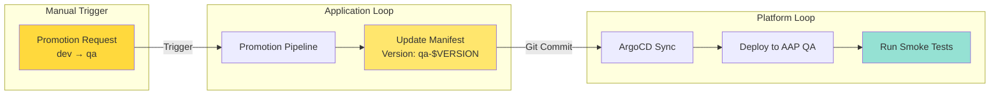

### Production Environment

```mermaid
graph LR
    subgraph "Approval Process"
        REQUEST[Promotion Request<br/>qa → prod]
        APPROVE[Manual Approval<br/>Change Advisory Board]
    end

    subgraph "Application Loop"
        PIPELINE_PROD[Promotion Pipeline]
        MANIFEST_PROD[Update Manifest<br/>Version: prod-$VERSION]
        BACKUP[Backup Rollback Point]
    end

    subgraph "Platform Loop"
        SYNC_PROD[ArgoCD Sync]
        DEPLOY_PROD[Deploy to AAP Prod]
        VERIFY[Verify Health]
    end

    REQUEST --> APPROVE
    APPROVE -->|Approved| PIPELINE_PROD
    PIPELINE_PROD --> BACKUP
    BACKUP --> MANIFEST_PROD
    MANIFEST_PROD -->|Git Commit| SYNC_PROD
    SYNC_PROD --> DEPLOY_PROD
    DEPLOY_PROD --> VERIFY

    style APPROVE fill:#ff6b6b
    style BACKUP fill:#ffd93d
    style VERIFY fill:#95e1d3
```

---

## Repository Mapping to Loops

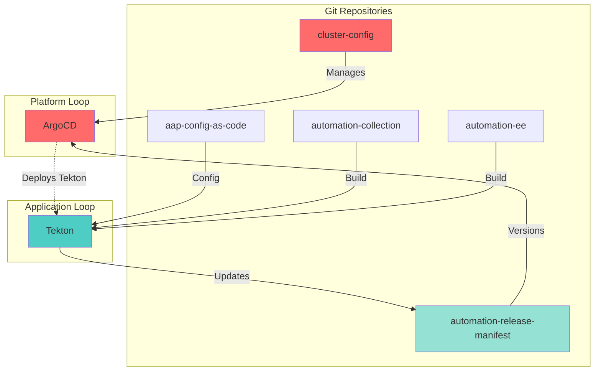

---

## Loop Reconciliation

### Platform Loop Reconciliation

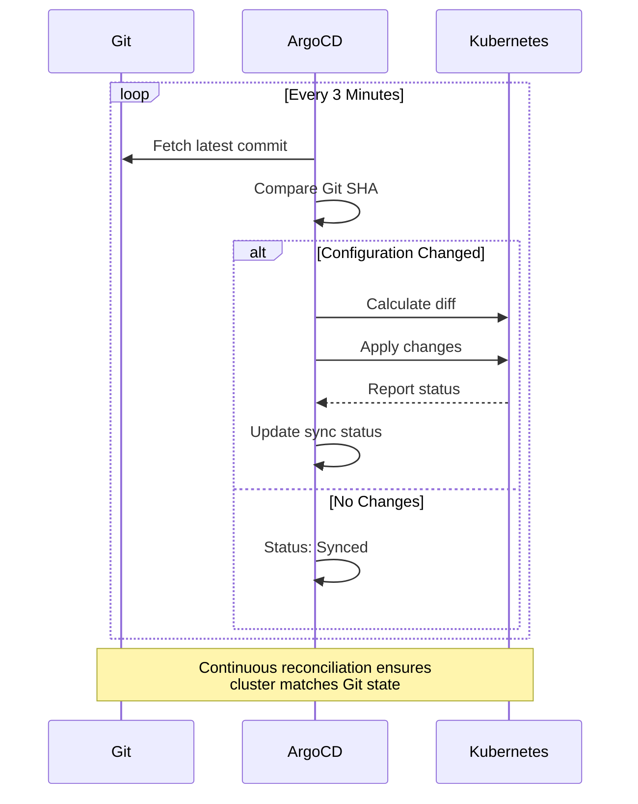

### Application Loop Reconciliation

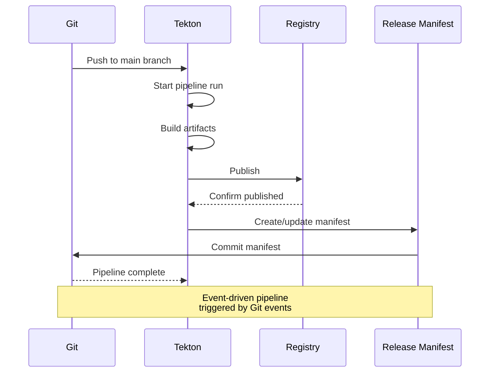

---

## Failure Handling

### Platform Loop Failures

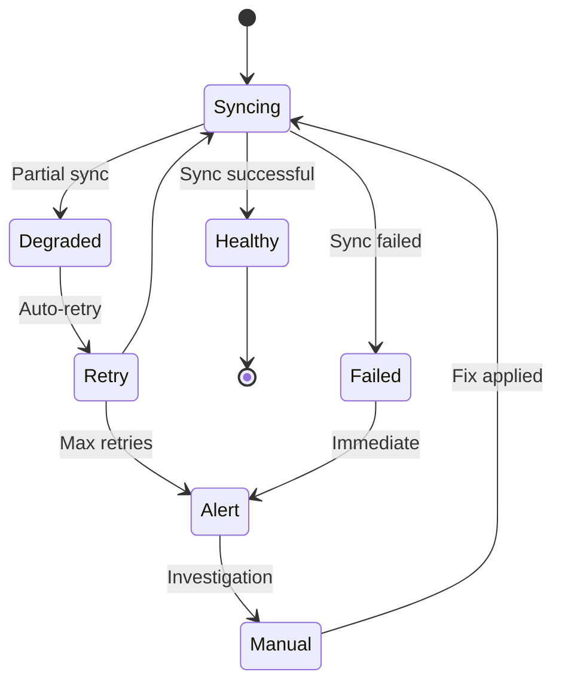

### Application Loop Failures

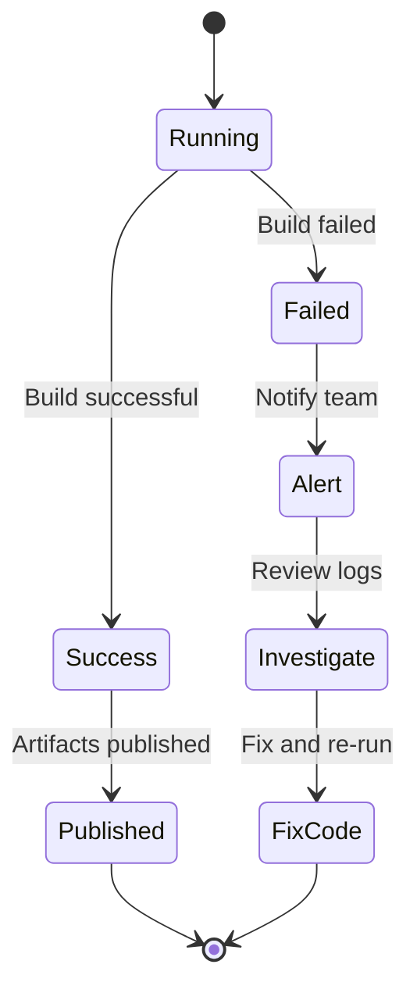

---

## Comparison: Platform vs Application Loop

| Aspect | Platform Loop (ArgoCD) | Application Loop (Tekton) |
|--------|------------------------|---------------------------|
| **Trigger** | Time-based poll (3min) | Event-based (webhook) |
| **Pattern** | Pull | Push |
| **Scope** | Cluster configuration | Ansible content |
| **Automation** | Fully automatic | Semi-automatic (approvals) |
| **Rollback** | Git revert | Manifest rollback |
| **Speed** | Slow (minutes) | Fast (seconds) |
| **Idempotent** | Yes | Yes |
| **Validation** | Kubernetes API | Tests + builds |

---

## Integration Points

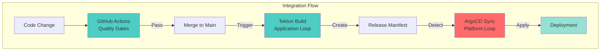

---

## Summary

### Key Differences

**Platform Loop (ArgoCD)**:
- ✅ Manages **what** runs (infrastructure)
- ✅ Continuous reconciliation
- ✅ Cluster-scoped
- ✅ Declarative sync

**Application Loop (Tekton)**:
- ✅ Manages **how** things are built (applications)
- ✅ Event-driven execution
- ✅ Build-scoped
- ✅ Imperative pipelines

### Why Both?

1. **Separation of Concerns**: Infrastructure vs application
2. **Different Patterns**: Continuous sync vs event-driven
3. **Different Speeds**: Minutes vs seconds
4. **Different Scope**: Cluster-wide vs artifact-specific
5. **Constitutional Alignment**: Article I (GitOps First) requires both

### Together They Provide

- **Complete GitOps**: Everything from Git
- **Fast Feedback**: Quick builds, gradual rollout
- **Safety**: Declarative infra, tested apps
- **Traceability**: All changes tracked in Git
- **Atomic Promotion**: Coordinated via manifests

---

**Constitutional Compliance**: ✅ Article I (GitOps First) implemented through dual loops

