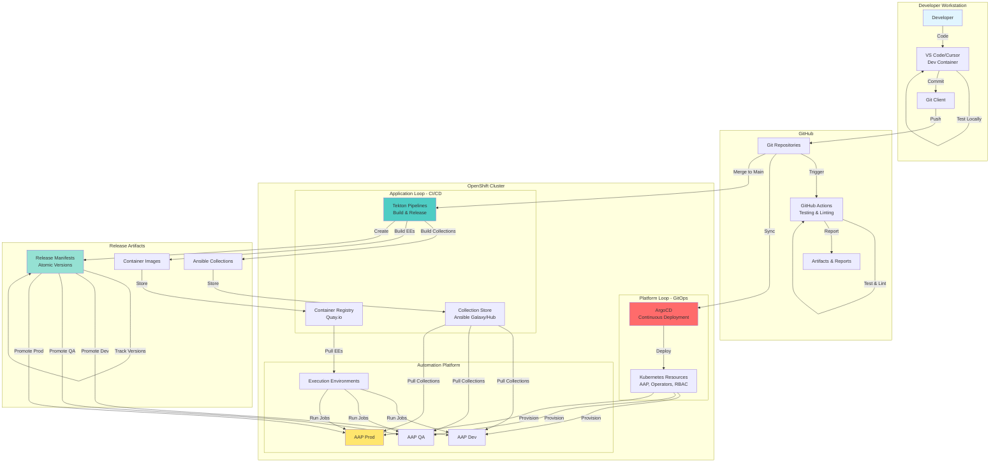
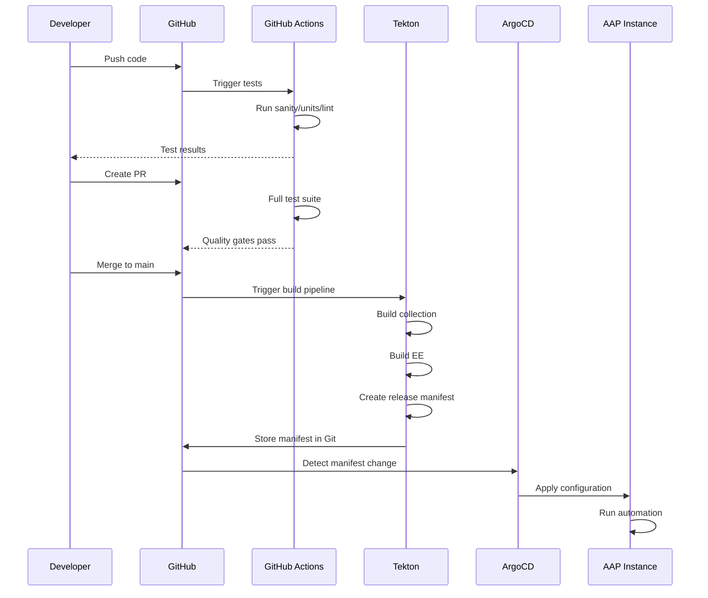
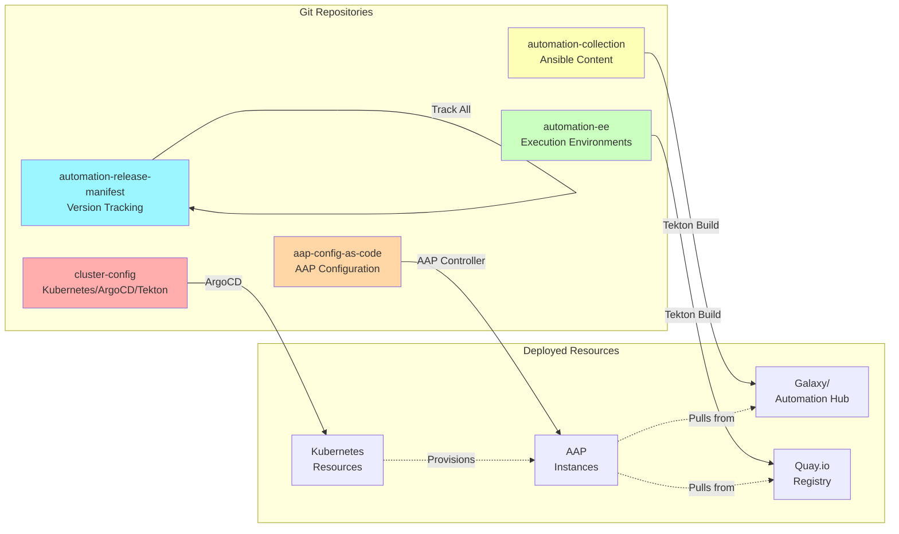
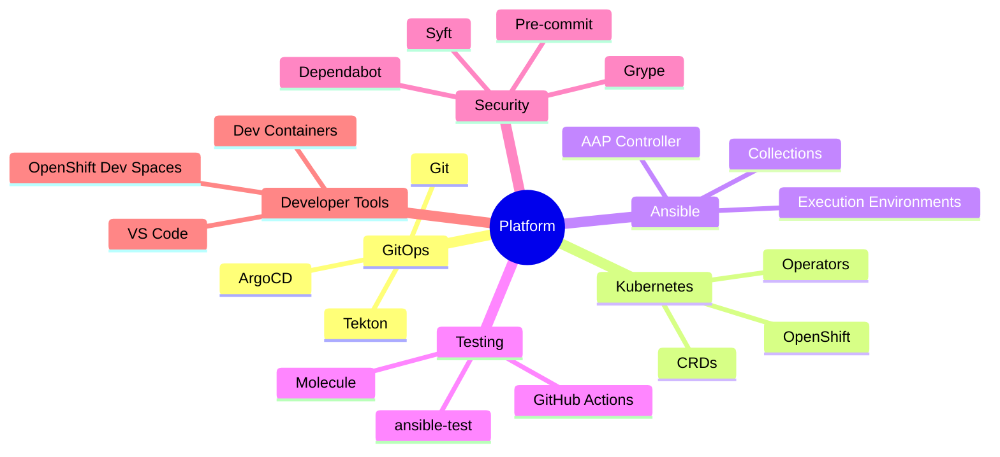
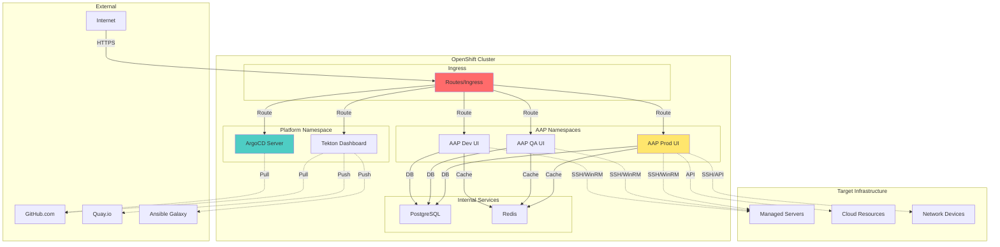
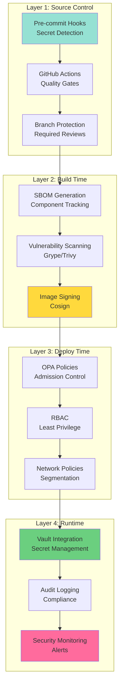
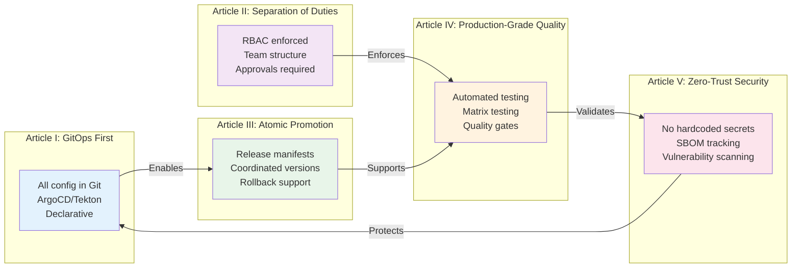
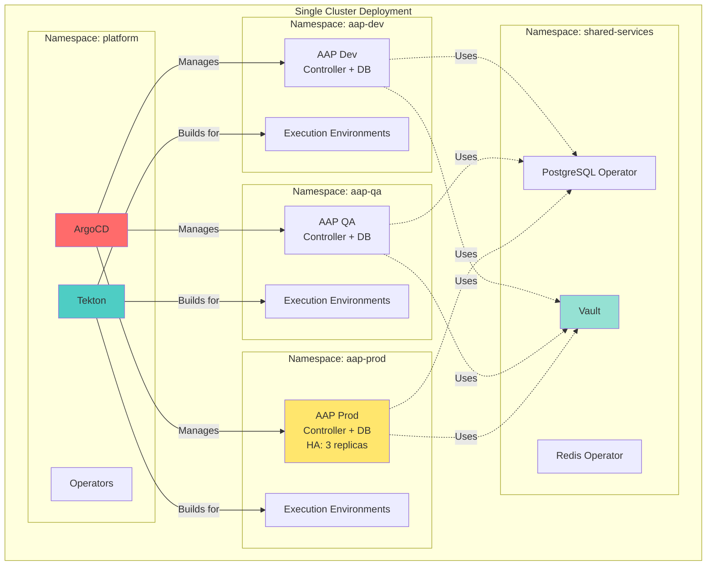

# Platform Architecture

**Cloud-Native Ansible Lifecycle Platform - High-Level Architecture**

## Overall Platform Architecture

---

## Component Responsibilities

### 🔵 Developer Workstation
- **Purpose**: Local development and testing
- **Tools**: VS Code/Cursor with Dev Containers
- **Activities**: 
  - Write Ansible content (roles, playbooks, modules)
  - Test locally with Molecule
  - Commit and push to Git

### 🟢 GitHub
- **Purpose**: Source control and quality gates
- **Components**:
  - **Git Repositories**: Source of truth for all code
  - **GitHub Actions**: Automated testing and linting (NOT building/releasing)
  - **Artifacts**: Test reports, coverage, SBOM

### 🔴 ArgoCD (Platform Loop)
- **Purpose**: GitOps-based cluster configuration
- **Scope**: 
  - Kubernetes resources
  - AAP instance deployments
  - Operators and CRDs
  - RBAC and network policies
- **Pattern**: Declarative, pull-based synchronization

### 🟡 Tekton (Application Loop)
- **Purpose**: CI/CD for Ansible content
- **Scope**:
  - Build Ansible collections
  - Build execution environments
  - Create release manifests
  - Publish to registries
  - Coordinate promotions
- **Pattern**: Event-driven, pipeline-based

### 🟠 AAP Instances
- **Purpose**: Run automation workloads
- **Environments**:
  - **Dev**: Development and feature testing
  - **QA**: Integration and validation testing  
  - **Prod**: Production automation execution
- **Configuration**: Managed as code via aap-config-as-code repo

---

## Data Flow

### Code → Test → Build → Deploy

---

## Repository Architecture

---

## Technology Stack

---

## Network Architecture

---

## Security Layers

---

## Constitutional Alignment

---

## Deployment Topology

---

## Summary

### Key Architectural Principles

1. **GitOps-Driven**: Everything managed through Git
2. **Dual Loop**: Platform (ArgoCD) + Application (Tekton)
3. **Separation of Concerns**: Clear boundaries between components
4. **Cloud-Native**: Kubernetes-native, container-based
5. **Security First**: Multiple layers of security controls

### Component Interactions

- **Developers** → Push code to **GitHub**
- **GitHub Actions** → Test and validate (quality gates)
- **ArgoCD** → Deploy platform configuration (cluster-config)
- **Tekton** → Build and release Ansible content
- **AAP** → Execute automation workloads

### Data Flow Patterns

- **Configuration**: Git → ArgoCD → Kubernetes → AAP
- **Content**: Git → Tekton → Registry/Galaxy → AAP
- **Promotion**: Manifest → Dev → QA → Prod (atomic)

---

**Constitutional Alignment**: ✅ All 5 articles implemented and enforced through architecture

