# Promotion Flow Architecture

**Atomic Promotion with Release Manifests**

---

## 🔧 Tool Responsibilities (Constitutional Article II: Separation of Duties)

### ArgoCD (Platform Loop)

**Manages**: Kubernetes/OpenShift platform resources

**Responsibilities**:
- ✅ AAP Operator installation and versioning
- ✅ Tekton Operators
- ✅ Namespaces, RBAC, ServiceAccounts
- ✅ CRDs (Custom Resource Definitions)
- ✅ Platform-level configuration

**Repository**: `cluster-config`

**What ArgoCD DOES NOT Do**:
- ❌ AAP Configuration (Projects, Job Templates, Inventories)
- ❌ Application-level automation
- ❌ Promotion orchestration

---

### Tekton (Application Loop)

**Manages**: Application-level automation and AAP configuration

**Responsibilities**:
- ✅ Build Execution Environments
- ✅ Apply AAP Configuration (via `infra.aap_configuration`)
- ✅ Create Release Manifests
- ✅ Orchestrate promotions (Dev → QA → Prod)
- ✅ Run tests and validations

**Repository**: All automation repos (collections, EE, aap-config-as-code)

**How Tekton Applies AAP Config**:
```bash
# Tekton runs Ansible playbook with infra.aap_configuration collection
ansible-playbook aap-config-as-code/playbook.yml \
  -i inventory.yml \
  -l aap_dev \
  -e controller_hostname=$AAP_HOST \
  -e controller_oauthtoken=$AAP_TOKEN
```

---

## Promotion Overview

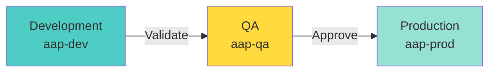

---

## Complete Promotion Pipeline with Git Tags

```mermaid
graph TB
    subgraph "Development Phase"
        CODE[Code Changes<br/>Feature Branch]
        TEST1[GitHub Actions<br/>Tests & Linting]
        MERGE[Merge to Main]
        TAG_DEV[Create Dev Tag<br/>dev-abc123]
    end

    subgraph "Build Phase"
        BUILD_COL[Build Collection]
        BUILD_EE[Build EE Image<br/>ee:dev-abc123]
        TEST_BUILD[Post-Build Tests]
    end

    subgraph "Release Phase"
        MANIFEST_DEV[Create Release Manifest<br/>dev-abc123.yaml]
        PUBLISH[Publish to Registries]
    end

    subgraph "Dev Environment"
        SYNC_DEV[AAP Dev Project<br/>Sync to main/dev tag]
        DEPLOY_DEV[Deploy to AAP Dev]
        SMOKE_DEV[Smoke Tests]
        VALIDATE_DEV[Validation Tests]
    end

    subgraph "QA Promotion"
        TAG_QA[Create Release Tag<br/>git tag 26.1.5-0]
        MANIFEST_QA[Create Manifest<br/>release-26.1.5-0.yaml]
        BUILD_EE_QA[Build EE<br/>ee:26.1.5-0]
        SYNC_QA[AAP QA Project<br/>Sync to 26.1.5-0]
        DEPLOY_QA[Deploy to AAP QA]
        TEST_QA[Full Test Suite]
        APPROVE_QA[QA Sign-off]
    end

    subgraph "Prod Promotion"
        CAB[Change Advisory Board]
        APPROVE_PROD[Production Approval]
        TAG_PROD[Same Tag Promoted<br/>26.1.5-0]
        BACKUP[Backup Rollback Point]
        MANIFEST_PROD[Update Manifest<br/>mark prod deployed]
        BUILD_EE_PROD[Same EE<br/>ee:26.1.5-0]
        SYNC_PROD[AAP Prod Project<br/>Sync to 26.1.5-0]
        DEPLOY_PROD[Deploy to AAP Prod]
        VERIFY_PROD[Production Verification]
    end

    CODE --> TEST1
    TEST1 -->|Pass| MERGE
    MERGE --> TAG_DEV
    TAG_DEV --> BUILD_COL
    TAG_DEV --> BUILD_EE
    BUILD_COL --> TEST_BUILD
    BUILD_EE --> TEST_BUILD
    TEST_BUILD -->|Pass| MANIFEST_DEV
    MANIFEST_DEV --> PUBLISH
    PUBLISH --> SYNC_DEV
    SYNC_DEV --> DEPLOY_DEV
    DEPLOY_DEV --> SMOKE_DEV
    SMOKE_DEV --> VALIDATE_DEV
    VALIDATE_DEV -->|Pass| TAG_QA

    TAG_QA --> MANIFEST_QA
    TAG_QA --> BUILD_EE_QA
    MANIFEST_QA --> SYNC_QA
    BUILD_EE_QA --> SYNC_QA
    SYNC_QA --> DEPLOY_QA
    DEPLOY_QA --> TEST_QA
    TEST_QA -->|Pass| APPROVE_QA

    APPROVE_QA --> CAB
    CAB --> APPROVE_PROD
    APPROVE_PROD --> TAG_PROD
    TAG_PROD --> BACKUP
    BACKUP --> MANIFEST_PROD
    TAG_PROD --> BUILD_EE_PROD
    MANIFEST_PROD --> SYNC_PROD
    BUILD_EE_PROD --> SYNC_PROD
    SYNC_PROD --> DEPLOY_PROD
    DEPLOY_PROD --> VERIFY_PROD

    style MERGE fill:#4ecdc4
    style TAG_DEV fill:#4ecdc4
    style TAG_QA fill:#ffd93d
    style TAG_PROD fill:#ff6b6b
    style DEPLOY_PROD fill:#95e1d3
```

---

## Git Tag-Based Promotion Strategy

### Tag Naming Convention (CalVer)

| Format | Example | Description |
|--------|---------|-------------|
| `YY.M.D-PATCH` | `26.1.5-0` | January 5, 2025 - Initial release |
| `YY.M.D-PATCH` | `26.1.5-1` | January 5, 2025 - Hotfix |
| `YY.M.D-PATCH` | `26.1.6-0` | January 6, 2025 - New release |

### Atomic Promotion

- **Same tag** used across all environments (dev → qa → prod)
- **Release manifest** tracks which environments have the tag deployed
- **No environment prefixes** - one tag promotes through all stages
- **AAP Projects**: Configure to checkout specific CalVer tags

### Example Tag Creation

```bash
# Create release tag
git checkout main
git pull
git tag -a 26.1.5-0 -m "Release January 5, 2025

Features:
- Add monitoring role
- Update database backup

Rollback: 26.1.4-0"
git push origin 26.1.5-0

# Hotfix (same day)
git tag -a 26.1.5-1 -m "Hotfix: Critical security patch"
git push origin 26.1.5-1
```

**See**: [GIT-WORKFLOW.md](../GIT-WORKFLOW.md) for complete workflow

---

## Release Manifest Structure

### Manifest Evolution Across Environments

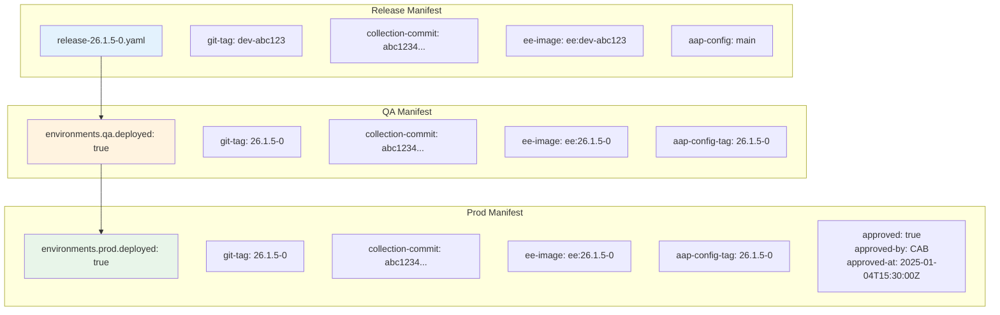

---

## Detailed Promotion Sequence

### 1. Development Deployment

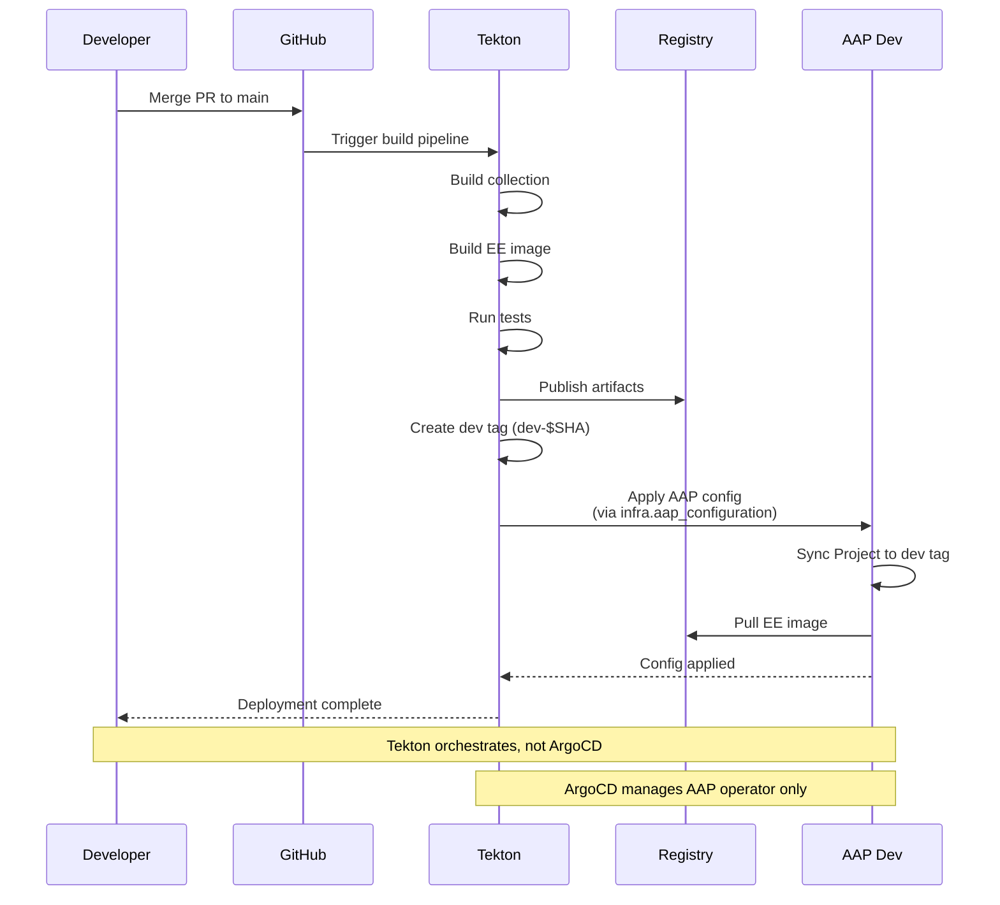

### 2. QA Promotion

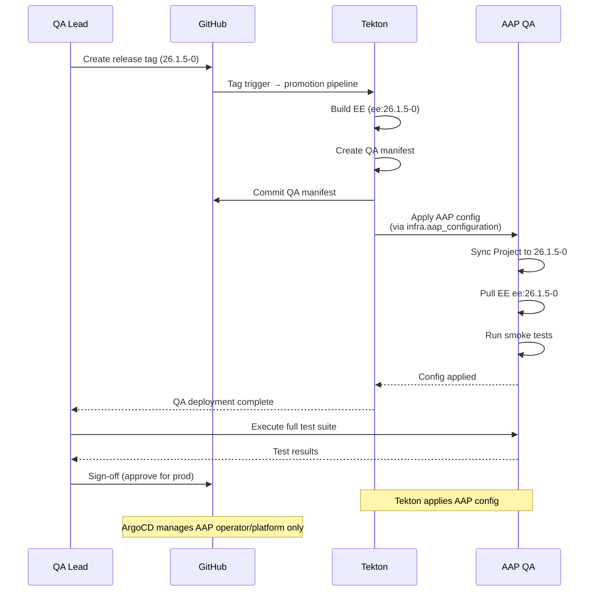

### 3. Production Promotion

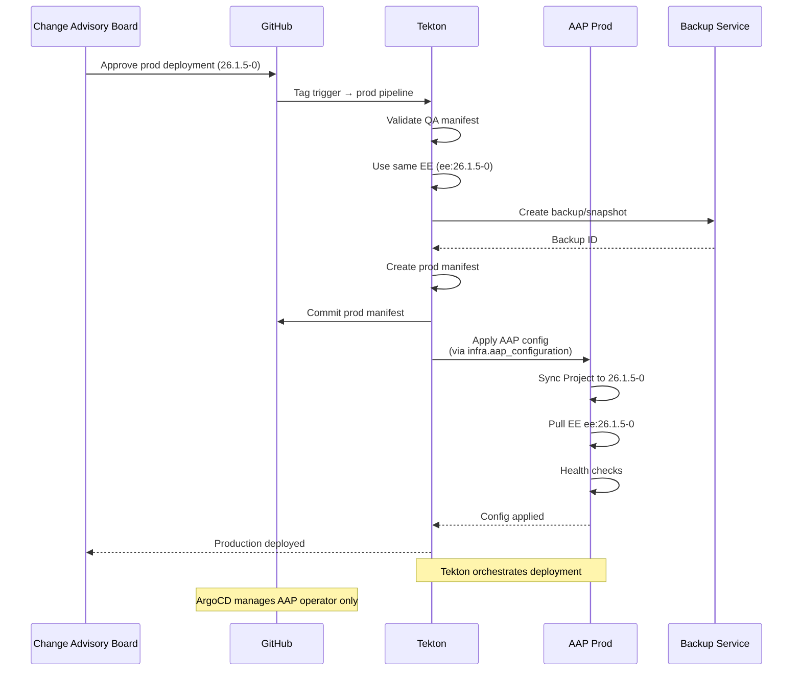

---

## Rollback Scenarios

### Development Rollback

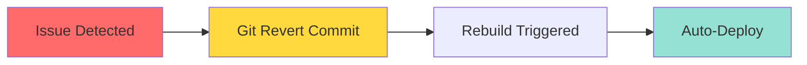

### QA/Production Rollback

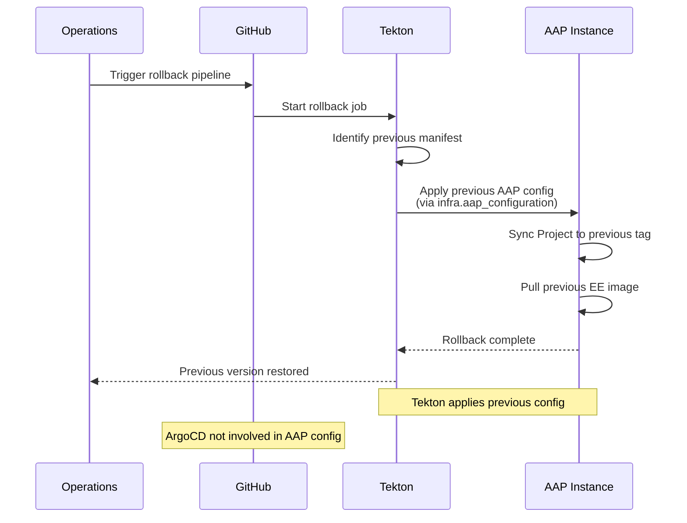

---

## Promotion Gates

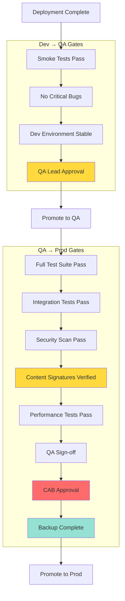

---

## Version Progression

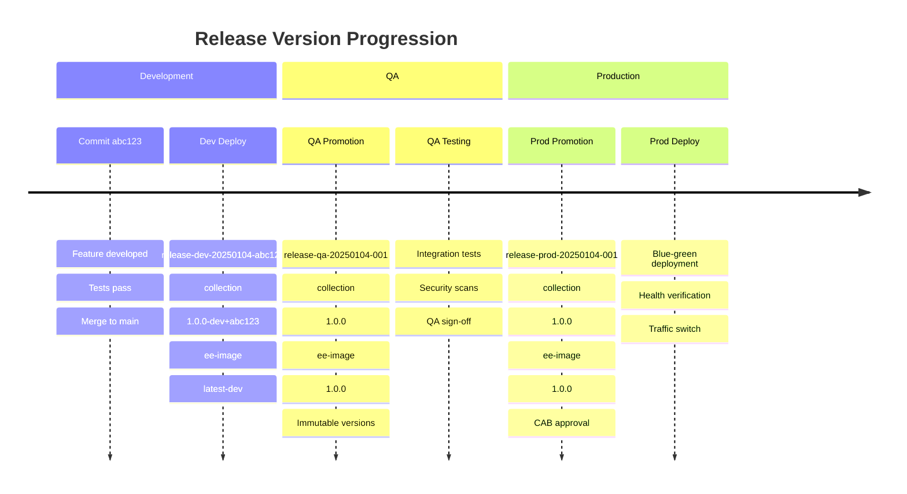

---

## Atomic Promotion Benefits

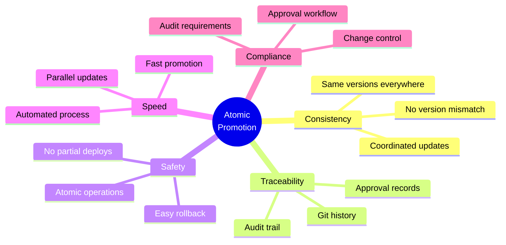

---

## Promotion Timeline

### Fast-Track Promotion (Emergency Fix)

```mermaid
gantt
    title Emergency Hotfix Promotion
    dateFormat HH:mm
    axisFormat %H:%M

    section Dev
    Code & Test     :00:00, 1h
    Build & Deploy  :01:00, 15m
    Validation      :01:15, 15m

    section QA
    Deploy to QA    :01:30, 10m
    Critical Tests  :01:40, 20m

    section Prod
    Emergency CAB   :02:00, 15m
    Prod Deploy     :02:15, 15m
    Verification    :02:30, 30m
```

### Standard Promotion (Feature Release)

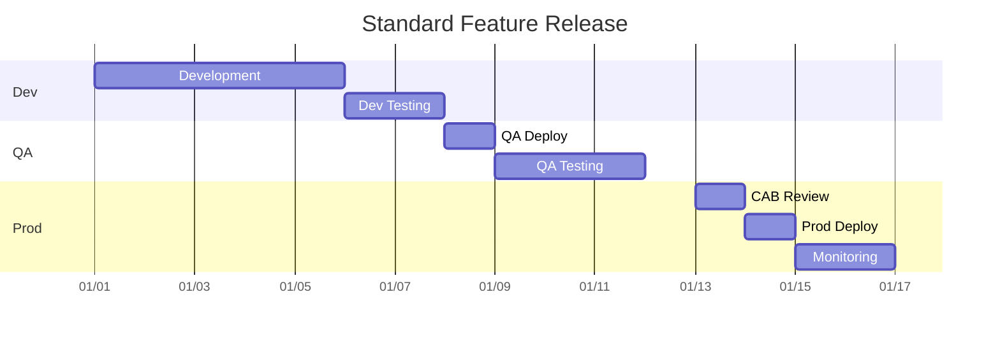

---

## Manifest Lifecycle

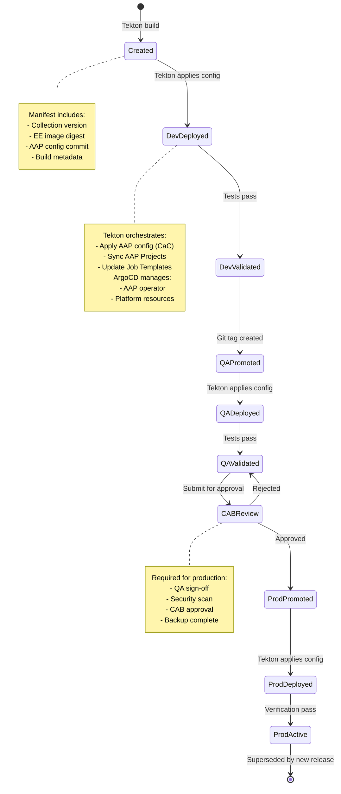

---

## Multi-Repository Coordination

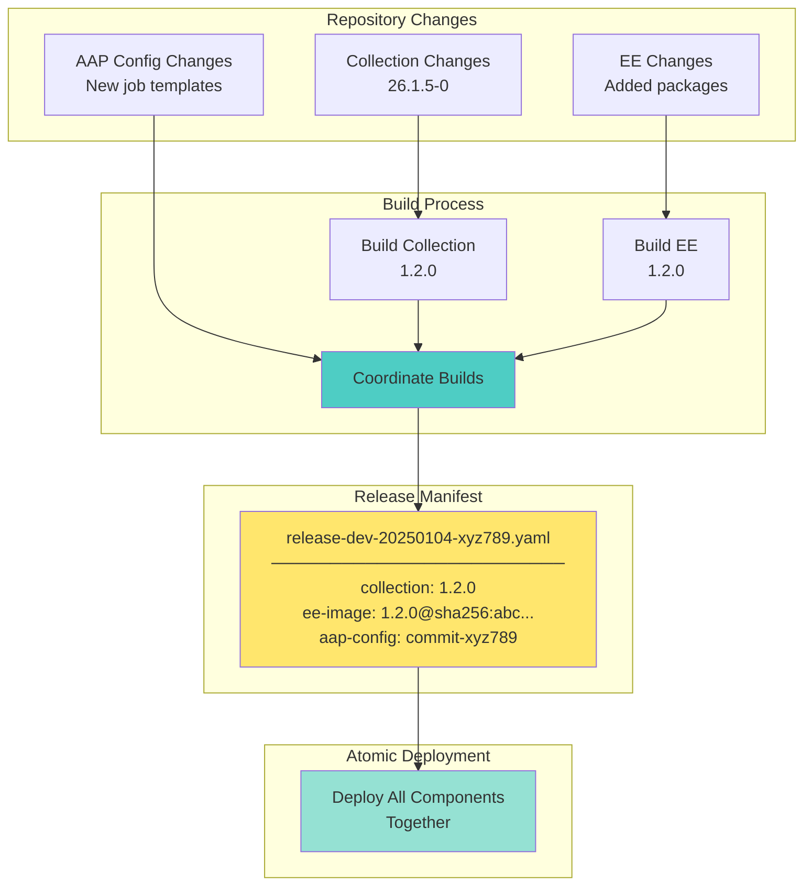

---

## Approval Workflow

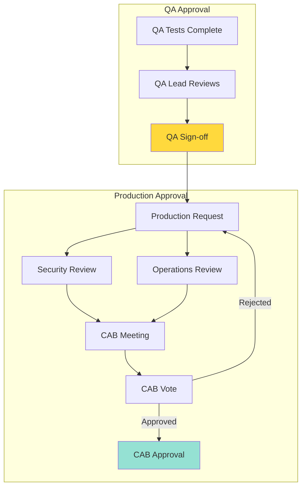

---

## Blue-Green Deployment (Production)

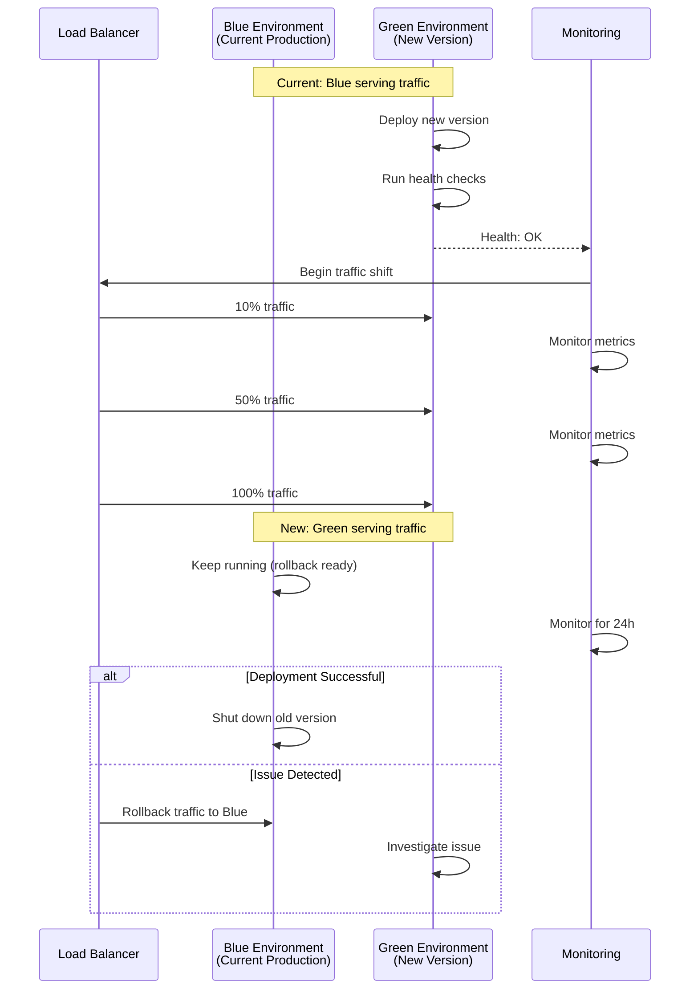

---

## Summary

### Promotion Principles

1. **Atomic**: All components promoted together
2. **Versioned**: Every promotion tracked in Git
3. **Gated**: Automated and manual approvals
4. **Traceable**: Full audit trail
5. **Reversible**: Fast rollback capability

### Key Characteristics

| Environment | Trigger | Approval | Speed | Risk |
|-------------|---------|----------|-------|------|
| **Dev** | Automatic | None | Fast (minutes) | Low |
| **QA** | Manual | QA Lead | Medium (hours) | Medium |
| **Prod** | Manual | CAB | Slow (days) | High |

### Constitutional Alignment

- ✅ **Article I**: All promotions via Git
- ✅ **Article II**: Approvals enforced by process
- ✅ **Article III**: Atomic promotion via manifests
- ✅ **Article IV**: Quality gates at each stage
- ✅ **Article V**: No secrets in manifests
