# Promotion Flow Architecture

**Atomic Promotion with Release Manifests**

## Promotion Overview

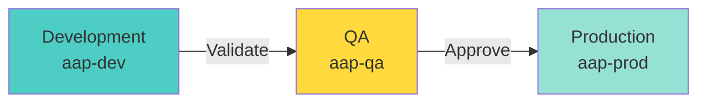

---

## Complete Promotion Pipeline with Git Tags

```mermaid
graph TB
    subgraph "Development Phase"
        CODE[Code Changes<br/>Feature Branch]
        TEST1[GitHub Actions<br/>Tests & Linting]
        MERGE[Merge to Main]
        TAG_DEV[Create Dev Tag<br/>dev-abc123]
    end

    subgraph "Build Phase"
        BUILD_COL[Build Collection]
        BUILD_EE[Build EE Image<br/>ee:dev-abc123]
        TEST_BUILD[Post-Build Tests]
    end

    subgraph "Release Phase"
        MANIFEST_DEV[Create Release Manifest<br/>dev-abc123.yaml]
        PUBLISH[Publish to Registries]
    end

    subgraph "Dev Environment"
        SYNC_DEV[AAP Dev Project<br/>Sync to main/dev tag]
        DEPLOY_DEV[Deploy to AAP Dev]
        SMOKE_DEV[Smoke Tests]
        VALIDATE_DEV[Validation Tests]
    end

    subgraph "QA Promotion"
        TAG_QA[Create QA Tag<br/>git tag qa-v1.1.0]
        MANIFEST_QA[Create Manifest<br/>qa-v1.1.0.yaml]
        BUILD_EE_QA[Build EE<br/>ee:qa-v1.1.0]
        SYNC_QA[AAP QA Project<br/>Sync to qa-v1.1.0]
        DEPLOY_QA[Deploy to AAP QA]
        TEST_QA[Full Test Suite]
        APPROVE_QA[QA Sign-off]
    end

    subgraph "Prod Promotion"
        CAB[Change Advisory Board]
        APPROVE_PROD[Production Approval]
        TAG_PROD[Create Prod Tag<br/>git tag prod-v1.0.0]
        BACKUP[Backup Rollback Point]
        MANIFEST_PROD[Create Manifest<br/>prod-v1.0.0.yaml]
        BUILD_EE_PROD[Build EE<br/>ee:prod-v1.0.0]
        SYNC_PROD[AAP Prod Project<br/>Sync to prod-v1.0.0]
        DEPLOY_PROD[Deploy to AAP Prod]
        VERIFY_PROD[Production Verification]
    end

    CODE --> TEST1
    TEST1 -->|Pass| MERGE
    MERGE --> TAG_DEV
    TAG_DEV --> BUILD_COL
    TAG_DEV --> BUILD_EE
    BUILD_COL --> TEST_BUILD
    BUILD_EE --> TEST_BUILD
    TEST_BUILD -->|Pass| MANIFEST_DEV
    MANIFEST_DEV --> PUBLISH
    PUBLISH --> SYNC_DEV
    SYNC_DEV --> DEPLOY_DEV
    DEPLOY_DEV --> SMOKE_DEV
    SMOKE_DEV --> VALIDATE_DEV
    VALIDATE_DEV -->|Pass| TAG_QA

    TAG_QA --> MANIFEST_QA
    TAG_QA --> BUILD_EE_QA
    MANIFEST_QA --> SYNC_QA
    BUILD_EE_QA --> SYNC_QA
    SYNC_QA --> DEPLOY_QA
    DEPLOY_QA --> TEST_QA
    TEST_QA -->|Pass| APPROVE_QA

    APPROVE_QA --> CAB
    CAB --> APPROVE_PROD
    APPROVE_PROD --> TAG_PROD
    TAG_PROD --> BACKUP
    BACKUP --> MANIFEST_PROD
    TAG_PROD --> BUILD_EE_PROD
    MANIFEST_PROD --> SYNC_PROD
    BUILD_EE_PROD --> SYNC_PROD
    SYNC_PROD --> DEPLOY_PROD
    DEPLOY_PROD --> VERIFY_PROD

    style MERGE fill:#4ecdc4
    style TAG_DEV fill:#4ecdc4
    style TAG_QA fill:#ffd93d
    style TAG_PROD fill:#ff6b6b
    style DEPLOY_PROD fill:#95e1d3
```

---

## Git Tag-Based Promotion Strategy

### Tag Naming Convention

| Environment | Tag Format | Example | Created When |
|-------------|------------|---------|--------------|
| **Development** | `dev-<short-sha>` | `dev-abc123` | Automatic on merge to main |
| **QA** | `qa-v<major>.<minor>.<patch>` | `qa-v1.1.0` | Manual, when ready for QA |
| **Production** | `prod-v<major>.<minor>.<patch>` | `prod-v1.0.0` | Manual, after CAB approval |

### Tag Immutability

- **Dev tags**: May be ephemeral, deleted after promotion
- **QA/Prod tags**: **IMMUTABLE** - never deleted or moved
- **Semantic Versioning**: QA and Prod follow [SemVer](https://semver.org/)
- **AAP Projects**: Configure to checkout specific tags (not branch names)

### Example Tag Creation

```bash
# Development (automatic)
git checkout main
git pull
git tag dev-$(git rev-parse --short HEAD)
git push origin dev-$(git rev-parse --short HEAD)

# QA (manual)
git tag -a qa-v1.1.0 -m "Release 1.1.0 for QA testing"
git push origin qa-v1.1.0

# Production (manual, after approval)
git tag -a prod-v1.0.0 -m "Production Release 1.0.0
Approved by: CAB
Change: CHG0001234"
git push origin prod-v1.0.0
```

**See**: [BRANCHING-STRATEGY.md](../BRANCHING-STRATEGY.md) for complete workflow

---

## Release Manifest Structure

### Manifest Evolution Across Environments

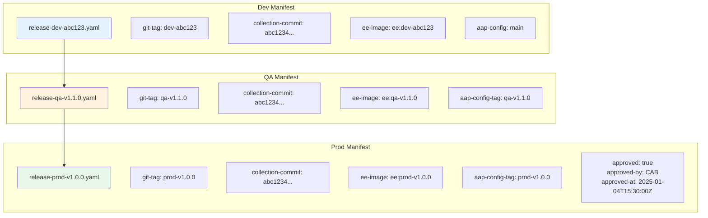

---

## Detailed Promotion Sequence

### 1. Development Deployment

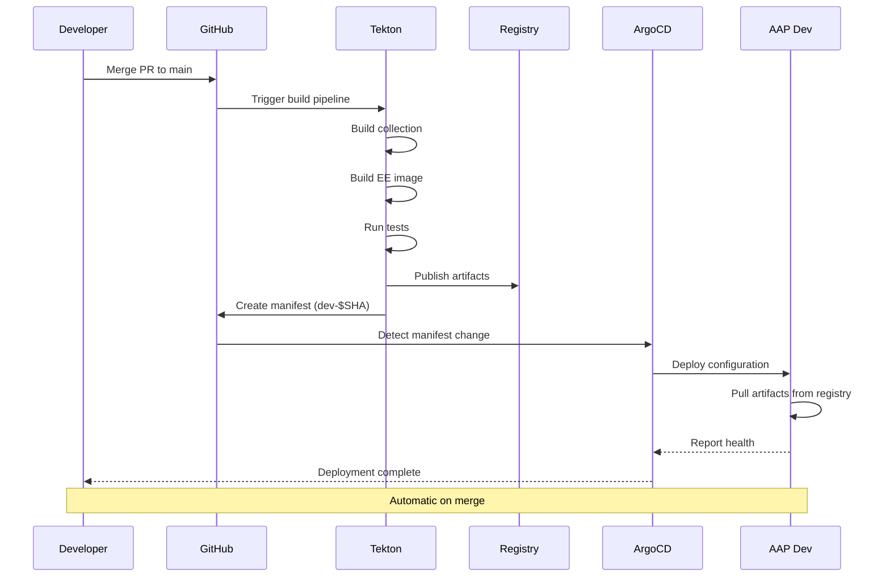

### 2. QA Promotion

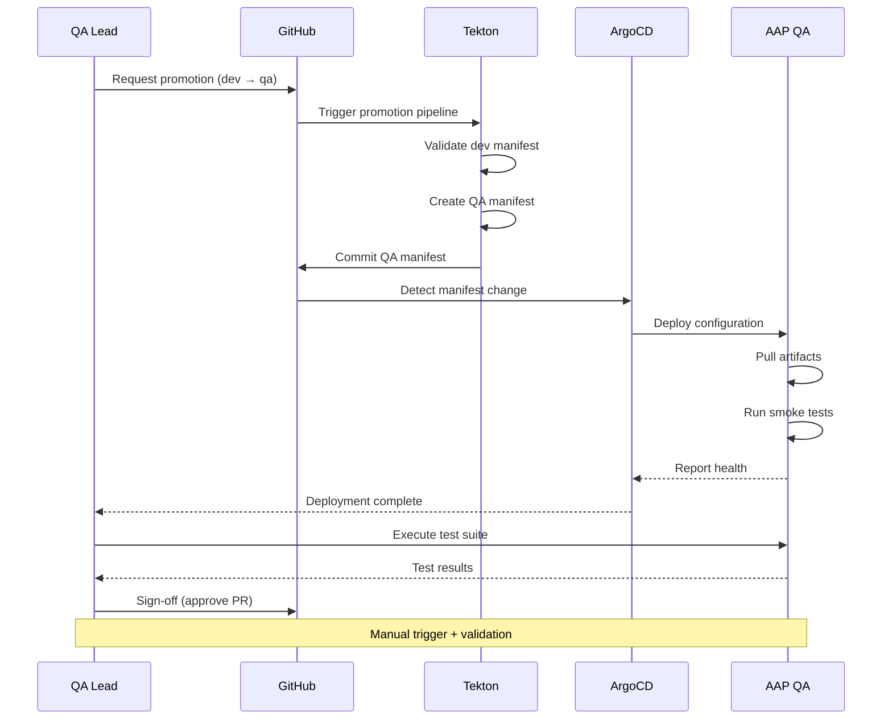

### 3. Production Promotion

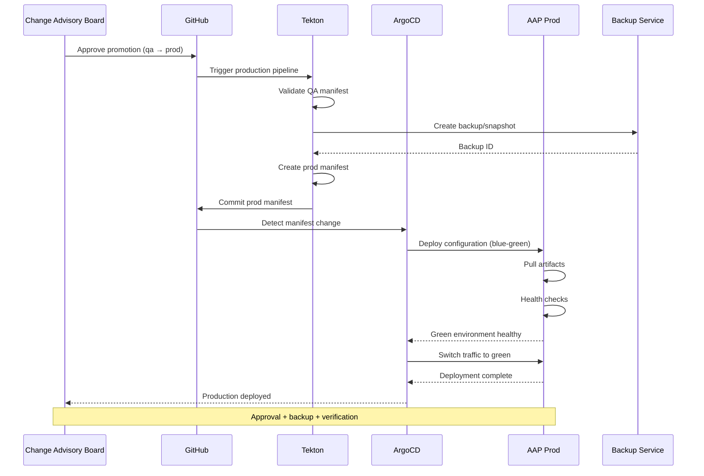

---

## Rollback Scenarios

### Development Rollback

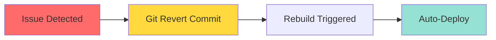

### QA/Production Rollback

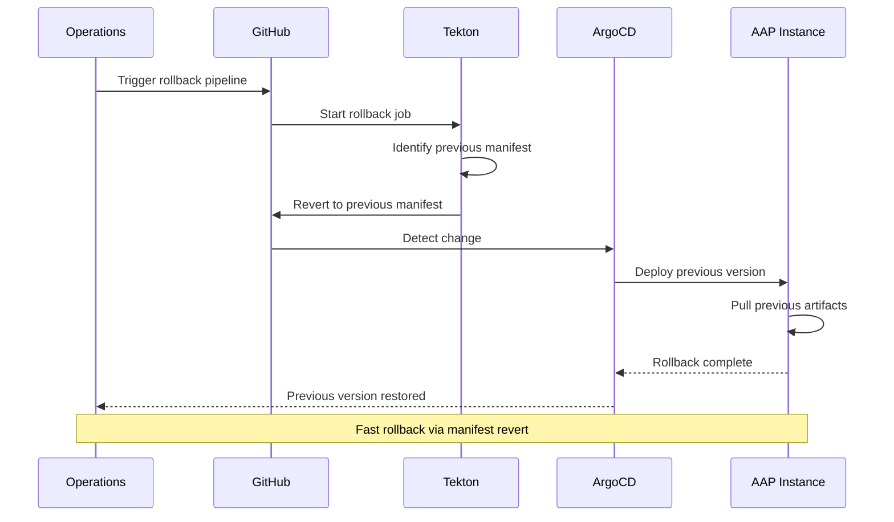

---

## Promotion Gates

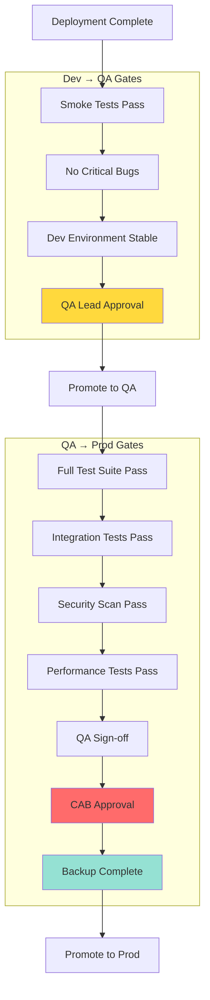

---

## Version Progression

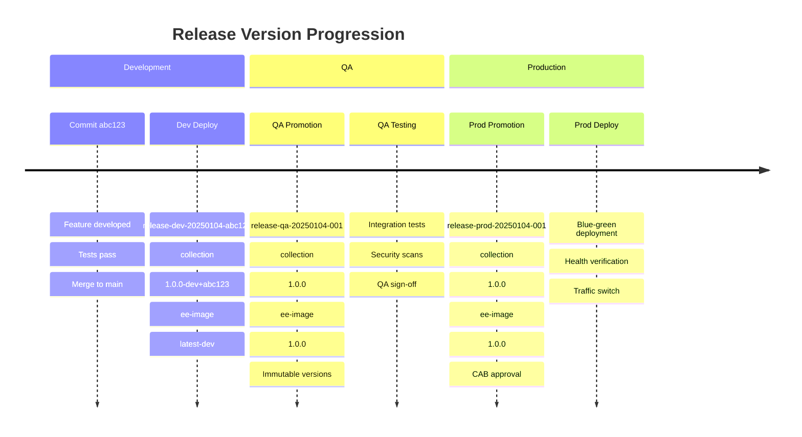

---

## Atomic Promotion Benefits

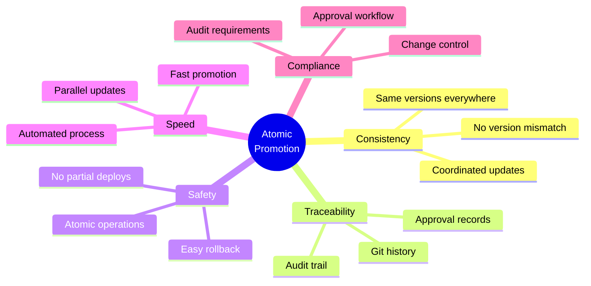

---

## Promotion Timeline

### Fast-Track Promotion (Emergency Fix)

```mermaid
gantt
    title Emergency Hotfix Promotion
    dateFormat HH:mm
    axisFormat %H:%M

    section Dev
    Code & Test     :00:00, 1h
    Build & Deploy  :01:00, 15m
    Validation      :01:15, 15m

    section QA
    Deploy to QA    :01:30, 10m
    Critical Tests  :01:40, 20m

    section Prod
    Emergency CAB   :02:00, 15m
    Prod Deploy     :02:15, 15m
    Verification    :02:30, 30m
```

### Standard Promotion (Feature Release)

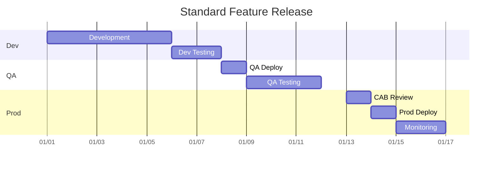

---

## Manifest Lifecycle

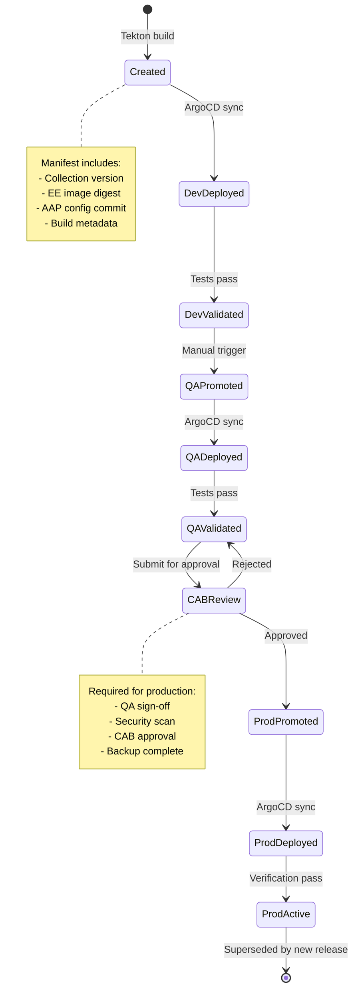

---

## Multi-Repository Coordination


---

## Approval Workflow

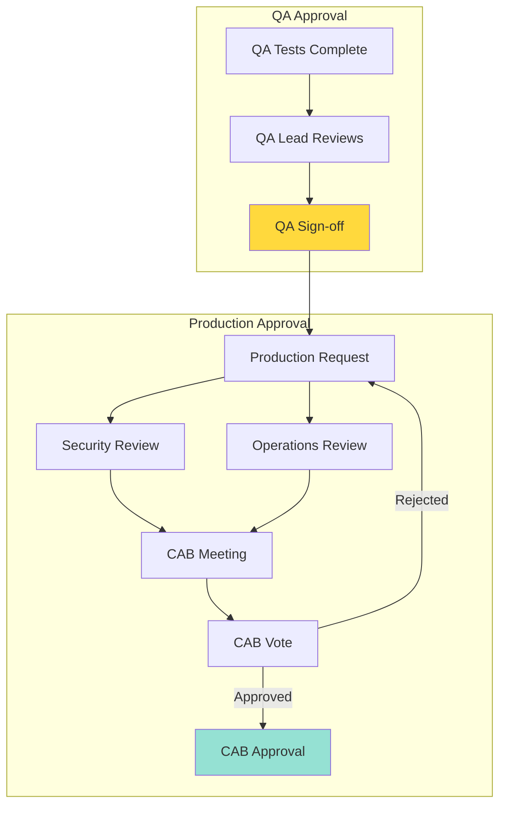

---

## Blue-Green Deployment (Production)

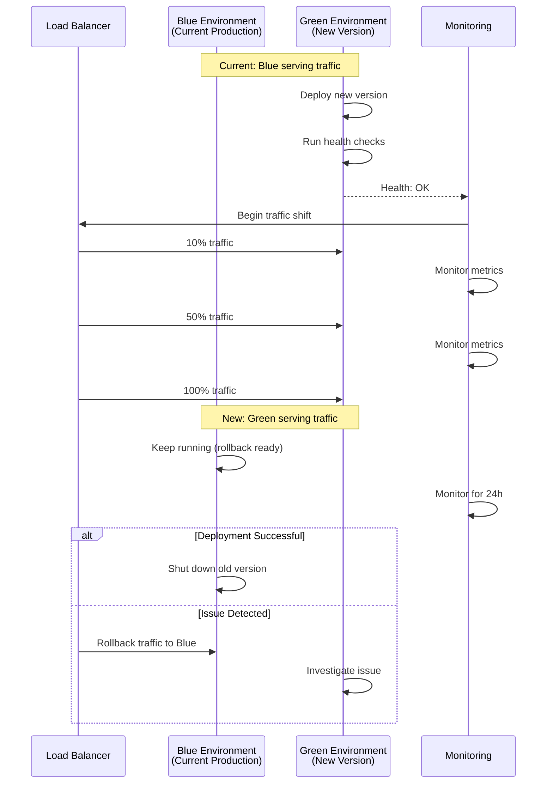

---

## Summary

### Promotion Principles

1. **Atomic**: All components promoted together
2. **Versioned**: Every promotion tracked in Git
3. **Gated**: Automated and manual approvals
4. **Traceable**: Full audit trail
5. **Reversible**: Fast rollback capability

### Key Characteristics

| Environment | Trigger | Approval | Speed | Risk |
|-------------|---------|----------|-------|------|
| **Dev** | Automatic | None | Fast (minutes) | Low |
| **QA** | Manual | QA Lead | Medium (hours) | Medium |
| **Prod** | Manual | CAB | Slow (days) | High |

### Constitutional Alignment

- ✅ **Article I**: All promotions via Git
- ✅ **Article II**: Approvals enforced by process
- ✅ **Article III**: Atomic promotion via manifests
- ✅ **Article IV**: Quality gates at each stage
- ✅ **Article V**: No secrets in manifests

---

**Result**: Safe, predictable, auditable promotion workflow

