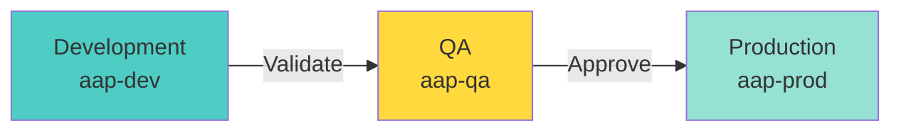
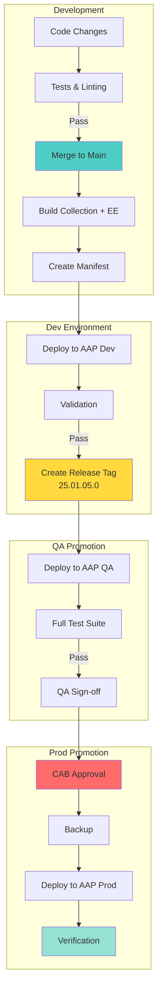
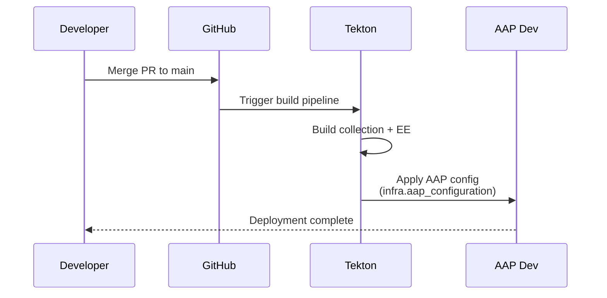
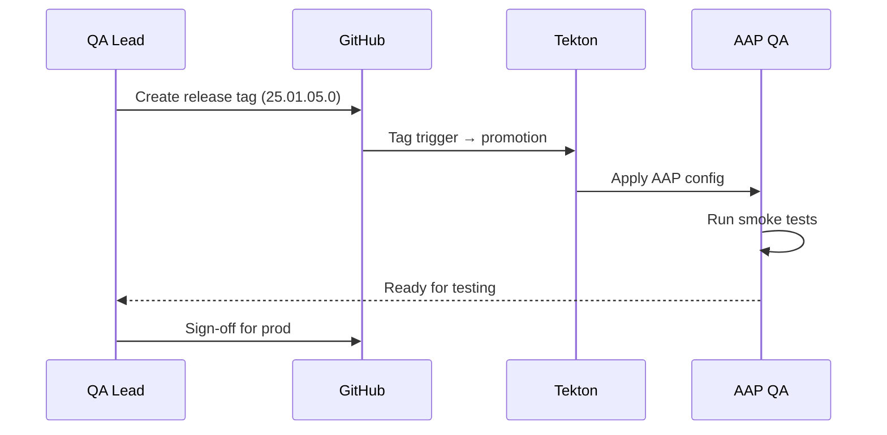
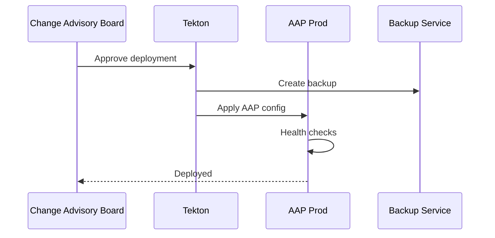
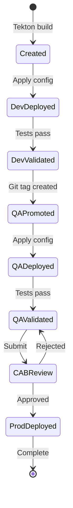

# Promotion Flow Architecture

**Atomic Promotion with Release Manifests**

---

## Tool Responsibilities

| Tool | Manages | Repository |
|------|---------|------------|
| **ArgoCD** (Platform Loop) | Kubernetes resources, AAP Operator, Tekton, RBAC | `cluster-config` |
| **Tekton** (Application Loop) | Build EEs, Apply AAP Config, Create Manifests, Promote | All automation repos |

---

## Promotion Overview



---

## Complete Promotion Pipeline



---

## Version Format (CalVer)

| Format | Example | Description |
|--------|---------|-------------|
| `YY.MM.DD.PATCH` | `25.01.05.0` | January 5, 2025 - Initial |
| `YY.MM.DD.PATCH` | `25.01.05.1` | January 5, 2025 - Hotfix |

**Key**: Same tag promotes through all environments (dev → qa → prod)

---

## Detailed Sequences

### Development Deployment



### QA Promotion



### Production Promotion



---

## Rollback

### Quick Rollback

```bash
# Using Tekton pipeline
tkn pipeline start rollback \
  -p TARGET_VERSION=25.01.04.0 \
  -p ENVIRONMENT=prod

# Or Git revert (for platform changes)
cd cluster-config
git revert HEAD && git push
```

---

## Promotion Gates

| Gate | Dev → QA | QA → Prod |
|------|----------|-----------|
| Tests Pass | ✅ | ✅ |
| Security Scan | - | ✅ |
| Sign-off | Dev Lead | QA Lead |
| CAB Approval | - | ✅ |
| Backup | - | ✅ |

---

## Release Manifest Lifecycle



---

## Constitutional Alignment

- ✅ **Article I**: All promotions via Git
- ✅ **Article II**: Approvals enforced
- ✅ **Article III**: Atomic promotion via manifests
- ✅ **Article IV**: Quality gates at each stage
- ✅ **Article V**: No secrets in manifests
