# Repository Structure Diagrams

**Git Repository Organization and Relationships**

## Repository Overview

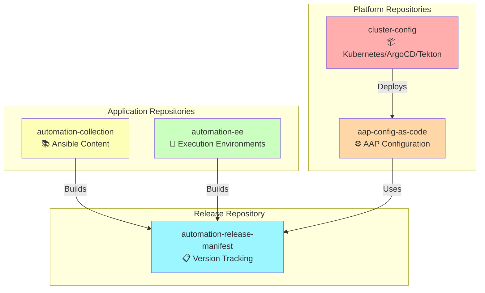

---

## cluster-config Repository

**Purpose**: OpenShift cluster configuration (Platform Loop)

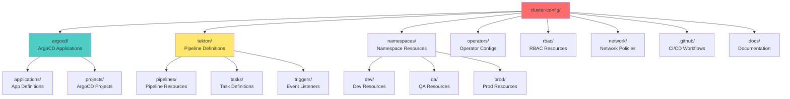

### Directory Structure

```
cluster-config/
├── argocd/
│   ├── applications/
│   │   ├── aap-dev.yaml              # AAP Dev instance
│   │   ├── aap-qa.yaml               # AAP QA instance
│   │   ├── aap-prod.yaml             # AAP Prod instance
│   │   └── tekton-pipelines.yaml    # Tekton pipeline app
│   ├── projects/
│   │   ├── platform.yaml             # Platform project
│   │   └── automation.yaml           # Automation project
│   └── appsets/
│       └── environment-appset.yaml   # Environment app set
│
├── tekton/
│   ├── pipelines/
│   │   ├── build-collection.yaml    # Collection build
│   │   ├── build-ee.yaml            # EE image build
│   │   ├── promote-qa.yaml          # QA promotion
│   │   └── promote-prod.yaml        # Prod promotion
│   ├── tasks/
│   │   ├── ansible-test.yaml        # Ansible testing
│   │   ├── build-image.yaml         # Image building
│   │   └── create-manifest.yaml     # Manifest creation
│   └── triggers/
│       ├── github-webhook.yaml      # GitHub integration
│       └── eventlisteners.yaml      # Event listeners
│
├── namespaces/
│   ├── platform/
│   │   └── namespace.yaml
│   ├── aap-dev/
│   │   ├── namespace.yaml
│   │   ├── limitrange.yaml
│   │   └── resourcequota.yaml
│   ├── aap-qa/
│   │   └── ...
│   └── aap-prod/
│       └── ...
│
├── operators/
│   ├── aap-operator.yaml            # AAP Operator
│   ├── postgresql-operator.yaml    # PostgreSQL
│   └── vault-operator.yaml          # Vault
│
├── rbac/
│   ├── platform-admin-role.yaml
│   ├── developer-role.yaml
│   └── automation-sa.yaml
│
├── network/
│   ├── networkpolicies/
│   │   ├── deny-all-default.yaml
│   │   ├── allow-aap-postgres.yaml
│   │   └── allow-external-api.yaml
│   └── routes/
│       ├── aap-dev-route.yaml
│       └── ...
│
├── .github/workflows/
│   ├── pre-commit.yml
│   ├── validate-kubernetes.yml
│   └── pr-validation.yml
│
├── .pre-commit-config.yaml
├── .yamllint
└── README.md
```

---

## aap-config-as-code Repository

**Purpose**: AAP configuration as code

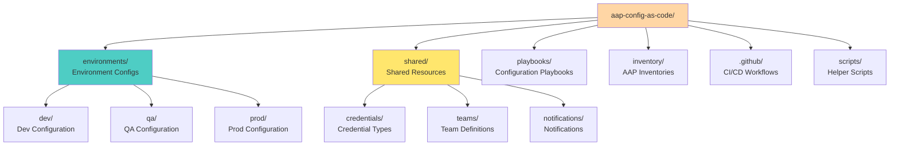

### Directory Structure

```
aap-config-as-code/
├── environments/
│   ├── dev/
│   │   ├── organizations.yml
│   │   ├── projects.yml
│   │   ├── inventories.yml
│   │   ├── job-templates.yml
│   │   ├── workflow-templates.yml
│   │   └── credentials.yml
│   ├── qa/
│   │   └── ...
│   └── prod/
│       └── ...
│
├── shared/
│   ├── credential-types/
│   │   ├── vault-credential-type.yml
│   │   └── cloud-credential-type.yml
│   ├── teams/
│   │   ├── platform-team.yml
│   │   ├── developers-team.yml
│   │   └── operations-team.yml
│   ├── notifications/
│   │   ├── slack-notification.yml
│   │   └── email-notification.yml
│   └── execution-environments/
│       └── ee-list.yml
│
├── playbooks/
│   ├── configure-aap.yml           # Main playbook
│   ├── configure-organizations.yml
│   ├── configure-projects.yml
│   ├── configure-inventories.yml
│   ├── configure-job-templates.yml
│   └── configure-workflows.yml
│
├── inventory/
│   ├── dev/
│   │   └── hosts.yml
│   ├── qa/
│   │   └── hosts.yml
│   └── prod/
│       └── hosts.yml
│
├── scripts/
│   ├── validate-aap-config.py      # Config validator
│   ├── backup-aap.sh              # Backup script
│   └── diff-configs.sh            # Config diff tool
│
├── .github/workflows/
│   ├── ansible-lint.yml
│   ├── deploy-dev.yml
│   └── pr-validation.yml
│
├── .pre-commit-config.yaml
├── .ansible-lint
└── README.md
```

---

## automation-collection Repository

**Purpose**: Custom Ansible collection (Application Loop)

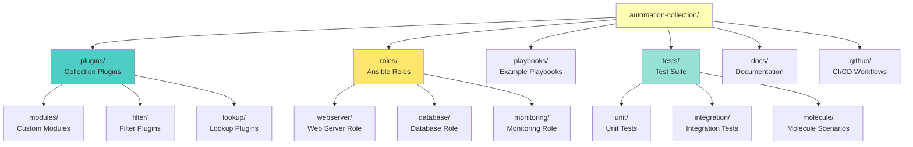

### Directory Structure

```
automation-collection/
├── plugins/
│   ├── modules/
│   │   ├── sample_module.py
│   │   ├── manage_service.py
│   │   └── config_manager.py
│   ├── filter/
│   │   ├── text_filters.py
│   │   └── data_filters.py
│   ├── lookup/
│   │   ├── vault_secrets.py
│   │   └── config_lookup.py
│   └── module_utils/
│       └── common.py
│
├── roles/
│   ├── webserver/
│   │   ├── tasks/
│   │   │   └── main.yml
│   │   ├── handlers/
│   │   │   └── main.yml
│   │   ├── templates/
│   │   │   ├── httpd.conf.j2
│   │   │   └── index.html.j2
│   │   ├── defaults/
│   │   │   └── main.yml
│   │   ├── vars/
│   │   │   ├── RedHat.yml
│   │   │   └── Debian.yml
│   │   ├── meta/
│   │   │   ├── main.yml
│   │   │   └── argument_specs.yml
│   │   ├── molecule/
│   │   │   ├── default/
│   │   │   ├── centos/
│   │   │   └── ubuntu/
│   │   └── README.md
│   ├── database/
│   │   └── ...
│   └── monitoring/
│       └── ...
│
├── playbooks/
│   ├── deploy-webserver.yml
│   ├── deploy-database.yml
│   └── full-stack-deploy.yml
│
├── tests/
│   ├── unit/
│   │   ├── test_modules.py
│   │   └── test_filters.py
│   ├── integration/
│   │   ├── test_integration.py
│   │   └── targets/
│   │       └── sample_module/
│   └── molecule/
│       └── shared-scenarios/
│
├── docs/
│   ├── modules/
│   │   └── sample_module.md
│   ├── roles/
│   │   └── webserver.md
│   └── guides/
│       └── getting-started.md
│
├── .github/workflows/
│   ├── test-sanity-units.yml
│   ├── integration-tests.yml
│   └── molecule-test.yml
│
├── galaxy.yml                      # Collection metadata
├── .pre-commit-config.yaml
├── .ansible-lint
└── README.md
```

---

## automation-ee Repository

**Purpose**: Execution environment definitions

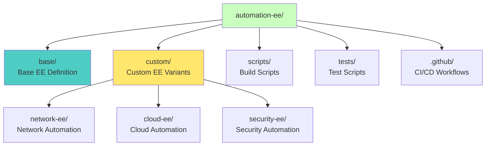

### Directory Structure

```
automation-ee/
├── base/
│   ├── execution-environment.yml    # Base EE definition
│   ├── requirements.yml            # Ansible deps
│   ├── requirements.txt            # Python deps
│   ├── bindep.txt                  # System deps
│   └── README.md
│
├── custom/
│   ├── network-ee/
│   │   ├── execution-environment.yml
│   │   ├── requirements.yml        # cisco.ios, etc.
│   │   └── requirements.txt
│   ├── cloud-ee/
│   │   ├── execution-environment.yml
│   │   ├── requirements.yml        # amazon.aws, etc.
│   │   └── requirements.txt        # boto3, etc.
│   └── security-ee/
│       ├── execution-environment.yml
│       └── requirements.yml
│
├── scripts/
│   ├── build-ee.sh                 # Build script
│   ├── test-ee.sh                  # Test script
│   ├── generate-sbom.sh            # SBOM generation
│   └── scan-vulnerabilities.sh     # Security scan
│
├── tests/
│   ├── test-basic-ee.yml           # Basic tests
│   ├── test-module-imports.yml     # Import tests
│   └── fixtures/
│       └── test-playbook.yml
│
├── .github/workflows/
│   ├── validate-ee.yml
│   ├── build-ee.yml
│   └── sbom-generation.yml
│
├── .pre-commit-config.yaml
└── README.md
```

---

## automation-release-manifest Repository

**Purpose**: Atomic version tracking

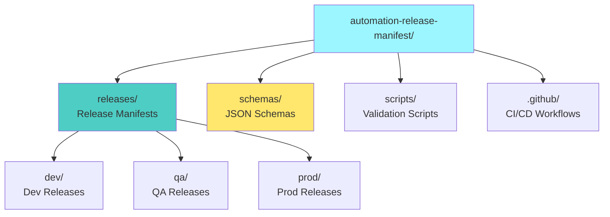

### Directory Structure

```
automation-release-manifest/
├── releases/
│   ├── dev/
│   │   ├── release-dev-20250104-abc123.yaml
│   │   ├── release-dev-20250103-xyz789.yaml
│   │   └── ...
│   ├── qa/
│   │   ├── release-qa-20250104-001.yaml
│   │   ├── release-qa-20250103-001.yaml
│   │   └── ...
│   └── prod/
│       ├── release-prod-20250104-001.yaml
│       ├── release-prod-20250101-001.yaml
│       └── ...
│
├── schemas/
│   ├── release-manifest-schema.json  # JSON Schema
│   └── examples/
│       ├── minimal-manifest.yaml
│       └── complete-manifest.yaml
│
├── scripts/
│   ├── create-manifest.py          # Manifest creator
│   ├── validate-manifest-schema.py # Schema validator
│   ├── promote-manifest.py         # Promotion tool
│   └── rollback-manifest.py        # Rollback tool
│
├── .github/workflows/
│   ├── validate-manifest.yml
│   └── auto-label.yml
│
├── .pre-commit-config.yaml
└── README.md
```

---

## Repository Relationships

### Build Flow

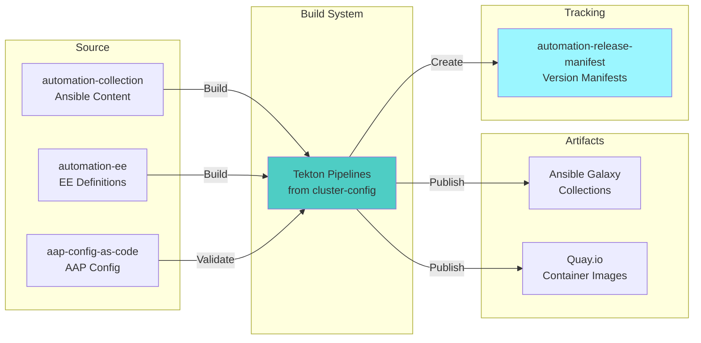

### Deployment Flow

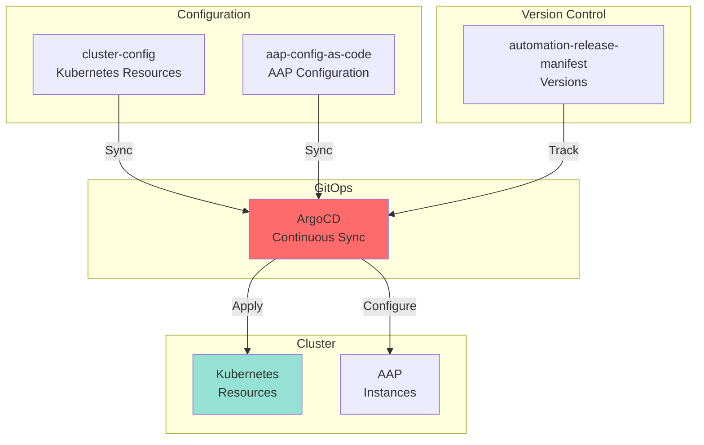

---

## Access Patterns

### Developer Daily Workflow

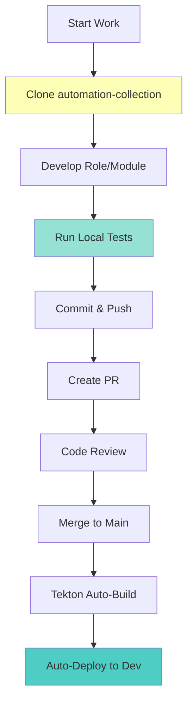

### Platform Engineer Daily Workflow

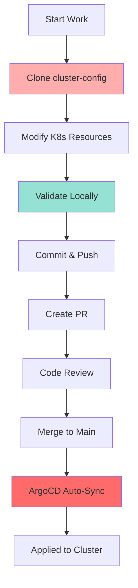

### Release Manager Daily Workflow

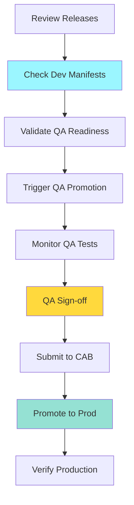

---

## Repository Statistics

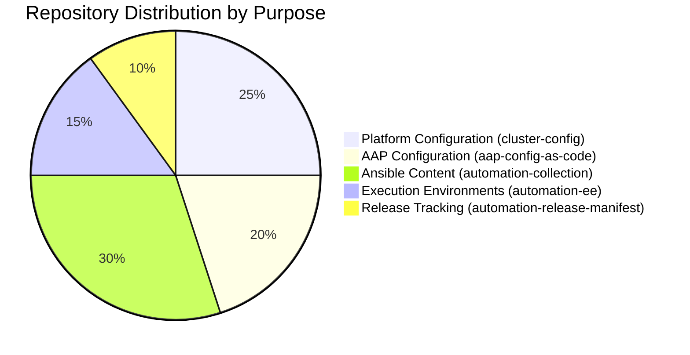

---

## Branching Strategy

### Main Branch Flow

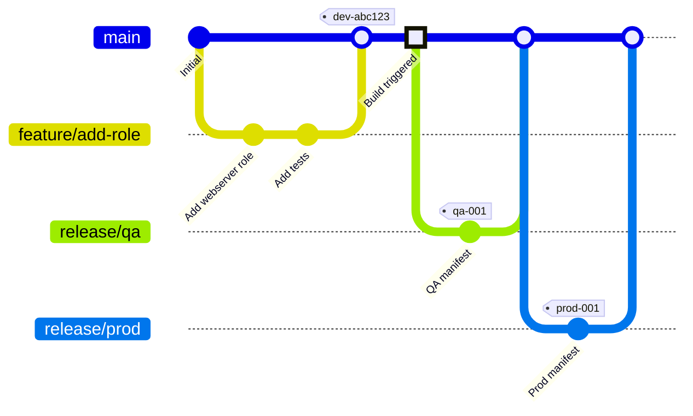

---

## Summary

### Repository Purposes

| Repository | Type | Purpose | Managed By |
|------------|------|---------|------------|
| **cluster-config** | Platform | Kubernetes/GitOps config | Platform Team |
| **aap-config-as-code** | Platform | AAP configuration | Automation Team |
| **automation-collection** | Application | Ansible content | Developers |
| **automation-ee** | Application | Container images | Developers |
| **automation-release-manifest** | Tracking | Version coordination | Release Mgmt |

### Key Characteristics

- ✅ **Separation of Concerns**: Each repo has clear purpose
- ✅ **Independent Development**: Teams work in parallel
- ✅ **Coordinated Releases**: Manifests unite all components
- ✅ **Full Traceability**: Git history tracks everything
- ✅ **Constitutional Compliance**: All 5 articles enforced

---

**Result**: Clean, maintainable, scalable repository structure

