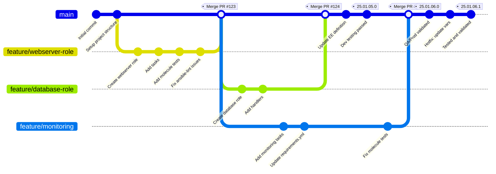
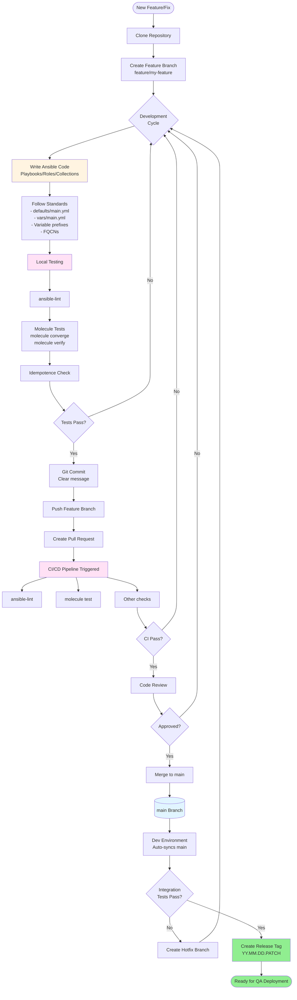
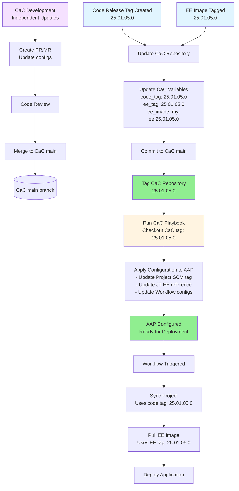

# Ansible Automation Platform Code Lifecycle - Workflow Diagrams

## Git Workflow - Trunk-Based Development with Tags

### Git Workflow Explanation

**Trunk-Based Development Strategy:**
- **main branch**: Single source of truth, always deployable
- **Feature branches**: Short-lived, merge back to main frequently
- **Git tags**: Immutable markers for environment promotion using **YY.MM.DD.PATCH** format
  - Example: `25.01.05.0` for January 5, 2025 initial release
  - Example: `25.01.05.1` for hotfix on same day
  - Same tag promotes through all environments (dev → qa → prod)

**Workflow Steps:**
1. Create feature branch from main
2. Develop playbooks/roles/collections
3. Run local tests (ansible-lint, molecule)
4. Create Pull Request
5. CI/CD runs automated tests
6. Code review and approval
7. Merge to main
8. Test in Dev environment (tracks main branch)
9. Create release tag when Dev tests pass (e.g., `25.01.05.0`)
10. Deploy to QA using same tag
11. After QA validation, deploy to Prod using same tag
12. For hotfixes, increment PATCH (e.g., `25.01.05.1`)

**Key Benefits:**
- Simplified Git management (no long-lived environment branches)
- Immutable releases via CalVer tags (YY.MM.DD.PATCH)
- Clear promotion path: Dev (main) → QA (tag) → Prod (same tag)
- Easy rollback (deploy previous tag via rollback script)
- Date-based versions provide instant visibility into release timing

---

## Code Development and Testing Flow

### Development Flow Key Points

**Local Development:**
- Feature branches for all changes
- Local testing before pushing
- ansible-lint for code quality
- Molecule for role/collection testing

**CI/CD Integration:**
- Automated testing on every PR
- Blocks merge if tests fail
- Enforces code quality standards

**Code Standards:**
- Idempotent playbooks
- Named tasks for debugging
- Proper variable precedence (defaults vs vars)
- FQCN for all modules
- Comprehensive README files

---

## Complete AAP Deployment Pipeline

```mermaid
flowchart TD
    Start([Start: Automation Need]) --> Phase1[Phase 1: Plan & Structure]

    Phase1 --> P1_1[Define Goal]
    Phase1 --> P1_2[Setup Inventories<br/>Dev/QA/Prod]
    Phase1 --> P1_3[Setup Dev Environment<br/>IDE, ADT, VSCode]
    Phase1 --> P1_4[Adopt Project Structure<br/>Alternative Directory Layout]
    Phase1 --> P1_5[Standardize Role Creation<br/>ansible-creator]
    Phase1 --> P1_6[Utilize Collections<br/>requirements.yml]

    P1_6 --> Phase2[Phase 2: Develop & Version]

    Phase2 --> P2_1[Write High-Quality Code<br/>Idempotent, Named Tasks]
    Phase2 --> P2_2[Manage Secrets<br/>AAP Credentials]
    Phase2 --> P2_3[Version Control in Git<br/>main branch]

    P2_3 --> FeatureBranch[Create Feature Branch]
    FeatureBranch --> P2_4[Code Development]
    P2_4 --> LocalLint[Local: ansible-lint]

    LocalLint --> Phase3[Phase 3: Test]

    Phase3 --> P3_1[Molecule Testing<br/>Local/Container]
    P3_1 --> P3_2[molecule converge]
    P3_2 --> P3_3[molecule verify]
    P3_3 --> P3_4[Idempotence Check]

    P3_4 --> PR[Create Pull Request]
    PR --> CI[CI/CD Pipeline]
    CI --> CI_Lint[Run ansible-lint]
    CI --> CI_Molecule[Run molecule test]

    CI_Molecule --> CodeReview[Code Review]
    CodeReview --> MergeMain[Merge to main]

    MergeMain --> MainBranch[(Git main Branch)]

    MainBranch --> DevSync[Dev AAP Project<br/>Syncs main branch]
    DevSync --> DevTest{Test in Dev?}
    DevTest -->|Pass| CreateQATag[Create Git Tag<br/>25.01.05.0]
    DevTest -->|Fail| FeatureBranch

    CreateQATag --> BuildEE[Build Execution Environment<br/>ansible-builder]
    BuildEE --> TagEE[Tag EE Image<br/>my-registry/my-ee:25.01.05.0]
    TagEE --> PushEE[Push to Container Registry<br/>Automation Hub/Quay]

    PushEE --> UpdateCaC[Update CaC Repository<br/>Set code tag: 25.01.05.0<br/>Set EE tag: 25.01.05.0]
    UpdateCaC --> TagCaC[Tag CaC Repository<br/>25.01.05.0]
    TagCaC --> ApplyCaC[Apply CaC to AAP<br/>infra.aap_configuration]

    ApplyCaC --> Phase4QA[Phase 4: Deploy to QA]

    Phase4QA --> WF_QA[QA Workflow Job Template]
    WF_QA --> QA1[Sync QA Project<br/>Tag: 25.01.05.0]
    QA1 --> QA2[Pull EE Image<br/>25.01.05.0]
    QA2 --> QA3[Run Job Template<br/>QA Inventory]
    QA3 --> QA4{QA Tests Pass?}

    QA4 -->|Fail| QA_Rollback[Rollback JT]
    QA_Rollback --> FeatureBranch

    QA4 -->|Pass| QA_Approval[Approval Node<br/>QA Sign-off]

    QA_Approval -->|Approved| PromoteProd[Promote to Prod<br/>Same tag: 25.01.05.0]
    QA_Approval -->|Rejected| FeatureBranch

    PromoteProd --> ApplyProdCaC[Apply CaC to Prod AAP<br/>Tag: 25.01.05.0]

    ApplyProdCaC --> Phase4Prod[Phase 4: Deploy to Prod]

    Phase4Prod --> WF_Prod[Prod Workflow Job Template]
    WF_Prod --> Prod1[Sync Prod Project<br/>Tag: 25.01.05.0]
    Prod1 --> Prod2[Pull EE Image<br/>25.01.05.0]
    Prod2 --> Prod3[Run Job Template<br/>Prod Inventory]
    Prod3 --> Prod4{Prod Deploy Success?}

    Prod4 -->|Fail| Prod_Rollback[Rollback JT<br/>Previous Tag]
    Prod_Rollback --> Incident[Incident Review]

    Prod4 -->|Success| Prod_Approval[Approval Node<br/>Prod Sign-off]
    Prod_Approval --> Complete([Deployment Complete])

    Phase5[Phase 5: Manage AAP - CaC] -.->|Independent Updates| CaCDev[CaC Development<br/>Update configs<br/>PR/MR workflow]
    CaCDev --> CaCMain[(CaC main branch)]
    CaCMain -.->|On Release| UpdateCaC
    Phase5 --> CaC1[AAP Configuration as Code<br/>Projects, JTs, WFJTs, EEs]
    CaC1 --> CaC2[GitOps Workflow<br/>PR/MR for Changes]
    CaC2 --> CaC3[Tagged with Release Version<br/>Applied to AAP Instances]

    style Phase1 fill:#e1f5ff
    style Phase2 fill:#fff4e1
    style Phase3 fill:#ffe1f5
    style Phase4QA fill:#e1ffe1
    style Phase4Prod fill:#e1ffe1
    style Phase5 fill:#f5e1ff
    style Complete fill:#90EE90
    style QA_Rollback fill:#ffcccc
    style Prod_Rollback fill:#ffcccc
```

## Key Components

### Phase 1: Plan & Structure (Blue)
- Define automation goals
- Setup development environment
- Configure AAP inventories for Dev/QA/Prod
- Establish project structure and role standards
- Define collections and dependencies

### Phase 2: Develop & Version (Orange)
- Feature branch development
- Code quality standards (idempotency, naming)
- Local linting with ansible-lint
- Version control with Git (trunk-based development)
- Pull Request workflow

### Phase 3: Test (Pink)
- Molecule testing framework
- Local container-based testing
- CI/CD pipeline integration
- Code review process
- Automated quality gates

### Phase 4: Deploy & Orchestrate (Green)
- **Dev Environment**: Syncs main branch for continuous testing
- **QA Environment**:
  - Uses CalVer tagged releases (YY.MM.DD.PATCH, e.g., 25.01.05.0)
  - Synchronized EE images with same version tag
  - Approval gates
  - Automated rollback on failure
- **Prod Environment**:
  - Uses same CalVer tag as QA (promotes atomically)
  - Version-locked EE images
  - Multiple approval gates
  - Rollback via rollback script (deploys previous tag)

### Phase 5: Manage AAP - Configuration as Code (Purple)
- AAP configuration managed in separate Git repository
- Independent development and updates via PR/MR workflow
- On release: Updated with new code/EE tags, then tagged with release version
- Applied to AAP instances using infra.aap_configuration collection
- Environment-specific variables managed per environment

## Key Synchronization Points

1. **Git Tags**: Immutable release markers using YY.MM.DD.PATCH format (e.g., `25.01.05.0`)
2. **EE Images**: Version-tagged to match Git tags (e.g., `myorg/ee:25.01.05.0`)
3. **AAP Projects**: Point to specific Git tags (same tag used across all environments)
4. **CaC Repository**:
   - Updated with code/EE tags when release is created
   - Tagged with same release version (e.g., `25.01.05.0`)
   - Applied to AAP to configure Projects, JTs, EEs for that release
   - Release manifest tracks which environments have deployed which version

## Workflow Features

- **Continuous Testing**: Dev environment continuously syncs main branch
- **Progressive Promotion**: Dev → QA → Prod with gates
- **Approval Nodes**: Human checkpoints before QA and Prod
- **Rollback Capability**: Automated rollback on failures
- **Version Control**: Everything tracked in Git (code, configs, EEs, CaC)
- **Immutable Releases**: Tags create fixed points in time
- **CaC Synchronization**: CaC updated and tagged with each release, then applied to AAP

## CaC Release Workflow Details

When a release tag is created (e.g., `25.01.05.0`):

1. **Code Repository**: Tagged with `25.01.05.0`
2. **EE Repository**: Built and tagged with `25.01.05.0`
3. **CaC Repository**:
   - Updated to reference code tag `25.01.05.0` and EE tag `25.01.05.0`
   - Committed to main branch
   - Tagged with `25.01.05.0` (same version as code/EE)
4. **CaC Application**:
   - Playbook runs using CaC tag `25.01.05.0`
   - Applies configuration to AAP instance
   - Configures Projects to use code tag `25.01.05.0`
   - Configures Job Templates to use EE tag `25.01.05.0`
5. **Promotion**: Same tag deploys to dev → qa → prod (tracked in release manifest)

This ensures all components (code, EE, CaC) are version-synchronized and applied atomically.

---

## Configuration as Code (CaC) Release Workflow

### CaC Workflow Explanation

**Independent Development:**
- CaC repository can be updated independently via PR/MR workflow
- Changes to AAP configuration (new JTs, updated workflows, etc.) happen separately from code releases
- CaC main branch contains the latest configuration definitions

**On Release:**
1. **Code Release**: Code repository tagged (e.g., `25.01.05.0`)
2. **EE Release**: EE image built and tagged (e.g., `25.01.05.0`)
3. **CaC Update**:
   - CaC repository updated with new code/EE tags
   - Variables updated: `code_tag`, `ee_tag`, `ee_image`
   - Committed to CaC main branch
4. **CaC Tag**: CaC repository tagged with same version (`25.01.05.0`)
5. **CaC Apply**:
   - CaC playbook runs, checking out CaC tag `25.01.05.0`
   - Applies configuration to AAP instance
   - Updates Projects to use code tag `25.01.05.0`
   - Updates Job Templates to use EE tag `25.01.05.0`
6. **Deployment**: AAP Workflow runs using the configured tags
7. **Promotion**: Tekton pipeline in automation-release-manifest handles promotion to QA/Prod

**Benefits:**
- ✅ CaC changes can be made independently
- ✅ CaC version matches code/EE versions
- ✅ Atomic promotion (code + EE + CaC together)
- ✅ Easy rollback (revert CaC tag to previous version)
- ✅ Clear audit trail (CaC tag shows what config was applied)

